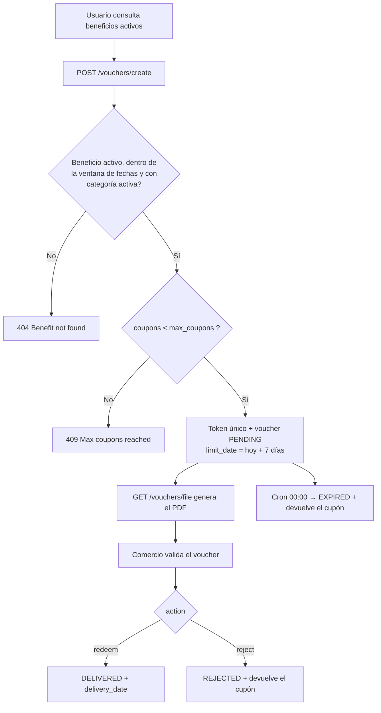

# Sistema de beneficios

## Objetivo:
Permitir que los socios asociados a CeCIT (centro de comercio de Alta Gracia) obtengan beneficios de distinta índole para usar en los negocios asociados al mismo.

## Roles de usuario:
- `USER` — Socio de CeCIT, canjea beneficios.
- `PARTNER_ADMIN` — Administrador de uno o varios negocios asociados.
- `CECIT_ADMIN` — Administrador de CeCIT, con acceso total.

## Módulos:
- Auth (`auth`) — registro, login, refresh, logout, edición de perfil.
- Gestión de Cuentas (`accounts`) — cuentas de acceso y roles.
- Gestión de Usuarios (`users`) — socios de CeCIT.
- Gestión de Vouchers (`vouchers`) — beneficios canjeados por un usuario.
- Gestión de Beneficios (`benefits`) — beneficios publicados.
- Gestión de Tipos de Beneficio (`benefit-types`).
- Gestión de Categorías (`categories`) y su relación con partners.
- Gestión de Métodos de Pago (`payment-methods`).
- Gestión de Administradores de negocios (`partners-admins`).
- Gestión de Negocios Asociados (`partners`) y sus direcciones (`directions`).

## Arquitectura general

```
Frontend ──HTTP──> NestJS ──TypeORM──> MariaDB (vía túnel SSH o local)
                      │
                      ├── @nestjs/schedule   tareas cron diarias
                      ├── nestjs-pino        logging estructurado
                      ├── Puppeteer         PDFs de voucher
                      └── cache en memoria   verificación de admin (60 s)
```

### Flujo de negocio de un voucher



### Reglas de negocio transversales

| Regla | Descripción |
|-------|-------------|
| Visibilidad de beneficios | Solo se listan beneficios `ACTIVE`, dentro de la ventana `start_date < hoy < end_date`, y cuyo partner tenga al menos una categoría `active`. |
| Baja de beneficio | `PATCH /benefits/deactivate` es una baja lógica: cambia el `status` a `INACTIVE` en lugar de borrar la fila (había FKs dependientes). |
| Cupones | Se descuentan al emitir y se devuelven al rechazar o al expirar. El canje es atómico (`UPDATE ... WHERE coupons < max_coupons`). |
| Vencimientos | Cron diario a las 00:00 para beneficios y vouchers; 03:00 para purgar refresh tokens expirados. |
| Autorización de partner | `AdminGuard` valida la relación admin ↔ partner, con resultado cacheado 60 s. `CECIT_ADMIN` siempre pasa. |

### Problemas conocidos

Detallados en [`tecnical/future.md`](../tecnical/future.md). Los más
relevantes a nivel funcional:

1. `PATCH /benefits` solo puede editar beneficios `ACTIVE` y dentro de ventana.
