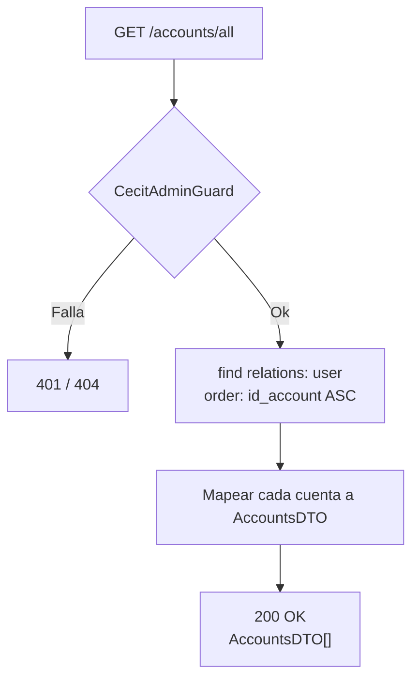
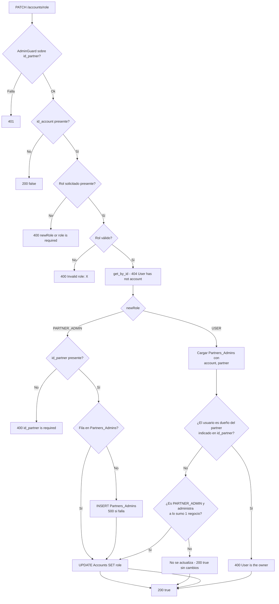

# Endpoints - Cuentas

En este archivo se detalla el funcionamiento interno de los endpoints relacionados a las cuentas de usuario en la plataforma.

---

## Módulo de Cuentas

El controlador de `Accounts` expone dos endpoints, ambos restringidos. Las
operaciones de autocreación de cuentas (registro, login) viven en el módulo de
autenticación; la edición de perfil también se movió a `AuthController`
(commit `43265f7`).

---

## `GET /accounts/all`

Protegido con `@UseGuards(AuthGuard('jwt'), CecitAdminGuard)`. Lista todas las
cuentas del sistema.

### Parámetros de entrada

Ninguno.

### Flujo del proceso



### Lógica de negocio

1. Se obtienen todas las `AccountsEntity` con la relación `user`, ordenadas por
   `id_account` ascendente.
2. Cada cuenta se mapea a `AccountsDTO` sumando `name`, `lastname` y `dni` desde
   la relación `user` (con `?? ''` como fallback).

### Respuesta

```json
[
  {
    "id_account": "U001",
    "email": "juan@example.com",
    "role": "USER",
    "active": true,
    "name": "Juan",
    "lastname": "Pérez",
    "dni": "12345678"
  },
  {
    "id_account": "U005",
    "email": "admin@cecit.edu.ar",
    "role": "CECIT_ADMIN",
    "active": true,
    "name": "Laura",
    "lastname": "Martínez",
    "dni": "30111222"
  }
]
```

---

## `PATCH /accounts/role`

Protegido con `@UseGuards(AuthGuard('jwt'), AdminGuard)`. Cambia el rol de una
cuenta.

### Parámetros de entrada

| Campo | Tipo | Validación | Descripción |
|-------|------|------------|-------------|
| `id_account` | String | `@IsNotEmpty() @IsString()` | Cuenta a modificar |
| `newRole` | `AccountRole` | `@IsNotEmpty() @IsEnum(AccountRole)` | Rol destino |
| `id_partner` | String? | `@IsOptional() @IsString()` | Negocio, obligatorio si `newRole = PARTNER_ADMIN` |

```typescript
export class UpdateRoleDTO {
    @IsNotEmpty()
    @IsString()
    id_account: string;

    @IsNotEmpty()
    @IsEnum(AccountRole)
    newRole: AccountRole;

    @IsOptional()
    @IsString()
    id_partner?: string;
}
```

El servicio tolera alias de nombres por si el body no coincide exactamente:
`newRole ?? role ?? new_role` e `id_partner ?? idPartner`.

### Flujo del proceso



### Lógica de negocio — `newRole = PARTNER_ADMIN`

Es la vía para **promover un empleado a administrador del negocio**. Ocurrió en
el commit `82670a9`.

1. `id_partner` es obligatorio: sin él, `400`.
2. Si no existe la fila en `Partners_Admins` para `(id_account, id_partner)`, se
   crea. Si el insert falla, `500 Error creating Partners_Admins record`.
3. Se actualiza `Accounts.role` a `PARTNER_ADMIN`.
4. Se devuelve `true`.

### Lógica de negocio — `newRole = USER`

1. Se cargan todas las relaciones `Partners_Admins` de la cuenta, con las
   relaciones `account` y `partner`.
2. **Bloqueo del dueño** (commit `e16e18e`): se busca la relación cuyo
   `id_partner` **coincida con el `id_partner` de la request** y se compara su
   `partner.id_owner` con `account.id_account`. Si coinciden, `400 User is the owner`.
   - El alcance es **solo el negocio nombrado en el body**. La protección no
     barre los demás partners que la cuenta administre.
   - Si la request no trae `id_partner`, no hay coincidencia y la protección no
     se dispara.
3. La actualización real es:
   ```typescript
   if ((account.role === AccountRole.PARTNER_ADMIN && relations.length <= 1) || !relations) {
       await this.accountsRepo.update({ id_account }, { role: AccountRole.USER });
   }
   ```
   Es decir, la baja solo se aplica si la cuenta era `PARTNER_ADMIN` **y**
   administra a lo sumo un negocio. Si administra varios, el rol se conserva
   para que no pierda el acceso a los demás.

### Comportamiento a corregir

> ⚠️ Una cuenta con **cero** relaciones y rol distinto de `PARTNER_ADMIN` (por
> ejemplo un `USER` al que se le pide `newRole: USER`) no entra en ninguna de las
> dos condiciones: `relations` es `[]`, que es truthy, así que `!relations` es
> `false`. **No se ejecuta ningún UPDATE** y el endpoint responde `200 true`
> sin haber cambiado nada. La guarda `|| !relations` parece haber sido escrita
> esperando un `undefined` que `find()` nunca devuelve.
>
> El mismo endpoint devuelve `200 true` tanto si cambió el rol como si no lo
> hizo, así que el frontend no puede distinguir los dos casos.

### Errores

| Código | Mensaje |
|--------|---------|
| `200` | `false` — si falta `id_account` (inalcanzable con la validación actual) |
| `400` | `newRole (or role) is required` |
| `400` | `Invalid role: <valor>` |
| `400` | `id_partner is required when newRole is PARTNER_ADMIN` |
| `400` | `User is the owner` |
| `404` | `User has not account` |
| `500` | `Error creating Partners_Admins record` |

### Respuesta

```json
true
```

---

## Servicios internos

### `AccountsService`

| Método | Descripción |
|--------|-------------|
| `create(account: AccountCreateDTO)` | Crea una cuenta mapeando **solo** `id_account`, `email` y `password`. El hash lo aplica el hook `@BeforeInsert`. `500 Error saving account` si no se guardó. |
| `get_by_email(email)` | `400 Email is empty` / `400 Email invalid` / `404 Account not found`. |
| `get_by_id(id_account)` | `400 Id is empty` / `404 Account not found`. |
| `has_account(email)` | `400 Email invalid` si está vacío o no es email; devuelve `repo.exists`. |
| `save(entity)` | Passthrough al repositorio. |
| `get_all()` | Todas las cuentas con `user`, ordenadas por `id_account`. `500 Accounts are empty`. |
| `update(dto: AccountsUpdateDTO)` | Actualiza email / password / active. Devuelve `AccountsDTO`. |
| `changeRole(user)` | Lógica de `PATCH /accounts/role`. |
| `verify_admin(id_admin, id_partner)` | Verificación de admin de partner **sin cache**. |
| `get_all_by_account(id_account)` | Filas de `Partners_Admins` de la cuenta. `400 id_account is required`. |

El servicio inyecta **dos** repositorios: `AccountsEntity` y
`PartnersAdminsEntity` (necesario para resolver roles y admins de partner).

### `update(dto)` en detalle

| Campo | Comportamiento |
|-------|----------------|
| `email` | Se normaliza con `trim().toLowerCase()`. Verifica que no esté en uso por otra cuenta → `400 Email already in use`. |
| `password` | Llama a `account.change_psswd()` (hash argon2). |
| `active` | Se asigna directamente. |

Después del save se re-lee la cuenta con `relations:['user']` y se mapea a
`AccountsDTO`.

⚠️ `AccountsUpdateDTO` **no está expuesto por ningún endpoint**: el cambio de
contraseña del propio usuario se hace por `PATCH /auth/update`, y el de email
por `PATCH /auth/update` o `PATCH /auth/update-profile-admin`. Solo
`changeRole` tiene endpoint propio.

⚠️ `update()` con `password` **no borra los refresh tokens**. Solo
`AuthService.updateEmail()` lo hace.

---

### `verify_admin` (copia sin cache)

Existe para que `AdminGuard` no dependa de `PartnersAdminsService` y se genere
una dependencia circular. Es la misma lógica, pero contra
`AccountsService`/`PartnersAdminsEntity` y sin `CACHE_MANAGER`:

```
1. accountsRepo.findOneBy({ id_account })
     → no existe, o role === USER → 401 'User is not admin'
2. role === CECIT_ADMIN → true
3. adminsRepo.findOne({ id_account, id_partner })
     → no existe → 401 'User is not admin of this partner'
4. → true
```

La versión **con** cache vive en `PartnersAdminsService.verify_admin()` y está
documentada en [`partners-admins.md`](./partners-admins.md).

---

## Estructura de la entidad

`@Entity('Accounts')`

| Campo | Columna | Tipo | Null | Default | Notas |
|-------|---------|------|------|---------|-------|
| `id_account` | `id_account` | `varchar(4)` | no | — | **`@PrimaryColumn`** (antes `id_user`) |
| `email` | `email` | `varchar(50)` | **sí** | — | `@Index()`, `unique: true` |
| `password` | `password` | `varchar(255)` | **sí** | — | Hash argon2 |
| `role` | `role` | `enum(AccountRole)` | no | `USER` | `@Index()` |
| `active` | `active` | `boolean` | no | `true` | |

### Cambios frente a la versión anterior

- La PK se renombró de `id_user` a `id_account`.
- Se eliminó la columna `last_activity` de la entidad. **La columna sigue
  existiendo en la base**, porque ninguna migración la elimina.
- `email` y `password` pasaron a ser nullable.
- Se widenaron `password` a `varchar(255)` (argon2 excede `varchar(50)`) y
  `role` pasó de `enum('0','1','2')` a `enum('USER','CECIT_ADMIN','PARTNER_ADMIN')`.

### Relaciones

- `@OneToOne(() => UsersEntity)` con
  `@JoinColumn({ name: 'id_account', referencedColumnName: 'id_user' })`.

> La FK comparte la PK: `Accounts.id_account` es a la vez clave primaria y
> referencia a `Users.id_user`.

### Lifecycle hooks y métodos

| Elemento | Descripción |
|----------|-------------|
| `@BeforeInsert() hashPassword()` | `password = await hash(this.password)` |
| `change_psswd(new_password)` | Rehashea la contraseña con argon2. *(nombre con doble `s`)* |
| `change_email(new_email)` | Asignación directa. **No lo usa ningún servicio**; `update()` asigna el campo directamente. |

---

## `AccountsDTO` — forma de respuesta

| Campo | Tipo | Origen |
|-------|------|--------|
| `id_account` | string | `Accounts.id_account` |
| `email` | string \| null | `Accounts.email` |
| `role` | `AccountRole` | `Accounts.role` |
| `active` | boolean | `Accounts.active` |
| `name` | string | `Users.name` ?? `''` |
| `lastname` | string | `Users.lastname` ?? `''` |
| `dni` | string | `Users.dni` ?? `''` |

---

## Migración pendiente

El renombre `Accounts.id_user` → `Accounts.id_account` **no tiene migración**.
`grep id_account src/migration/` solo encuentra la columna
`Partners_Admins.id_account`, que las migraciones posteriores renombran *a*
`id_user`. Con `synchronize: false`, la base y las entidades están
desalineadas. Ver [`future.md`](./future.md).

---

Ver también:
- [`auth.md`](./auth.md) — registro, login, refresh, logout y edición de perfil.
- [`partners-admins.md`](./partners-admins.md) — la tabla `Partners_Admins`.
