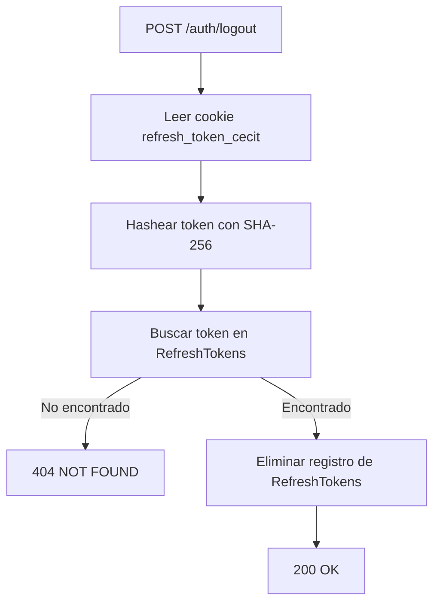
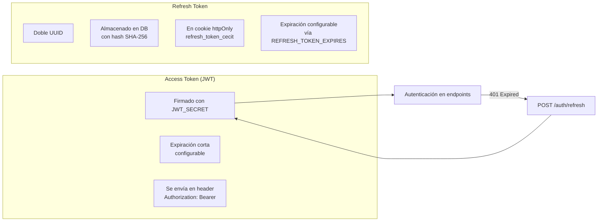

# Endpoints
En este archivo se detalla el funcionamiento interno de cada endpoint relacionado a la creación y autenticación de cuentas dentro de la plataforma.

---

## `POST /auth/register`

### Parámetros de entrada

| Campo | Tipo | Descripción |
|-------|------|-------------|
| `id_user` | String (4 chars) | Código de socio CeCIT. |
| `email` | String | Correo electrónico del usuario. |
| `password` | String | Contraseña de la cuenta (se hashea con argon2 antes de persistir). |

```typescript
export class AccountCreateDTO {
    @IsNotEmpty()
    id_user: string;

    @IsNotEmpty()
    @IsEmail()
    email: string;

    @IsNotEmpty()
    password: string;
}
```

### Flujo del proceso

```mermaid
flowchart TD
    A[POST /auth/register] --> B[¿Existe el usuario en Users?]
    B -->|No| C[404 NOT FOUND]
    B -->|Sí| D[¿Ya existe cuenta con ese email?]
    D -->|Sí| E[400 BAD REQUEST]
    D -->|No| F[Crear AccountsEntity<br/>con role = USER por defecto]
    F --> G[Generar refresh token]
    G --> H[Guardar refresh token en DB<br/>(hash SHA-256)]
    H --> I[Firmar access_token JWT]
    I --> J[Setear refresh_token en cookie httpOnly]
    J --> K[200 OK<br/>{ access_token }]
```

### Lógica de negocio

1. Se valida que el `id_user` exista en la tabla `Users` (socios de CeCIT). Si no existe, se responde con `404`.
2. Se verifica que no haya una cuenta registrada previamente con ese `email`. Si existe, se responde con `400`.
3. Se crea la cuenta en la tabla `Accounts` con rol `USER` por defecto. La contraseña se hashea automáticamente con argon2 gracias al hook `@BeforeInsert` de TypeORM.
4. Se genera un refresh token (UUID doble) y se almacena en la tabla `RefreshTokens` con hash SHA-256.
5. Se firma un access token JWT con los claims: `sub` (id_user), `email` y `jti`.
6. Se devuelve el `access_token` en el body y el `refresh_token` se setea como cookie httpOnly (`refresh_token_cecit`) con validez de 7 días.

### Respuesta

```http
HTTP/1.1 201 Created
Content-type: application/json
Set-Cookie: refresh_token_cecit=<JWT>; HttpOnly; Secure; SameSite=Lax; Path=/; Max-Age=700000;
{
    "access_token": "askdjaksdjajsd.askdjaksjd.aksdjaskdj",
}
```

**Nota:** Actualmente el registro no asigna roles especiales (`PARTNER_ADMIN`, `CECIT_ADMIN`). La asignación de `PARTNER_ADMIN` basada en `id_owner` de `Partners` está descrita como funcionalidad planeada pero no implementada en el código.


---

## `POST /auth/login`

Protegido con rate limiting: máximo 3 intentos por minuto.

### Parámetros de entrada

| Campo | Tipo | Descripción |
|-------|------|-------------|
| `email` | String | Correo electrónico de la cuenta. |
| `password` | String | Contraseña de la cuenta. |

```typescript
export class LoginDTO {
    @IsNotEmpty()
    @IsEmail()
    email: string;

    @IsNotEmpty()
    password: string;
}
```

### Flujo del proceso

```mermaid
flowchart TD
    A[POST /auth/login] --> B[Buscar cuenta por email]
    B -->|No existe| C[404 NOT FOUND]
    B -->|Existe| D[Verificar password con argon2]
    D -->|No coincide| E[400 BAD REQUEST]
    D -->|Coincide| F[Generar nuevo refresh token]
    F --> G[Guardar refresh token en DB]
    G --> H[Firmar access_token JWT]
    H --> I[Setear refresh_token en cookie httpOnly]
    I --> J[200 OK<br/>{ access_token }]
```

### Lógica de negocio

1. Se busca la cuenta por email en `Accounts`. Si no existe, `404`.
2. Se verifica la contraseña usando `argon2.verify()`. Si no coincide, `400`.
3. Se genera un nuevo refresh token, se almacena en `RefreshTokens` y se rota la cookie.
4. Se firma un nuevo `access_token` JWT con `sub`, `email` y `jti`.
5. Se devuelve el `access_token` en el body; el `refresh_token` se setea como cookie httpOnly.

### Respuesta

```http
HTTP/1.1 201 Created
Content-type: application/json
Set-Cookie: refresh_token_cecit=<JWT>; HttpOnly; Secure; SameSite=Lax; Path=/; Max-Age=700000;
{
    "access_token": "askdjaksdjajsd.askdjaksjd.aksdjaskdj",
}
```

---

## `POST /auth/refresh`

Renueva el access token usando el refresh token almacenado en la cookie.

### Parámetros de entrada

| Campo | Tipo | Origen | Descripción |
|-------|------|--------|-------------|
| `refresh_token_cecit` | String | Cookie | Refresh token actual. |

### Flujo del proceso

```mermaid
flowchart TD
    A[POST /auth/refresh] --> B[Leer cookie refresh_token_cecit]
    B --> C[Hashear token con SHA-256]
    C --> D[Buscar token en RefreshTokens]
    D -->|No encontrado| E[404 NOT FOUND]
    D -->|Encontrado| F{¿Token revocado?}
    F -->|Sí| G[401 UNAUTHORIZED]
    F -->|No| H{¿Token expirado?}
    H -->|Sí| I[401 UNAUTHORIZED]
    H -->|No| J[Generar nuevo refresh token]
    J --> K[Actualizar token en DB<br/>cambio de token + renovar fecha]
    K --> L[Obtener cuenta por email]
    L --> M[Firmar nuevo access_token JWT<br/>con sub, email, role y jti]
    M --> N[Setear nueva cookie httpOnly]
    N --> O[200 OK<br/>{ access_token }]
```

### Lógica de negocio

1. Se extrae el `refresh_token_cecit` de las cookies de la solicitud.
2. Se hashea con SHA-256 y se busca en la tabla `RefreshTokens`.
3. Se valida que el token no esté revocado ni expirado. Si lo está, se elimina el registro y se responde con `401`.
4. Se genera un nuevo refresh token y se actualiza el registro existente (cambio de token y renovación de fecha de expiración).
5. Se obtiene la cuenta asociada al email del token.
6. Se firma un nuevo `access_token` JWT que ahora incluye el `role` del usuario en los claims.
7. Se actualiza la cookie con el nuevo refresh token.

**Diferencia con register/login:** En el refresh, el JWT incluye el campo `role` del usuario, permitiendo que los guards de autorización (`AdminGuard`, `CecitAdminGuard`) funcionen correctamente tras un refresh.

### Respuesta

```http
HTTP/1.1 201 Created
Content-type: application/json
Set-Cookie: refresh_token_cecit=<JWT>; HttpOnly; Secure; SameSite=Lax; Path=/; Max-Age=700000;
{
    "access_token": "askdjaksdjajsd.askdjaksjd.aksdjaskdj",
}
```

---

## `POST /auth/logout`

Invalida el refresh token actual.

### Parámetros de entrada

| Campo | Tipo | Origen | Descripción |
|-------|------|--------|-------------|
| `refresh_token_cecit` | String | Cookie | Refresh token a invalidar. |

### Flujo del proceso



### Lógica de negocio

1. Se extrae el `refresh_token_cecit` de las cookies.
2. Se hashea con SHA-256 y se busca en `RefreshTokens`.
3. Si existe, se elimina el registro de la base de datos, invalidando el token.
4. No elimina la cookie del lado del cliente (éste debe hacerlo).

---

## `GET /auth/profile`

Protegido con `@UseGuards(AuthGuard('jwt'))`. Retorna los datos del usuario autenticado extraídos del JWT.

### Parámetros de entrada

Ninguno. Requiere header `Authorization: Bearer <access_token>`.

### Lógica de negocio

1. El `JwtStrategy` valida el token del header `Authorization: Bearer`.
2. Extrae el payload y lo transforma en un objeto con `user_id`, `email` y `role`.
3. El controlador simplemente devuelve `request.user`, que contiene la información del token.

```typescript
// JwtStrategy.validate()
return {
    user_id: payload.sub,
    email: payload.email,
    role: payload.role
}
```

### Respuesta

```json
{
    "user_id": "0001",
    "email": "usuario@example.com",
    "role": "USER"
}
```

---

## Guards de autorización

### `CecitAdminGuard`

Restringe el acceso a usuarios con rol `CECIT_ADMIN`. Busca la cuenta por email (del JWT) y verifica que `role === AccountRole.CECIT_ADMIN`.

### `AdminGuard`

Restringe el acceso a administradores de un partner específico (`PARTNER_ADMIN`). Verifica:
1. Que el usuario tenga rol `PARTNER_ADMIN`.
2. Que el `id_partner` en la request coincida con el `id_partner` asociado al admin en `Partners_Admins`.

---

## Flujo de tokens


