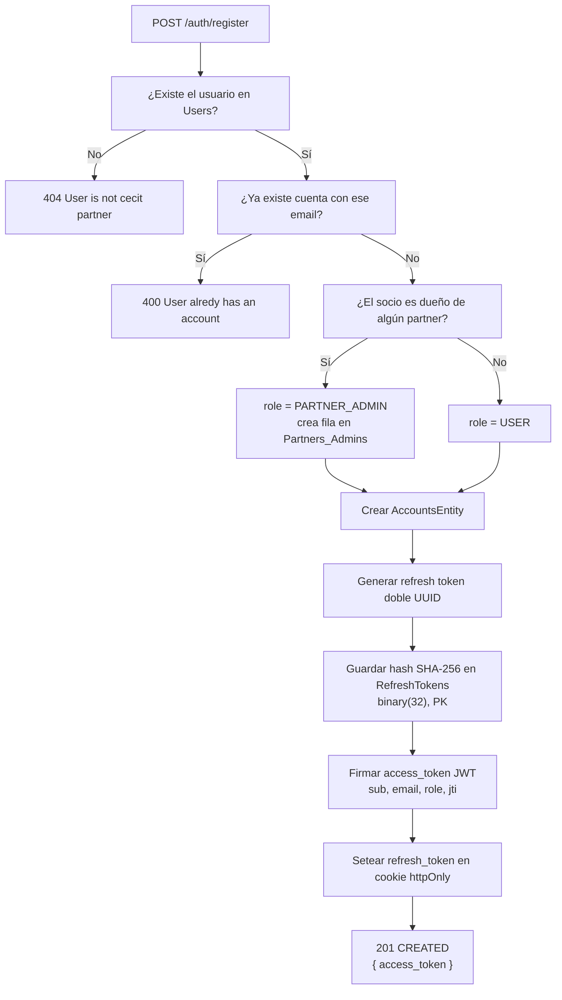
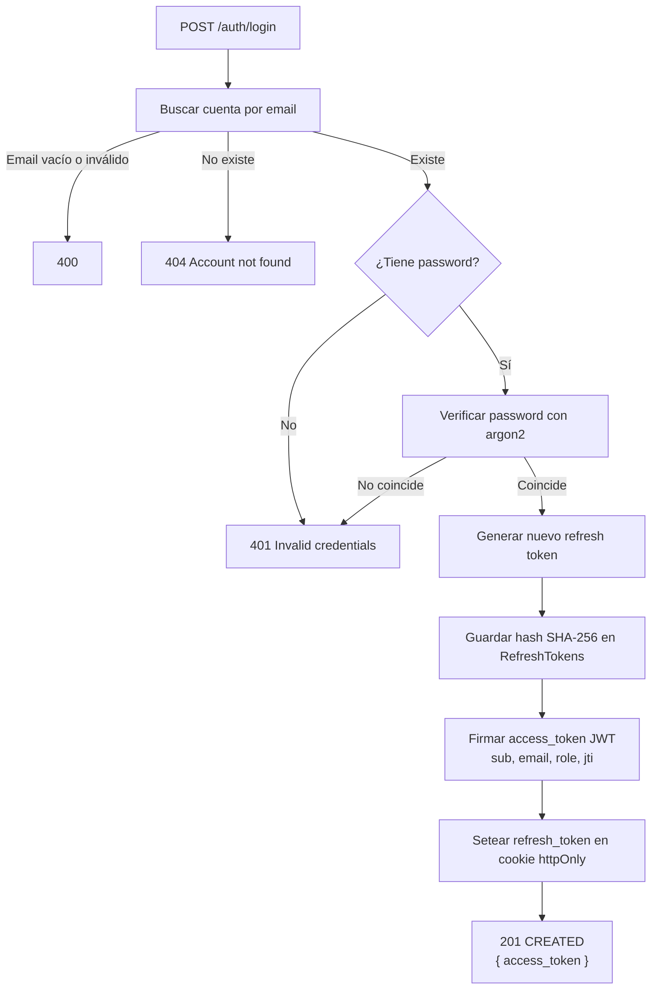
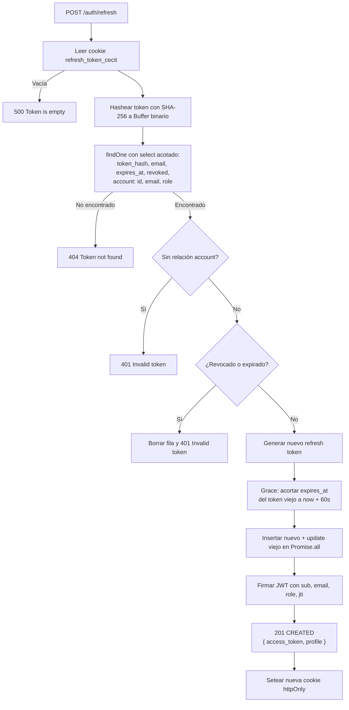
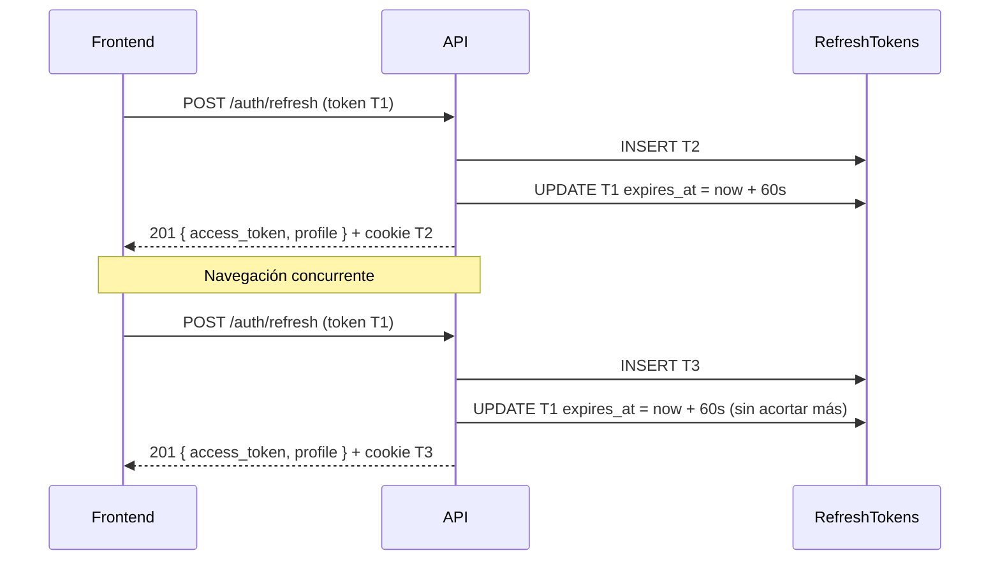
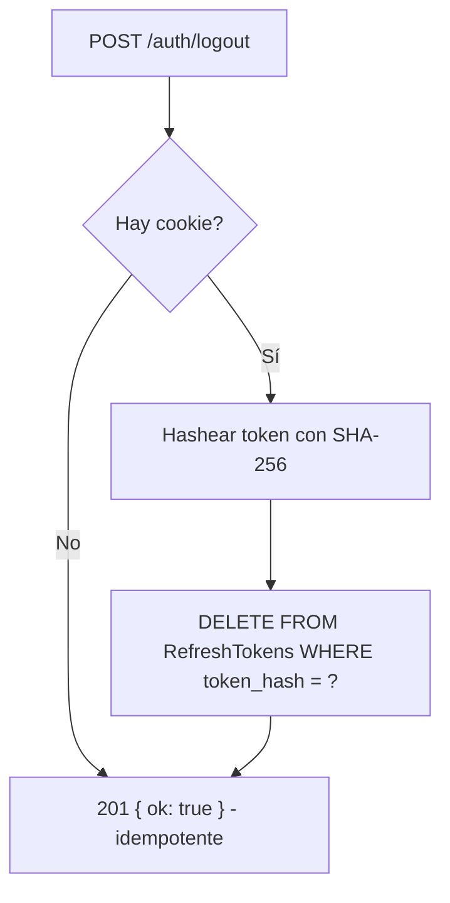
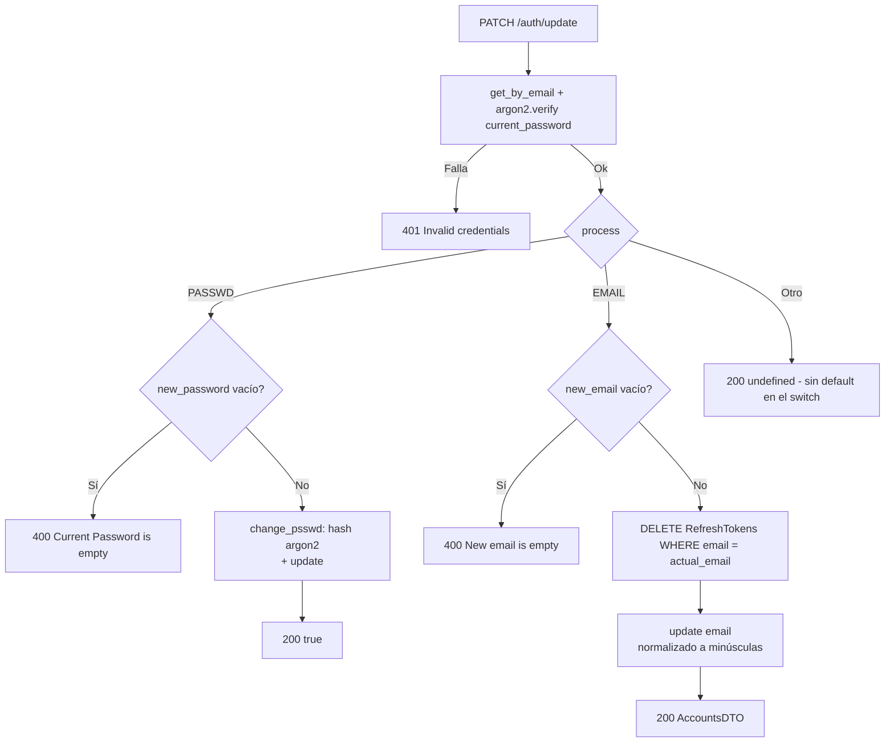
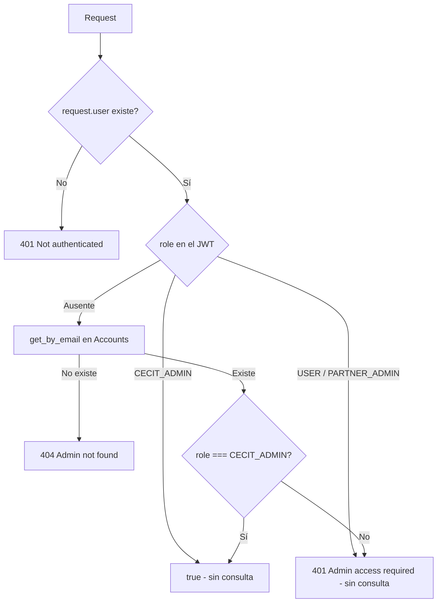
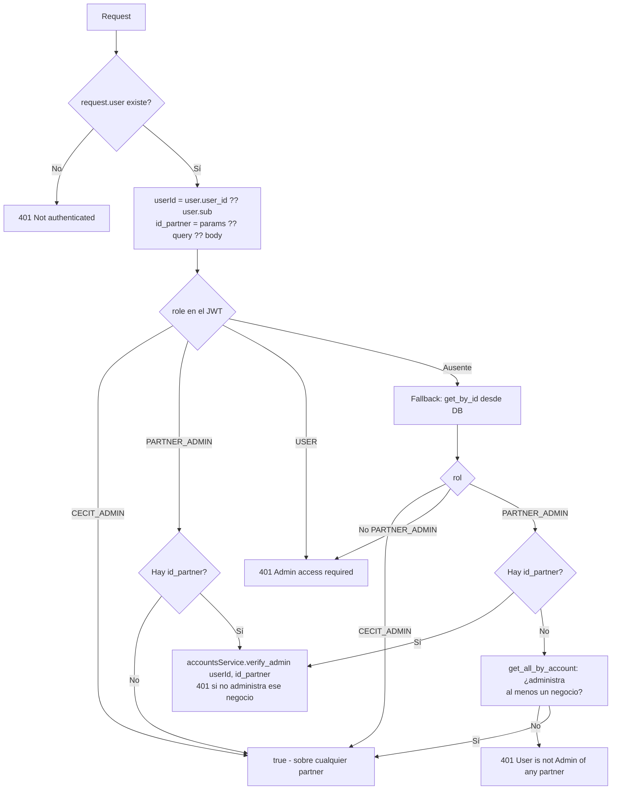
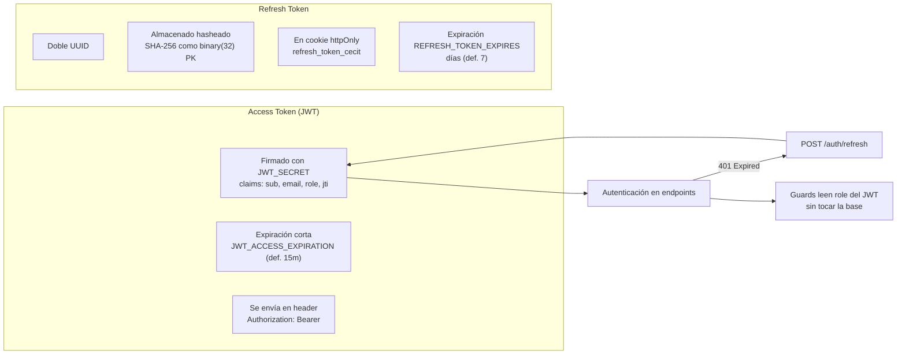
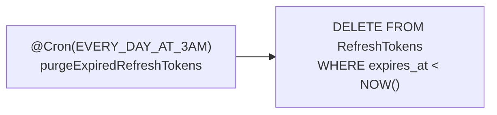

# Endpoints
En este archivo se detalla el funcionamiento interno de cada endpoint relacionado a la creación y autenticación de cuentas dentro de la plataforma.

---

## `POST /auth/register`

### Parámetros de entrada

| Campo | Tipo | Descripción |
|-------|------|-------------|
| `id_account` | String (4 chars) | Código de socio CeCIT (PK de `Users.id_user`). |
| `email` | String | Correo electrónico del usuario. |
| `password` | String | Contraseña de la cuenta (se hashea con argon2 antes de persistir). |
| `role` | `AccountRole` | Aceptado en el DTO pero **ignorado** (ver más abajo). |

```typescript
export class AccountCreateDTO {
    @IsNotEmpty()
    id_account: string;

    @IsNotEmpty()
    @IsEmail()
    email: string;

    @IsNotEmpty()
    password: string;

    role: AccountRole; // sin validador, y descartado por el servicio
}
```

### Flujo del proceso


```mermaid
flowchart TD
    A[POST /auth/register] --> B[¿Existe el usuario en Users?]
    B -->|No| C[404 User is not cecit partner]
    B -->|Sí| D[¿Ya existe cuenta con ese email?]
    D -->|Sí| E[400 User alredy has an account]
    D -->|No| F[¿El socio es dueño de algún partner?]
    F -->|Sí| G["role = PARTNER_ADMIN<br/>crea fila en Partners_Admins"]
    F -->|No| H[role = USER]
    G --> I[Crear AccountsEntity]
    H --> I
    I --> J[Generar refresh token doble UUID]
    J --> K["Guardar hash SHA-256 en RefreshTokens<br/>binary(32), PK"]
    K --> L["Firmar access_token JWT<br/>sub, email, role, jti"]
    L --> M[Setear refresh_token en cookie httpOnly]
    M --> N["201 CREATED<br/>{ access_token }"]
```

### Lógica de negocio

1. Se valida que el `id_account` exista en la tabla `Users` (socios de CeCIT). Si no existe, `404 User is not cecit partner`.
2. Se verifica que no haya una cuenta registrada previamente con ese `email`. Si existe, `400 User alredy has an account`.
3. Se busca si el socio es propietario de un partner (`Partners.id_owner === id_account`):
   - **Sí** → el rol es `PARTNER_ADMIN` y se crea la fila en `Partners_Admins` vía `PartnersAdminsService.createByOwner()` (idempotente).
   - **No** → el rol es `USER`.
4. Se genera un refresh token (doble UUID) y se almacena hasheado con SHA-256.
5. Se firma un access token JWT con los claims: `sub` (id_account), `email`, `role` y `jti`.
6. Se devuelve el `access_token` en el body y el `refresh_token` se setea como cookie httpOnly.

### Comportamiento a corregir

- `AccountsService.create()` solo mapea `id_account`, `email` y `password`: el
  `role` calculado **se pierde** y la cuenta queda en `USER` (default de la base).
  El JWT devuelto dice `PARTNER_ADMIN` pero la base dice `USER`, hasta que el
  usuario refresca el token. Además el `id_partner` de esa relación queda
  apuntando a un partner real pero la cuenta no puede administrarlo.
- Se firmaba un JWT **sin `role`**, lo que obligaba a los guards a consultar la
  base en cada request. Ahora `role` viaja en el payload.

### Errores

| Código | Mensaje |
|--------|---------|
| `404` | `User is not cecit partner` |
| `400` | `User alredy has an account` |
| `500` | `Error saving account` / `Error saving token` |

### Respuesta

```http
HTTP/1.1 201 Created
Content-type: application/json
Set-Cookie: refresh_token_cecit=<UUID-UUID>; HttpOnly; SameSite=Lax; Path=/; Max-Age=604800;
{
    "access_token": "askdjaksdjajsd.askdjaksjd.aksdjaskdj"
}
```

---

## `POST /auth/login`

Protegido con rate limiting: máximo 3 intentos por minuto
(`@Throttle({ default: { limit: 3, ttl: 60000 } })`).

### Parámetros de entrada

| Campo | Tipo | Descripción |
|-------|------|-------------|
| `email` | String | Correo electrónico de la cuenta. |
| `password` | String | Contraseña de la cuenta. |

```typescript
export class LoginDTO {
    @IsNotEmpty()
    @IsEmail()
    email: string;

    @IsNotEmpty()
    password: string;
}
```

### Flujo del proceso


```mermaid
flowchart TD
    A[POST /auth/login] --> B[Buscar cuenta por email]
    B -->|Email vacío o inválido| C[400]
    B -->|No existe| D[404 Account not found]
    B -->|Existe| E{¿Tiene password?}
    E -->|No| F[401 Invalid credentials]
    E -->|Sí| G[Verificar password con argon2]
    G -->|No coincide| F
    G -->|Coincide| H[Generar nuevo refresh token]
    H --> I[Guardar hash SHA-256 en RefreshTokens]
    I --> J["Firmar access_token JWT<br/>sub, email, role, jti"]
    J --> K[Setear refresh_token en cookie httpOnly]
    K --> L["201 CREATED<br/>{ access_token }"]
```

### Lógica de negocio

1. Se busca la cuenta por email en `Accounts`. Si el email está vacío o no es un email válido, `400`; si no existe la cuenta, `404`.
2. Si la cuenta no tiene password, `401 Invalid credentials`.
3. Se verifica la contraseña con `argon2.verify()`. Si no coincide, `401 Invalid credentials`.
4. Se genera un nuevo refresh token, se almacena hasheado y se setea la cookie.
5. Se firma un `access_token` JWT con `sub`, `email`, `role` y `jti`.

**Cambio:** las credenciales inválidas ahora responden `401` en lugar de
`400 Bad Password`.

### Respuesta

```http
HTTP/1.1 201 Created
Content-type: application/json
Set-Cookie: refresh_token_cecit=<UUID-UUID>; HttpOnly; SameSite=Lax; Path=/; Max-Age=604800;
{
    "access_token": "askdjaksdjajsd.askdjaksjd.aksdjaskdj"
}
```

---

## `POST /auth/refresh`

Renueva el access token usando el refresh token almacenado en la cookie. Se
refactorizó para reducir consultas a la base.

### Parámetros de entrada

| Campo | Tipo | Origen | Descripción |
|-------|------|--------|-------------|
| `refresh_token_cecit` | String | Cookie | Refresh token actual. |

### Flujo del proceso


```mermaid
flowchart TD
    A[POST /auth/refresh] --> B[Leer cookie refresh_token_cecit]
    B -->|Vacía| E1[500 Token is empty]
    B --> C[Hashear token con SHA-256 a Buffer binario]
    C --> D["findOne con select acotado:<br/>token_hash, email, expires_at, revoked,<br/>account: id, email, role"]
    D -->|No encontrado| E[404 Token not found]
    D -->|Encontrado| F{Sin relación account?}
    F -->|Sí| G[401 Invalid token]
    F -->|No| H{¿Revocado o expirado?}
    H -->|Sí| I["Borrar fila y 401 Invalid token"]
    H -->|No| J[Generar nuevo refresh token]
    J --> K["Grace: acortar expires_at<br/>del token viejo a now + 60s"]
    K --> L[Insertar nuevo + update viejo en Promise.all]
    L --> M["Firmar JWT con sub, email, role, jti"]
    M --> N["201 CREATED<br/>{ access_token, profile }"]
    N --> O[Setear nueva cookie httpOnly]
```

### Lógica de negocio

1. Se extrae el `refresh_token_cecit` de las cookies. Si está vacío, `hashToken()` lanza un `Error` plano (no una excepción HTTP de Nest), que el handler de errores por defecto de Nest convierte en `500`.
2. Se hashea con SHA-256 devolviendo un **Buffer binario** (32 bytes), que es la clave primaria de `RefreshTokens`.
3. Se busca el token con un `select` acotado: se traen `token_hash`, `email`, `expires_at`, `revoked` y de la cuenta solo `id_account`, `email` y `role`. **El hash argon2 no se trae**, lo que evita Transfer-Through de una columna pesada.
4. Si no hay fila → `404 Token not found`. Si la fila no tiene `account` → `401 Invalid token`.
5. Se valida que no esté revocado ni expirado. Si lo está, se **elimina la fila** y se responde `401 Invalid token`.
6. Se genera un token nuevo. El token viejo **no se borra**: se le acorta `expires_at` a `now + 60 s` (ventana de gracia), para que navegaciones concurrentes del frontend no se invaliden entre sí. La inserción del nuevo y el update del viejo corren en `Promise.all`.
7. Se firma un `access_token` con `sub`, `email`, `role` y `jti`.
8. Se devuelve además `profile`, para que el frontend pueda rehidratarse sin
   una llamada extra.

### Ventana de gracia


```mermaid
sequenceDiagram
    participant FE as Frontend
    participant A as API
    participant DB as RefreshTokens

    FE->>A: POST /auth/refresh (token T1)
    A->>DB: INSERT T2
    A->>DB: UPDATE T1 expires_at = now + 60s
    A-->>FE: 201 { access_token, profile } + cookie T2

    Note over FE,A: Navegación concurrente #2 con la cookie vieja
    FE->>A: POST /auth/refresh (token T1)
    A->>DB: INSERT T3
    A->>DB: UPDATE T1 expires_at = now + 60s (sin acortar más)
    A-->>FE: 201 { access_token, profile } + cookie T3
```

La expiración del token viejo **solo se acorta, nunca se extiende**, de modo
que la ventana de gracia no se puede renovar indefinidamente.

### Errores

| Código | Mensaje | Causa |
|--------|---------|-------|
| `500` | `Token is empty` | No llegó la cookie (se lanza un `Error` crudo, no una excepción HTTP) |
| `404` | `Token not found` | No existe el hash en la base |
| `401` | `Invalid token` | Revocado, expirado, o sin `account` asociado |
| `401` | `Refresh token revoked` / `Refresh token expired` | Se registra antes de ser re-normalizado a `Invalid token` |

### Respuesta

```http
HTTP/1.1 201 Created
Content-type: application/json
Set-Cookie: refresh_token_cecit=<UUID-UUID>; HttpOnly; SameSite=Lax; Path=/; Max-Age=604800;
{
    "access_token": "askdjaksdjajsd.askdjaksjd.aksdjaskdj",
    "profile": {
        "user_id": "U001",
        "email": "usuario@example.com",
        "role": "USER"
    }
}
```

---

## `POST /auth/logout`

Invalida el refresh token actual.

### Parámetros de entrada

| Campo | Tipo | Origen | Descripción |
|-------|------|--------|-------------|
| `refresh_token_cecit` | String | Cookie | Refresh token a invalidar. |

### Flujo del proceso


```mermaid
flowchart TD
    A[POST /auth/logout] --> B{Hay cookie?}
    B -->|No| C["201 { ok: true } - idempotente"]
    B -->|Sí| D[Hashear token con SHA-256]
    D --> E[DELETE FROM RefreshTokens WHERE token_hash = ?]
    E --> C
```

### Lógica de negocio

1. Se extrae la cookie `refresh_token_cecit`.
2. Si no hay token, se retorna temprano **sin error**.
3. Se hashea con SHA-256 y se ejecuta `DELETE ... WHERE token_hash = ?`.
4. Se limpia la cookie con `clearCookie('refresh_token_cecit', { path: '/' })`.

**Cambio:** el endpoint pasó a ser **idempotente**. Antes hacía un `findOne`
previo y devolvía `404` si el token no existía.

### Respuesta

```json
{ "ok": true }
```

---

## `GET /auth/profile`

Protegido con `@UseGuards(AuthGuard('jwt'))`. Retorna los datos del usuario
autenticado extraídos del JWT.

### Parámetros de entrada

Ninguno. Requiere header `Authorization: Bearer <access_token>`.

### Lógica de negocio

1. El `JwtStrategy` valida el token del header `Authorization: Bearer`.
2. Extrae el payload y lo transforma en un objeto con `user_id`, `email` y `role`.
3. El controlador simplemente devuelve `request.user`.

```typescript
// JwtStrategy.validate()
return {
    user_id: payload.sub,
    email: payload.email,
    role: payload.role
}
```

### Respuesta

```json
{
    "user_id": "U001",
    "email": "usuario@example.com",
    "role": "USER"
}
```

---

## `PATCH /auth/update`

Protegido con `@UseGuards(AuthGuard('jwt'))`. El usuario edita su propia cuenta.
El campo `process` decide la operación.

### Parámetros de entrada

| Campo | Tipo | Validación | Descripción |
|-------|------|------------|-------------|
| `process` | `"PASSWD" \| "EMAIL"` | **sin validador** | Operación a performar. |
| `email` | String | `@IsEmail() @IsNotEmpty()` | Email actual (siempre requerido). |
| `current_password` | String | `@IsString() @IsNotEmpty()` | Password actual (siempre requerido). |
| `new_email` | String? | `@IsEmail()` | Destino, si `process = EMAIL`. |
| `new_password` | String? | sin validador | Destino, si `process = PASSWD`. |

### Flujo del proceso


```mermaid
flowchart TD
    A[PATCH /auth/update] --> B[get_by_email + argon2.verify current_password]
    B -->|Falla| C[401 Invalid credentials]
    B -->|Ok| D{process}
    D -->|PASSWD| E{new_password vacío?}
    E -->|Sí| F[400 Current Password is empty]
    E -->|No| G["change_psswd: hash argon2<br/>+ update"]
    G --> H["200 true"]
    D -->|EMAIL| I{new_email vacío?}
    I -->|Sí| J[400 New email is empty]
    I -->|No| K["DELETE RefreshTokens WHERE email = actual_email"]
    K --> L["update email<br/>normalizado a minúsculas"]
    L --> M["200 AccountsDTO"]
    D -->|Otro| N["200 undefined - sin default en el switch"]
```

### Lógica de negocio

**`process = "PASSWD"`**
1. Se valida `current_password` con argon2. Si falla, `401`.
2. Si no viene `new_password`, `400 Current Password is empty`.
3. Se hashea la nueva contraseña con argon2 y se actualiza la cuenta.
4. Devuelve `200 true`.

**`process = "EMAIL"`**
1. Se valida `current_password` con argon2. Si falla, `401`.
2. Si no viene `new_email`, `400 New email is empty`.
3. **Se borran todos los refresh tokens del email actual**, lo que invalida
   cualquier sesión abierta en otros dispositivos: el usuario tendrá que
   autenticarse de nuevo.
4. Se actualiza el email (normalizado a minúsculas) y se devuelve el
   `AccountsDTO` actualizado.

### Comportamiento a corregir

- El `switch` sobre `process` no tiene `default`: un valor distinto de
  `PASSWD`/`EMAIL` devuelve `200` con body `undefined`.
- El mensaje de error de `updatePasswd()` dice `'Error changing email'`
  (copy-paste).
- El cambio de contraseña desde este endpoint **no** borra los refresh tokens,
  a diferencia del cambio de email.

### Errores

| Código | Mensaje |
|--------|---------|
| `401` | `Invalid credentials` |
| `400` | `Current Password is empty` / `New email is empty` |
| `500` | `Error changing email` |

---

## `PATCH /auth/update-profile-admin`

Protegido con `@UseGuards(AuthGuard('jwt'), CecitAdminGuard)`. Un
`CECIT_ADMIN` cambia el email de cualquier cuenta.

### Parámetros de entrada

| Campo | Tipo | Validación |
|-------|------|------------|
| `id_account` | String | `@IsNotEmpty()` |
| `email` | String | `@IsEmail() @IsNotEmpty()` |
| `new_email` | String | `@IsEmail() @IsNotEmpty()` |

### Lógica de negocio

1. Se busca la cuenta por **`id_account`** (no por `email`):
   `AccountsService.update()` → `get_by_id(dto.id_account)`.
2. El campo `email` del body se usa como filtro para borrar los refresh tokens
   de esa dirección, no para localizar la cuenta.
3. **Se borran todos los refresh tokens con `email = <email del body>`**, igual
   que en el cambio de email del propio usuario. Es el mismo
   `AuthService.updateEmail()` en ambos casos, así que el comportamiento es
   idéntico.
4. Se revalida que el `new_email` no esté en uso por otra cuenta
   (`400 Email already in use`). El valor se normaliza a minúsculas.
5. Se devuelve el `AccountsDTO` actualizado.

> Consecuencia práctica: al cambiar el email de un socio desde el panel de
> CeCIT, ese usuario queda deslogueado en todos sus dispositivos y debe
> autenticarse de nuevo. Es el comportamiento correcto, pero conviene que el
> frontend lo anticipe.

### Respuesta

```json
{
    "id_account": "U001",
    "email": "nuevo@example.com",
    "role": "USER",
    "active": true,
    "name": "Juan",
    "lastname": "Pérez",
    "dni": "12345678"
}
```

---

## Guards de autorización

### `CecitAdminGuard`


```mermaid
flowchart TD
    A[Request] --> B{request.user existe?}
    B -->|No| C[401 Not authenticated]
    B -->|Sí| D{role en el JWT}
    D -->|CECIT_ADMIN| E[true - sin consulta]
    D -->|USER / PARTNER_ADMIN| F[401 Admin access required - sin consulta]
    D -->|Ausente| G[get_by_email en Accounts]
    G -->|No existe| H[404 Admin not found]
    G -->|Existe| I{role === CECIT_ADMIN?}
    I -->|No| F
    I -->|Sí| E
```

El camino rápido evita la consulta a la base en el caso común. El fallback
solo se activa con tokens antiguos que no tenían `role` en el payload.

### `AdminGuard`

Se reescribió por completo. La dependencia pasó de `PartnersAdminsService` a
`AccountsService` para evitar una dependencia circular.

**Resolución del `id_partner`** — se busca en params → query → body, aceptando
`id_partner` o `idPartner`:

| Origen | Ejemplo de endpoint |
|--------|--------------------|
| `query.id_partner` | `GET /benefits/partner?id_partner=X` |
| `query.id_partner` | `GET /partners/locations?id_partner=X` |
| `body.id_partner` | `PATCH /partners/logo` |
| `body.id_partner` | `POST /directions` |


```mermaid
flowchart TD
    A[Request] --> B{request.user existe?}
    B -->|No| C[401 Not authenticated]
    B -->|Sí| D[userId = user.user_id ?? user.sub<br/>id_partner = params ?? query ?? body]
    D --> E{role en el JWT}
    E -->|CECIT_ADMIN| F[true - sobre cualquier partner]
    E -->|PARTNER_ADMIN| G{Hay id_partner?}
    G -->|No| F
    G -->|Sí| H["accountsService.verify_admin userId, id_partner<br/>401 si no administra ese negocio"]
    E -->|USER| I[401 Admin access required]
    E -->|Ausente| J["Fallback: get_by_id desde DB"]
    J --> K{rol}
    K -->|CECIT_ADMIN| F
    K -->|No PARTNER_ADMIN| I
    K -->|PARTNER_ADMIN| L{Hay id_partner?}
    L -->|Sí| H
    L -->|No| M["get_all_by_account: ¿administra<br/>al menos un negocio?"]
    M -->|No| N[401 User is not Admin of any partner]
    M -->|Sí| F
```

**Cambios respecto a la versión anterior:**
- El id del usuario sale **siempre del JWT**; antes se leía de params/body y
  se respondía `404 Partner id not found in request` si faltaba.
- Se agregó el bypass para `CECIT_ADMIN` (antes no estaba: un admin de CeCIT
  sin relación con el partner quedaba afuera).
- Un `PARTNER_ADMIN` sin `id_partner` en la request ahora pasa sin consultar,
  en vez de exigir la relación.
- Un `PARTNER_ADMIN` que administra varios negocios puede operar sin
  `id_partner` en la request, siempre que tenga al menos una relación.

### Verificación cacheada

`PartnersAdminsService.verify_admin(id_admin, id_partner)` cachea los
resultados **positivos** durante 60 s:

```
cacheKey = `admin-partner:${id_admin}_${id_partner}`
1. ¿Cache hit? → devolver el booleano cacheado
2. accountsRepo.findOneBy({ id_account })
     → no existe → 401 'User is not admin'
3. role === USER  → 401 'User is not admin'
4. role === CECIT_ADMIN → cache.set(key, true); return true
5. adminsRepo.findOne({ id_account, id_partner })
     → no existe → 401 'User is not admin of this partner'
6. cache.set(key, true); return true
```

Solo se cachean resultados `true`, así que **quitar** a un admin de un negocio
tarda hasta 60 s en surtir efecto. El TTL proviene del
`CacheModule.register({ isGlobal: true, ttl: 60000 })` global.

`AccountsService.verify_admin()` es una copia **sin cache** de esta misma lógica
que existe para que `AdminGuard` no dependa de `PartnersAdminsService`.

---

## Flujo de tokens


```mermaid
flowchart LR
    subgraph "Access Token (JWT)"
        A["Firmado con JWT_SECRET<br/>claims: sub, email, role, jti"]
        B["Expiración corta<br/>JWT_ACCESS_EXPIRATION (def. 15m)"]
        C["Se envía en header<br/>Authorization: Bearer"]
    end

    subgraph "Refresh Token"
        D["Doble UUID"]
        E["Almacenado hasheado<br/>SHA-256 como binary(32) PK"]
        F["En cookie httpOnly<br/>refresh_token_cecit"]
        G["Expiración REFRESH_TOKEN_EXPIRES<br/>días (def. 7)"]
    end

    A --> H[Autenticación en endpoints]
    H -->|401 Expired| I[POST /auth/refresh]
    I --> A
    H --> J[Guards leen role del JWT<br/>sin tocar la base]
```

## Entidad `RefreshTokens`

| Columna | Tipo | Null | Default | Notas |
|---------|------|------|---------|-------|
| `token_hash` | `binary(32)` | no | — | **PK**. Digest SHA-256 crudo (Buffer), no hex |
| `email` | `varchar(50)` | no | — | INDEX. FK → `Accounts.email` |
| `expires_at` | `datetime` | no | — | La calcula `@BeforeInsert setDate()` |
| `revoked` | `boolean` | no | `false` | |
| `created_at` | `datetime` | no | — | `@CreateDateColumn` |

Cambios frente a la versión anterior:
- Se eliminó la PK `id_token` (uuid) y `token_hash` pasó a ser la PK
  directamente, como `binary(32)`.
- Se agregó la columna `email` con su FK a `Accounts.email`, lo que permite
  hacer join y trae el rol sin una segunda consulta.
- El hasheo `@BeforeInsert hashToken()` se movió al servicio; la entidad ya no
  hashea sola.
- `setDate()` ahora tiene fallback: `REFRESH_TOKEN_EXPIRES || 7`. Antes una
  variable ausente producía `NaN` días.

## Tarea programada


```mermaid
flowchart LR
    A["@Cron(EVERY_DAY_AT_3AM)<br/>purgeExpiredRefreshTokens"] --> B["DELETE FROM RefreshTokens<br/>WHERE expires_at < NOW()"]
```

## Dependencias
- `@nestjs/jwt`, `@nestjs/passport`, `passport-jwt` — JWT
- `argon2` — hasheo de contraseñas
- `@nestjs/throttler` — rate limiting
- `@nestjs/schedule` — purga de tokens
- `cache-manager` — cache de `verify_admin`

## Pendientes
- Migración de `Accounts.id_user` → `Accounts.id_account` y
  `RefreshTokens` al esquema `binary(32)`: no existe. Ver
  [`future.md`](./future.md).
