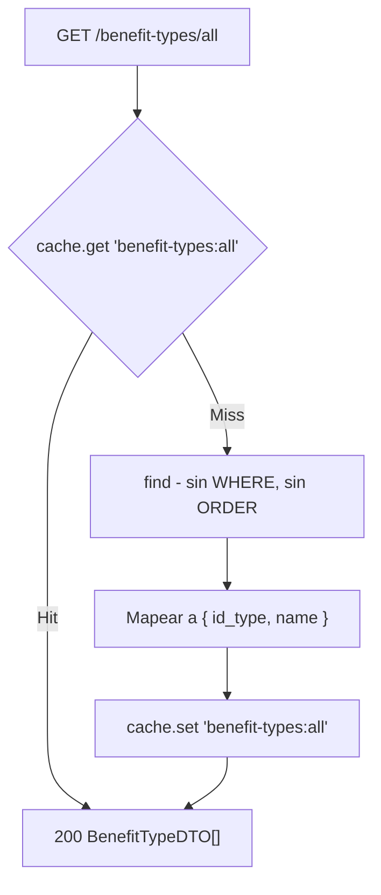

# Endpoints - Tipos de Beneficio

En este archivo se detalla el funcionamiento interno de cada endpoint relacionado a los tipos de beneficio de la plataforma.

> Este módulo **no cambió funcionalmente** en el rango documentado. El diff
> contra `7f106cc` es solo reformateo (prettier, de 4 a 2 espacios) y la
> eliminación de dos imports sin uso de `AccountsService` en el constructor.

---

## `GET /benefit-types/all`

Obtiene todos los tipos de beneficio registrados.

### Parámetros de entrada

Ninguno.

### Flujo del proceso



### Lógica de negocio

1. Se busca la clave `benefit-types:all` en el cache.
2. Si hay hit, se devuelve el resultado cacheado.
3. Si hay miss, se ejecuta `find()` — **sin filtro por `active` y sin orden** — y se mapea con `BenefitTypeMapper.toDTO()`, que retorna `{ id_type, name }`.
4. Se cachea el resultado.

> La cache usa el **TTL global de 60 s** del `CacheModule.register({ isGlobal:
> true, ttl: 60000 })`, porque `cache.set()` se llama sin un segundo argumento.
> Un tipo creado o eliminado directamente en la base recién se refleja al
> vencer ese TTL. La invalidación explícita (`cache.del`) solo ocurre cuando
> este mismo módulo crea o borra un tipo.

### Respuesta

```json
[
  { "id_type": 1, "name": "Descuento" },
  { "id_type": 2, "name": "Promoción" },
  { "id_type": 3, "name": "Cupón" },
  { "id_type": 4, "name": "2x1" }
]
```

> `active` **no se devuelve**: el mapper lo descarta. El frontend no puede
> distinguir un tipo activo de uno inactivo con este endpoint.

---

## `POST /benefit-types`

Protegido con `@UseGuards(AuthGuard('jwt'), CecitAdminGuard)`. Crea un nuevo
tipo de beneficio.

### Parámetros de entrada

> `BenefitTypeCreateDTO` es una `interface`: el `ValidationPipe` no la valida.

| Campo | Tipo | Descripción |
|-------|------|-------------|
| `name` | String | Nombre del tipo de beneficio. |
| `active` | Boolean | Estado. Si se omite, aplica el default de la base (`true`). |

### Lógica de negocio

1. Se crea la entidad con `benefitTypeRepository.create(benefitType)`.
2. Se guarda.
3. Se invalida la cache: `cache.del('benefit-types:all')`.
4. Se retorna la entidad mapeada a `BenefitTypeDTO`.

### Respuesta

```json
{ "id_type": 5, "name": "2x1" }
```

---

## `DELETE /benefit-types`

Protegido con `@UseGuards(AuthGuard('jwt'), CecitAdminGuard)`. Elimina un tipo de
beneficio.

### Parámetros de entrada

> `BenefitTypeDeleteDTO` es una `interface`: sin validación.

| Campo | Tipo | Origen | Descripción |
|-------|------|--------|-------------|
| `id_type` | Number | Body | ID del tipo a eliminar. |

### Lógica de negocio

1. Se ejecuta `benefitTypeRepository.delete({ id_type })` — **borrado duro**.
2. Se invalida la cache.
3. Se retorna `true`.

### Riesgo

Es un borrado físico: si hay beneficios que referencian ese `id_type`, la FK
lanza un error de integridad referencial crudo (no una `NotFoundException` ni un
manejo amable). La alternativa sería una baja lógica con `active = false`, que
es exactamente para lo que existe la columna.

### Errores

| Código | Mensaje |
|--------|---------|
| `404` | `El tipo de beneficio que se quiere borrar no fué encontrado` |
| `500` | Error de FK crudo si hay beneficios asociados |

### Respuesta

```json
true
```

---

## Servicio `BenefitTypeService`

| Método | Descripción |
|--------|-------------|
| `get_all()` | Listado cacheado, sin filtro de `active`. |
| `create(dto)` | `repository.create()` + save + `cache.del`. |
| `delete(dto)` | Borrado duro + `cache.del`. |
| `get_by_id(id_type)` | `400 Id is required` / `404 BenefitType not found`. La usa `BenefitsService.create()`. |

## Estructura de la entidad

`@Entity('BenefitTypes')`

| Campo | Columna | Tipo | Default | Notas |
|-------|---------|------|---------|-------|
| `id_type` | `id_type` | `int` | AI | `@PrimaryGeneratedColumn` |
| `name` | `name` | `varchar(50)` | — | |
| `active` | `active` | `boolean` | `true` | |

Sin relaciones. La relación con `Benefits` es un
`@ManyToOne(() => BenefitTypeEntity)` desde `BenefitsEntity.id_type`.

## Tabla en DB

- `BenefitTypes`

## Dependencias
- `TypeORM` — repositorio de entidad
- `cache-manager` (`CACHE_MANAGER`) — cache de `get_all()`
- `AccountsModule` — importado en el módulo pero **sin uso**

---

Ver también: [`benefits.md`](./benefits.md).
