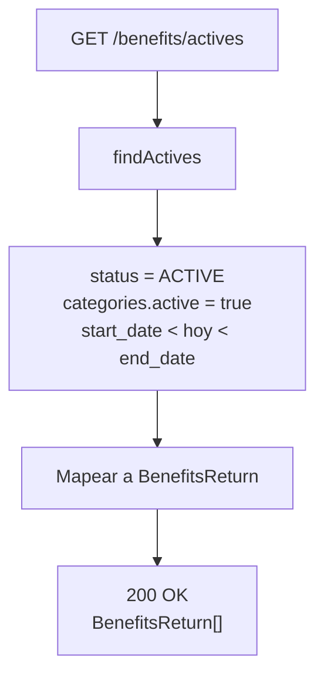
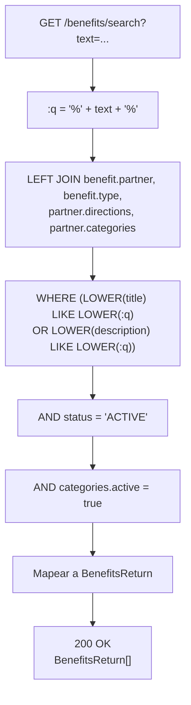
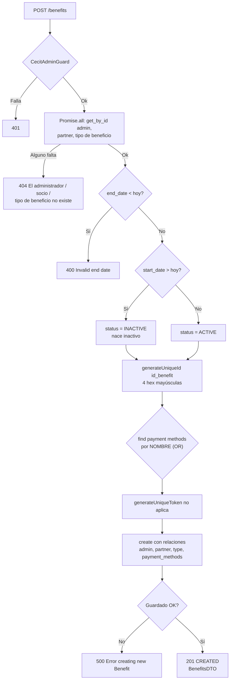
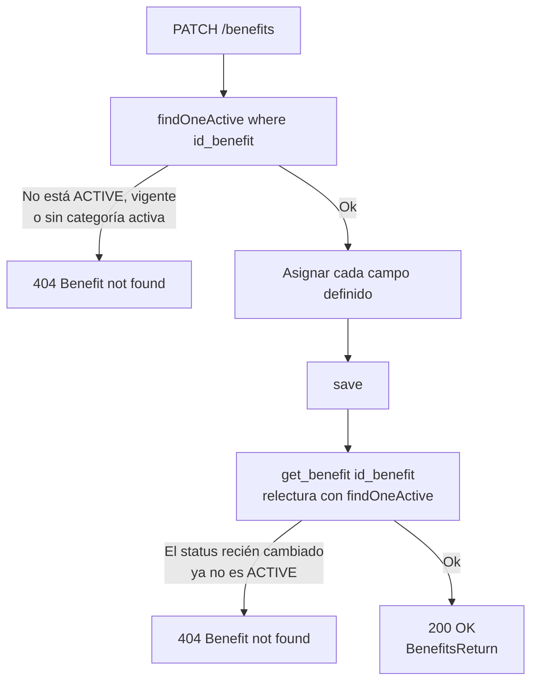
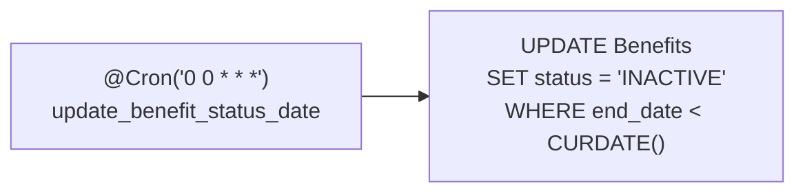

# Endpoints - Beneficios

En este archivo se detalla el funcionamiento interno de cada endpoint relacionado a los beneficios de la plataforma.

---

## Visibilidad de un beneficio

Dos helpers privados de `BenefitsService` concentran todo el filtro de
visibilidad, que se usa tanto para listados como para validaciones puntuales:

```typescript
private async findActives(options?: FindManyOptions<BenefitsEntity>) {
    const today = new Date();
    return this.benefitsRepository.find({
        ...options,
        relations: ['partner', 'partner.directions', 'partner.categories', 'type', 'payment_methods'],
        where: {
            ...options?.where,
            status: BenefitStatus.ACTIVE,
            partner: { categories: { active: true } },
            start_date: LessThan(today),      // exclusivo
            end_date: MoreThan(today),        // exclusivo
        },
    });
}

async findOneActive(options?: FindOneOptions<BenefitsEntity>) {
    // mismo predicado; lanza NotFoundException('Benefit not found') si no hay match
}
```

Los cuatro filtros:

| Filtro | Efecto |
|--------|--------|
| `status = ACTIVE` | Excluye `INACTIVE` y `PENDING`. |
| `partner.categories.active = true` | Si el negocio no tiene ninguna categoría activa, **ningún** beneficio suyo se lista. Se aplica en el `WHERE` del join, no como post-filtro, así que desactivar una categoría tiene efecto inmediato. |
| `start_date < hoy` | Beneficios aún no vigentes. |
| `end_date > hoy` | Beneficios vencidos. |

Las comparaciones son **excluyentes** (commit `698ee5d`): un beneficio cuyo
límite sea exactamente "ahora" queda fuera.

Las relaciones cargadas son `['partner', 'partner.directions', 'partner.categories', 'type', 'payment_methods']`. Desde el commit `5d881c8` las categorías llegan planas
desde `partner.categories` (antes había que atravesar
`partner.categories[].category`).

---

## `GET /benefits/all`

Obtiene todos los beneficios registrados.

> **Excepción:** este endpoint **no aplica ningún filtro de visibilidad**.
> Devuelve también beneficios `INACTIVE`, `PENDING` y vencidos. Si lo que se
> busca es el listado público del usuario, corresponde `GET /benefits/actives`.

### Parámetros de entrada

Ninguno.

### Lógica de negocio

1. `get_all()` ejecuta `find({ relations: ['partner', 'partner.directions', 'partner.categories', 'type', 'payment_methods'], order: { date_entered: 'DESC' } })` — **las mismas relaciones que `findActives()`**, pero sin el `where` de visibilidad.
2. Se mapea cada uno a `BenefitsReturn` (ver [Mapeo](#mapeo)).
3. Se devuelve el arreglo.

### Respuesta

```json
[
  {
    "id_benefit": "B001",
    "id_admin": "U006",
    "id_partner": "P001",
    "partner": "Restaurante El Buen Sabor",
    "type": "Descuento",
    "categories": ["Gastronomía"],
    "payment_methods": ["Efectivo", "Mercado Pago"],
    "logo": "https://placehold.co/200x200?text=...",
    "directions": ["Av. Mitre 1450, Córdoba"],
    "start_date": "2024-01-01T00:00:00.000Z",
    "end_date": "2024-12-31T00:00:00.000Z",
    "image": "https://placehold.co/600x400?text=...",
    "title": "Descuento 20%",
    "description": "Descuento en todos los productos",
    "coupons": 50,
    "max_coupons": 100,
    "max_per_user": 3,
    "status": "ACTIVE",
    "refund_limit": null
  }
]
```

---

## `GET /benefits/actives`

Idéntico a `/benefits/all` pero con el filtro de visibilidad completo.

### Flujo del proceso



### Respuesta

Mismo formato que `/benefits/all`.

---

## `GET /benefits/popular`

Obtiene los 20 beneficios más populares según la cantidad de cupones canjeados.

### Lógica de negocio

`findActives({ order: { coupons: 'DESC' }, take: 20 })`.

### Respuesta

```json
[{ "... BenefitsReturn ..." }]
```

---

## `GET /benefits/news`

Obtiene los 20 beneficios más recientes según su fecha de ingreso.

### Lógica de negocio

`findActives({ order: { date_entered: 'DESC' }, take: 20 })`.

### Respuesta

```json
[{ "... BenefitsReturn ..." }]
```

---

## `GET /benefits/search`

Búsqueda de beneficios por texto libre. Agregado en el commit `bf91b32`.

### Parámetros de entrada

| Campo | Tipo | Origen | Validación |
|-------|------|--------|------------|
| `text` | String | Query | `@IsNotEmpty() @IsString()` |

Si falta o viene vacío, el `ValidationPipe` responde `400`. El servicio además
tiene su propia guarda (`400 Search text is required`,
`BadRequestException`), alcanzable solo si el texto llega vacío por una vía que
esquive la validación.

### Flujo del proceso



### SQL generado

```sql
SELECT ...
FROM Benefits benefit
LEFT JOIN Partners partner        ON benefit.id_partner = partner.id_partner
LEFT JOIN BenefitTypes type       ON benefit.id_type    = type.id_type
LEFT JOIN Directions directions  ON partner.id_partner = directions.id_partner
LEFT JOIN Partners_Categories pc  ON partner.id_partner = pc.id_partner
LEFT JOIN Categories categories   ON pc.id_category     = categories.id_category
WHERE (LOWER(benefit.title) LIKE LOWER(:q)
    OR LOWER(benefit.description) LIKE LOWER(:q))
  AND benefit.status = 'ACTIVE'
  AND categories.active = true;
```

### Diferencias respecto al resto de listados

1. **No filtra por la ventana de fechas.** Un beneficio vencido que sigue en
   `ACTIVE` aparece en la búsqueda: el cron solo lo desactiva a medianoche, y
   solo una vez vencido.
2. **`payment_methods` siempre viene vacío.** El join no incluye
   `PaymentMethods_Benefits`, así que el `?? []` del mapper kicks in.

### Respuesta

```json
[{ "... BenefitsReturn con payment_methods: [] ..." }]
```

---

## `GET /benefits/partner`

Protegido con `@UseGuards(AuthGuard('jwt'), AdminGuard)`. Beneficios activos de
un negocio.

### Parámetros de entrada

| Campo | Tipo | Origen | Descripción |
|-------|------|--------|-------------|
| `id_partner` | String | Query | ID del negocio |

El `AdminGuard` lee el mismo `id_partner` de la query, así que la verificación de
propiedad del negocio es automática.

### Lógica de negocio

1. `get_by_partner(id_partner)` ejecuta directamente
   `findActives({ where: { id_partner } })`.
2. Se mapea a `BenefitsReturn[]`.

### Errores

El método **no valida ni normaliza** el `id_partner`: no hay chequeo de vacío ni
de existencia. Solo puede fallar por el `AdminGuard` o por un error de base.

| Código | Mensaje | Origen |
|--------|---------|--------|
| `401` | `Admin access required` | `AdminGuard` (rol `USER` en el JWT) |
| `401` | `User is not admin` / `User is not admin of this partner` | `AccountsService.verify_admin` |

> El mensaje `ID partner is required` **no existe en este endpoint**: pertenece a
> `get_categories(id_partner)`, que no está expuesto por ningún controlador.

---

## `GET /benefits/benefit`

Obtiene un beneficio por su ID.

> ⚠️ Es un `GET` que **toma el ID del body**. Muchos proxies y CDNs descartan
> bodies en GET. Además el `ValidationPipe` responde `400` si no se manda body.

### Parámetros de entrada

| Campo | Tipo | Origen | Validación |
|-------|------|--------|------------|
| `id_benefit` | String | **Body** | `@IsNotEmpty()` |

### Lógica de negocio

`findOneActive({ where: { id_benefit } })` → `404 Benefit not found` si no hay
match (incluye beneficios `INACTIVE`, vencidos o de negocios sin categoría
activa).

### Respuesta

Un objeto `BenefitsReturn`.

---

## `POST /benefits`

Protegido con `@UseGuards(AuthGuard('jwt'), CecitAdminGuard)`. Crea un nuevo
beneficio.

### Parámetros de entrada

> `BenefitsCreateDTO` es una **`interface` de TypeScript**: el `ValidationPipe`
> no la valida. El cuerpo no tiene ninguna verificación de tipos.

| Campo | Tipo | Descripción |
|-------|------|-------------|
| `id_admin` | String | ID de la cuenta administradora. |
| `id_partner` | String | ID del partner asociado. |
| `id_type` | Number | ID del tipo de beneficio. |
| `start_date` | Date | Inicio de la vigencia. |
| `end_date` | Date | Fin de la vigencia. |
| `image` | String | URL de la imagen (provista por el frontend). |
| `title` | String | Título del beneficio. |
| `description` | String | Descripción del beneficio. |
| `coupons` | Number | **Cupones iniciales — lo elige el cliente.** |
| `max_coupons` | Number | Cantidad máxima de cupones. |
| `max_per_user` | Number | Máximo por usuario (default de la entidad: 3). |
| `payment_methods` | String[] | **Nuevo.** Nombres de los métodos de pago. |

### Flujo del proceso



### Lógica de negocio

1. En `Promise.all` se resuelven el admin, el partner y el tipo de beneficio. Cada uno lanza `404` con su mensaje en español.
2. Si `end_date` ya pasó, `400 Invalid end date`.
3. **Estado automático:** `status = start_date > hoy ? INACTIVE : ACTIVE`. Un beneficio con fecha de inicio futura nace `INACTIVE` y, como no hay cron que lo reactive, queda invisible hasta que alguien llame a `PATCH /benefits/activate`.
4. `id_benefit = await generateUniqueId(benefitsRepository, 'id_benefit')`. Si falla, `500 No se pudo generar el beneficio`.
5. **Métodos de pago** (commit `28fd21d`): se resuelven en **una sola consulta** buscando por `name`, no por id:
   ```typescript
   const paymentMethods = await paymentMethodsRepo.find({
       where: dto.payment_methods.map(name => ({ name })),
   });
   ```
   Los nombres inexistentes se descartan **en silencio**. Si el array viene
   vacío o ausente, el beneficio se crea sin métodos de pago (válido).
6. Se crea la entidad con el spread `...dto` más `id_benefit`, `admin`, `partner`, `type`, `status` y `payment_methods`, y se guarda.

### Consideraciones

- ⚠️ El spread `...dto` arrastra `coupons` y `max_coupons` desde el body: **el
  cliente decide el stock inicial de cupones**.
- `refund_limit` no está en el DTO, así que queda en `null`.
- Si `image` viene vacía, `@BeforeInsert checkImage()` genera
  `https://placehold.co/600x400?text=<title>`.

### Errores

| Código | Mensaje |
|--------|---------|
| `400` | `Invalid end date` |
| `404` | `El administrador no existe` / `El socio no existe` / `El tipo de beneficio no existe` |
| `500` | `No se pudo generar el beneficio` / `Error creating new Benefit` / `Error creating Benefit` |

### Respuesta

`BenefitsMapper.toDTO(entity)`:

```json
{
  "id_benefit": "B015",
  "id_admin": "U006",
  "id_partner": "P001",
  "date_entered": "2024-06-01T00:00:00.000Z",
  "start_date": "2024-06-15T00:00:00.000Z",
  "end_date": "2024-12-31T00:00:00.000Z",
  "image": "https://placehold.co/600x400?text=...",
  "title": "Nuevo Descuento",
  "description": "Descripción del nuevo descuento",
  "id_type": 2,
  "status": "ACTIVE",
  "coupons": 0,
  "max_coupons": 200
}
```

> `BenefitsDTO` no incluye `max_per_user`, `refund_limit` ni `payment_methods`.

---

## `PATCH /benefits`

Protegido con `@UseGuards(AuthGuard('jwt'), CecitAdminGuard)`. Actualiza un
beneficio. Agregado en el commit `38818b8`.

### Parámetros de entrada

`BenefitsUpdateDTO` — todos los campos opcionales salvo `id_benefit`.

| Campo | Tipo | Validación |
|-------|------|------------|
| `id_benefit` | String | `@IsNotEmpty()` |
| `title` | String? | `@IsOptional() @IsString()` |
| `description` | String? | `@IsOptional() @IsString()` |
| `image` | String? | `@IsOptional() @IsUrl()` |
| `start_date` | Date? | `@IsOptional()` (sin validador de tipo) |
| `end_date` | Date? | `@IsOptional()` (sin validador de tipo) |
| `coupons` | Number? | `@IsOptional() @IsNumber()` |
| `max_coupons` | Number? | `@IsOptional() @IsNumber()` |
| `max_per_user` | Number? | `@IsOptional() @IsNumber()` |
| `status` | String? | `@IsOptional() @IsString()` — ⚠️ **no valida contra el enum** |

### Flujo del proceso



### Restricciones

- **Solo se pueden editar beneficios `ACTIVE` y dentro de la ventana de
  fechas**, porque el método arranca con `findOneActive()`. Un beneficio futuro
  (`INACTIVE`) o vencido no es editable por esta vía.
- La relectura final también usa `findOneActive()`. Si el propio patch cambió
  `status` a algo no activo, la respuesta es `404` **después** de haber escrito
  correctamente — un falso error.

### Errores

| Código | Mensaje |
|--------|---------|
| `400` | Fallo de `ValidationPipe` |
| `404` | `Benefit not found` (al inicio o al releer) |
| `401` | `Admin access required` |

### Respuesta

`200` con un `BenefitsReturn`.

---

## `PATCH /benefits/activate`

Protegido con `@UseGuards(AuthGuard('jwt'), CecitAdminGuard)`. Pasa el beneficio
a `status = ACTIVE`.

### Parámetros de entrada

| Campo | Tipo | Origen | Validación |
|-------|------|--------|------------|
| `id_benefit` | String | Body (`BenefitIDTO`) | `@IsNotEmpty()` |

### Lógica de negocio

`benefitsRepository.update({ id_benefit }, { status: BenefitStatus.ACTIVE })`.
Devuelve `true`.

> El `404 Benefit not found` documentado en el flujo es **inalcanzable**:
> `repository.update()` siempre devuelve un objeto truthy, así que la comprobación
> `if (!result)` nunca falla.

---

## `PATCH /benefits/deactivate`

Protegido con `@UseGuards(AuthGuard('jwt'), CecitAdminGuard)`. **Reemplaza al
`DELETE /benefits` eliminado.**

### Parámetros de entrada

| Campo | Tipo | Origen | Validación |
|-------|------|--------|------------|
| `id_benefit` | String | Body (`BenefitIDTO`) | `@IsNotEmpty()` |

### Lógica de negocio

```sql
UPDATE Benefits SET status = 'INACTIVE' WHERE id_benefit = ?;
```

Devuelve `true`.

### Por qué es una baja lógica

El commit `004d801` cambió el borrado físico por este update: `Benefits` tiene
FKs dependientes y `delete()` rompía la integridad referencial. Como el filtro
de visibilidad ya excluye los `INACTIVE`, la fila desaparece de todos los
listados igual que si se hubiera borrado.

### Errores

| Código | Mensaje |
|--------|---------|
| `404` | `El beneficio que se quiere borrar no fué encontrado` (inalcanzable, ver arriba) |

---

## Mapeo — `mapBenefit` / `mapBenefits`

Producen un `BenefitsReturn`:

| Campo | Origen |
|-------|--------|
| `id_benefit`, `id_admin`, `id_partner` | Columnas de `BenefitsEntity` |
| `partner` | `benefit.partner.name` |
| `type` | `benefit.type.name` |
| `categories` | `benefit.partner.categories.map(c => c.name)` — **aplanado** |
| `payment_methods` | `(benefit.payment_methods ?? []).map(p => p.name)` — desde el `@ManyToMany` |
| `logo` | `benefit.partner.logo` |
| `directions` | `(benefit.partner.directions ?? []).map(d => d.direction)` — **nuevo, era string** |
| `start_date`, `end_date`, `image`, `title`, `description` | Columnas |
| `coupons`, `max_coupons`, `max_per_user` | Columnas |
| `status` | Columna |
| `refund_limit` | Columna (siempre `null` en alta) |

---

## Contadores de cupones

```typescript
async incrementCoupons(id_benefit: string, maxCoupons: number): Promise<boolean> {
    const result = await this.benefitsRepository.increment(
        { id_benefit, coupons: LessThan(maxCoupons) },
        'coupons',
        1,
    );
    return (result.affected ?? 0) > 0;
}

async decrementCoupons(id_benefit: string): Promise<boolean> {
    const result = await this.benefitsRepository.decrement({ id_benefit }, 'coupons', 1);
    return (result.affected ?? 0) > 0;
}
```

`incrementCoupons` es **atómico** (la condición va en el `WHERE`), lo que evita
que dos canjes simultáneos superen `max_coupons`.

> ⚠️ `decrementCoupons` **no tiene piso en 0**: si se llama más veces de las
> que corresponde, `coupons` queda negativo.

---

## `getMappedByIds` — resolución en batch

Agregado en `5d881c8` para eliminar el N+1 de `VouchersService.get_by_account()`.

```typescript
async getMappedByIds(ids: string[]): Promise<Map<string, BenefitsReturn>>
```

- Toma los `id_benefit` **únicos** y hace **una** consulta.
- Filtra `status = ACTIVE` y `partner.categories.active = true`.
- **No filtra** por la ventana `start_date`/`end_date`.

> Consecuencia: los vouchers cuyo beneficio dejó de estar `ACTIVE` (o cuyo
> partner perdió sus categorías activas) **se omiten en silencio** de
> `GET /vouchers/byaccount`.

---

## `getPaymentMethodNames(id_benefit)`

Carga el beneficio con `relations: ['payment_methods']` — **sin** filtro de
activo — y devuelve los nombres. La usa `VouchersService.get_by_token()`.

---

## Tarea programada



Dos carencias:

1. El `WHERE` no filtra por `status`, así que toca todas las filas vencidas
   cada día (es idempotente, pero es trabajo inútil).
2. **No existe el job inverso** que reactive beneficios cuya `start_date` ya
   llegó. Combinado con la regla de alta (`start_date > hoy → INACTIVE`), un
   beneficio con fecha de inicio futura queda invisible e incanjable hasta que
   alguien llame manualmente a `PATCH /benefits/activate`.

---

## Estructura de la entidad

`@Entity('Benefits')`

| Campo | Columna | Tipo | Null | Default | Notas |
|-------|---------|------|------|---------|-------|
| `id_benefit` | `id_benefit` | `varchar(4)` | no | — | `@PrimaryColumn`. Generado en la app |
| `id_admin` | `id_admin` | `varchar(4)` | no | — | |
| `id_partner` | `id_partner` | `varchar(4)` | no | — | |
| `date_entered` | `date_entered` | `date` | no | `CURRENT_DATE` | `@Index()` |
| `start_date` | `start_date` | **`datetime`** | no | — | `@Index()`. Era `date` |
| `end_date` | `end_date` | **`datetime`** | no | — | `@Index()`. Era `date` |
| `image` | `image` | **`varchar(2048)`** | no | — | Era 500. Para URLs del frontend |
| `title` | `title` | `varchar(100)` | no | — | |
| `description` | `description` | `varchar(500)` | no | — | |
| `status` | `status` | `enum(BenefitStatus)` | no | `ACTIVE` | `@Index()` |
| `id_type` | `id_type` | `int` | no | — | |
| `max_coupons` | `max_coupons` | `int` | no | — | |
| `coupons` | `coupons` | `int` | no | — | `@Index()` |
| `max_per_user` | `max_per_user` | `int` | no | `3` | |
| `refund_limit` | `refund_limit` | `float` | **sí** | — | **Nuevo, sin migración** |

### Relaciones

| Propiedad | Tipo | Destino | Join |
|-----------|------|---------|------|
| `admin` | `@ManyToOne` | `AccountsEntity` | `id_admin` → `Accounts.id_account` |
| `partner` | `@ManyToOne` | `PartnersEntity` | `id_partner` |
| `type` | `@ManyToOne` | `BenefitTypeEntity` | `id_type` |
| `payment_methods` | `@ManyToMany` | `PaymentMethodsEntity` | `@JoinTable('PaymentMethods_Benefits')`, `id_benefit` / `id_payment_method` |

### Cambios de esquema

| Cambio | Commit | Migración |
|--------|--------|-----------|
| `start_date` / `end_date`: `date` → `datetime` | `48432ac` | `1788300000000-benefits-datetime.ts` ✅ |
| `image`: 500 → 2048 | — | ❌ **sin migración** |
| `refund_limit` agregado | — | ❌ **sin migración** |
| `admin` referencia `id_account` | `5d881c8` | ❌ **sin migración** |

---

## DTOs

| DTO | Tipo | Notas |
|-----|------|-------|
| `BenefitsCreateDTO` | `interface` | **Sin validación** |
| `BenefitsUpdateDTO` | `class` | Validado, todo opcional |
| `BenefitIDTO` | `class` | `{ id_benefit }` con `@IsNotEmpty()` |
| `BenefitsSearchDTO` | `class` | `{ text }` con `@IsNotEmpty() @IsString()` |
| `BenefitsDTO` | `interface` | Respuesta del alta |
| `BenefitsReturn` | `interface` | Respuesta de los listados |
| `CouponsReturn` | `interface` | `{ coupons, max_coupons, max_per_user }` |

`get_coupons(id)` devuelve `CouponsReturn` pero **no está expuesto por ningún
endpoint**. Igual que `get_categories(id_partner)`: código muerto.

---

## Dependencias
- `PinoLogger` — logging estructurado
- `AccountsService`, `PartnersService`, `BenefitTypeService` — validaciones del alta
- `Repository<PaymentMethodsEntity>` — resolución de métodos de pago
- `PartnersAdminsModule` — `AdminGuard`
- `src/common/utils/id-generator.ts` — generación de `id_benefit`

---

Ver también:
- [`benefit-types.md`](./benefit-types.md) — tipos de beneficio.
- [`payment-benefit.md`](./payment-benefit.md) — relación con métodos de pago.
- [`vouchers.md`](./vouchers.md) — canje y control de cupones.
- [`categories.md`](./categories.md) — el filtro por categoría activa.
