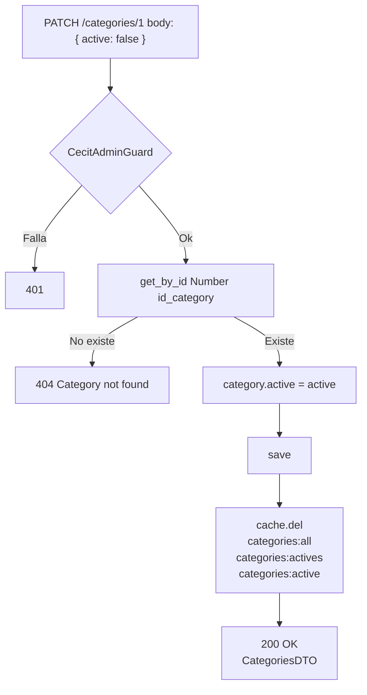
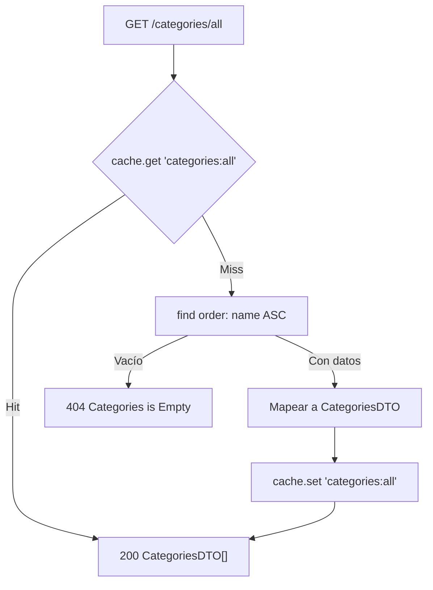

# Endpoints - Categorías

En este archivo se detalla el funcionamiento interno de cada endpoint relacionado a las categorías de la plataforma.

Las categorías clasifican a los **negocios**, no a los beneficios. Un beneficio
pertenece a un partner, y hereda las categorías de ese partner. Este acoplamiento
tiene una consecuencia importante, documentada en
[Exclusión de beneficios](#exclusión-de-beneficios).

---

## `POST /categories/create`

Protegido con `@UseGuards(AuthGuard('jwt'), CecitAdminGuard)`. Crea una nueva
categoría.

### Parámetros de entrada

> `CategoriesDTO` no lleva decoradores de validación: el `ValidationPipe` la
> acepta sin comprobar nada.

| Campo | Tipo | Descripción |
|-------|------|-------------|
| `name` | String | Nombre de la categoría. |
| `icon_url` | String | URL del ícono representativo. |
| `active` | Boolean (opcional) | Si se omite, aplica el default `true` de la base. |

### Lógica de negocio

1. `repo.create(data)`.
2. Se guarda. Si falla, `500 Error creating category`.
3. Se invalida **solo** la cache `categories:all` con `cache.del()`.
4. Se responde con `CategoriesMapper.toDTO(entity)`.

> ⚠️ La invalidación **no borra** la clave `categories:actives` (ni
> `categories:active`). Crear una categoría nueva no afecta el listado de
> activas, así que acá no se nota, pero es una inconsistencia latente.

### Errores

| Código | Mensaje |
|--------|---------|
| `401` | `Admin access required` |
| `500` | `Error creating category` |

### Respuesta

```json
{
  "id_category": 6,
  "name": "Gastronomía",
  "icon_url": "https://example.com/icons/gastronomia.png",
  "active": true
}
```

> `id_category` se agregó al DTO en este rango. Antes la respuesta no incluía el
> ID, lo que impedía activar/desactivar la categoría recién creada.

---

## `PATCH /categories/:id_category`

Protegido con `@UseGuards(AuthGuard('jwt'), CecitAdminGuard)`. Activa o desactiva
una categoría. Agregado en el commit `049e005` como parte del **panel de
administración de categorías**.

### Parámetros de entrada

| Campo | Tipo | Origen | Validación |
|-------|------|--------|------------|
| `id_category` | String | URL param | Se convierte con `Number(...)`. Sin validación. |
| `active` | Boolean | Body | `@Body('active')` — un único campo, sin DTO ni decoradores. |

```typescript
@Patch(':id_category')
@UseGuards(AuthGuard('jwt'), CecitAdminGuard)
async toggle(@Param('id_category') id_category: string, @Body('active') active: boolean) {
    const updated = await this.categoriesService.toggleActive(Number(id_category), active);
    return CategoriesMapper.toDTO(updated);
}
```

### Flujo del proceso



### Lógica de negocio

1. Se busca la categoría. Si no existe, `404 Category not found`.
2. Se asigna `category.active = active`.
3. Se guarda.
4. Se invalidan **las tres** claves de cache: `categories:all`, `categories:actives` y `categories:active`.
5. El controlador mapea el resultado con `CategoriesMapper.toDTO()`.

### Errores

| Código | Mensaje |
|--------|---------|
| `401` | `Admin access required` |
| `404` | `Category not found` |

### Respuesta

```json
{
  "id_category": 1,
  "name": "Gastronomía",
  "icon_url": "https://example.com/icons/gastronomia.png",
  "active": false
}
```

> La forma es idéntica a la de `POST /categories/create`: **ambos** pasan por
> `CategoriesMapper.toDTO()`. La única diferencia observable es que `create` usa
> el `create()` del servicio y este usa `toggleActive()`.

---

## `GET /categories/all`

Obtiene todas las categorías registradas, incluidas las inactivas.

### Parámetros de entrada

Ninguno.

### Flujo del proceso



### Lógica de negocio

1. Se busca la clave `categories:all` en la cache.
2. Si hay hit, se devuelve.
3. Si hay miss, `find({ order: { name: 'ASC' } })` — el orden por nombre se agregó en `576212b`. Si no hay nada, `404 Categories is Empty`.
4. Se mapea con `CategoriesMapper.toDTO()` y se cachea.

### Respuesta

```json
[
  {
    "id_category": 3,
    "name": "Deportes",
    "icon_url": "https://example.com/icons/deportes.png",
    "active": true
  },
  {
    "id_category": 4,
    "name": "Educación",
    "icon_url": "https://example.com/icons/educacion.png",
    "active": false
  }
]
```

---

## `GET /categories/actives`

Solo las categorías con `active = true`. Agregado en el commit `d1224db`.

### Parámetros de entrada

Ninguno.

### Lógica de negocio

Idéntica a `/categories/all`, con dos diferencias:

1. El `find` incluye `where: { active: true }`.
2. Cachea bajo la clave `categories:actives`.

### Respuesta

```json
[
  { "id_category": 3, "name": "Deportes", "icon_url": "https://...", "active": true }
]
```

### Defecto de cache

```typescript
async findActives(): Promise<CategoriesDTO[]> {
    const cached = await this.cache.get<CategoriesDTO[]>('categories:actives');
    if (cached) return cached;

    const rows = await this.repo.find({ where: { active: true }, order: { name: 'ASC' } });
    if (!rows?.length) throw new NotFoundException('Categories is Empty');
    const mapped = rows.map(c => CategoriesMapper.toDTO(c));

    await this.cache.set('categories:active', mapped);   // <-- clave distinta
    return mapped;
}
```

> **La clave de escritura y la de lectura no coinciden**: lee
> `categories:actives` pero escribe `categories:active`. Esta cache **nunca
> nunca acierta** y nunca se lee. El único efecto es dejar entradas basura en el cache
> hasta que expiren (60 s).
>
> `toggleActive()` borra las tres claves, así que ambas grafías se limpian igual
> cuando se activa o desactiva algo. El problema es el rendimiento: cada llamada
> a `/categories/actives` vuelve a pegarle a la base.

---

## Exclusión de beneficios

Este es el efecto funcional más importante de las categorías.

`BenefitsService` tiene dos helpers privados que aplican este filtro:

```typescript
where: {
    status: BenefitStatus.ACTIVE,
    partner: { categories: { active: true } },
    start_date: LessThan(today),
    end_date: MoreThan(today),
}
```

El término `partner: { categories: { active: true } }` se aplica **en el `WHERE`
del join**, no como post-filtro. Consecuencias:

| Acción | Efecto inmediato |
|--------|------------------|
| Desactivar la última categoría activa de un partner | **Todos** sus beneficios desaparecen de `/benefits/actives`, `/popular`, `/news`, `/search` y `/partner` |
| Los vouchers de esos beneficios | Desaparecen de `GET /vouchers/byaccount` (el `getMappedByIds` no los encuentra) |
| La emisión de nuevos vouchers | `404 Benefit not found` en `POST /vouchers/create` |
| Los vouchers ya emitidos | Siguen existiendo, pero el comercio no puede verlos en `/redeemed` si tampoco puede ver el beneficio |

> No hay ninguna forma de **reactivar** automáticamente: `toggleActive()` es
> manual y no queda registro de qué beneficios se ocultaron.

Ver [`benefits.md`](./benefits.md).

---

## Servicio `CategoriesService`

| Método | Descripción |
|--------|-------------|
| `create(data)` | `save`; `500 Error creating category`; `cache.del('categories:all')` **únicamente**. |
| `findAll()` | Cacheado. Sin filtro. `order: { name: 'ASC' }`. `404 Categories is Empty`. |
| `findActives()` | Cacheado. `where: { active: true }`, `order: { name: 'ASC' }`. `404 Categories is Empty`. **Defecto de clave.** |
| `get_by_id(id_category)` | `400 Id is required` / `404 Category not found`. |
| `toggleActive(id_category, active)` | **Nuevo.** Actualiza `active` e invalida las tres claves de cache. |

---

## Entidad `CategoriesEntity`

`@Entity('Categories')`

| Campo | Columna | Tipo | Null | Default | Notas |
|-------|---------|------|------|---------|-------|
| `id_category` | `id_category` | `int` | no | AI | `@PrimaryGeneratedColumn` |
| `name` | `name` | `varchar(50)` | no | — | |
| `icon_url` | `icon_url` | `varchar(255)` | no | — | |
| `active` | `active` | `boolean` | no | `true` | |

### Relaciones

| Propiedad | Tipo | Destino | Notas |
|-----------|------|---------|-------|
| `partners` | `@ManyToMany` | `PartnersEntity` | Lado **inverso** (no lleva `@JoinTable`). Tabla `Partners_Categories`. |

> Era `@OneToMany(() => PartnersCategoriesEntity)`. La entidad intermedia se
> eliminó en `5d881c8`.

### Cache — tabla de claves

| Clave | Contenido | TTL | Se limpia en |
|-------|-----------|-----|--------------|
| `categories:all` | Todas las categorías ordenadas por nombre | 60 s | `create()`, `toggleActive()` |
| `categories:actives` | Solo las activas | — | `toggleActive()` |
| `categories:active` | **Gracia de la que se lee `categories:actives` pero se escribe `categories:active`. Nunca se lee.** | 60 s | `toggleActive()` |

---

## DTOs

### `CategoriesDTO`

Es una `class` **sin decoradores**, así que el `ValidationPipe` la acepta sin
comprobar nada:

```typescript
export class CategoriesDTO {
    id_category?: number;   // agregado en este rango
    name: string;
    icon_url: string;
    active?: boolean;
}
```

### `CategoriesMapper.toDTO(category)`

```typescript
return {
    id_category: category.id_category,
    name: category.name,
    icon_url: category.icon_url,
    active: category.active,
};
```

> El objeto tiene los mismos cuatro campos que `CategoriesDTO`, así que en la
> práctica la salida es indistinguible de un DTO restringido.

---

## Módulo `CategoriesModule`

```typescript
@Module({
    imports: [TypeOrmModule.forFeature([CategoriesEntity]), AccountsModule],
    controllers: [CategoriesController],
    providers: [CategoriesService],
    exports: [CategoriesService],
})
```

`AccountsModule` se importa pero no se usa (el guard vive en `auth/`).

---

## Tabla en DB

- `Categories`
- `Partners_Categories` (relación, propiedad de `PartnersEntity`)

---

Ver también:
- [`partners-categories.md`](./partners-categories.md) — asignar categorías a un negocio.
- [`benefits.md`](./benefits.md) — el filtro que excluye beneficios.
