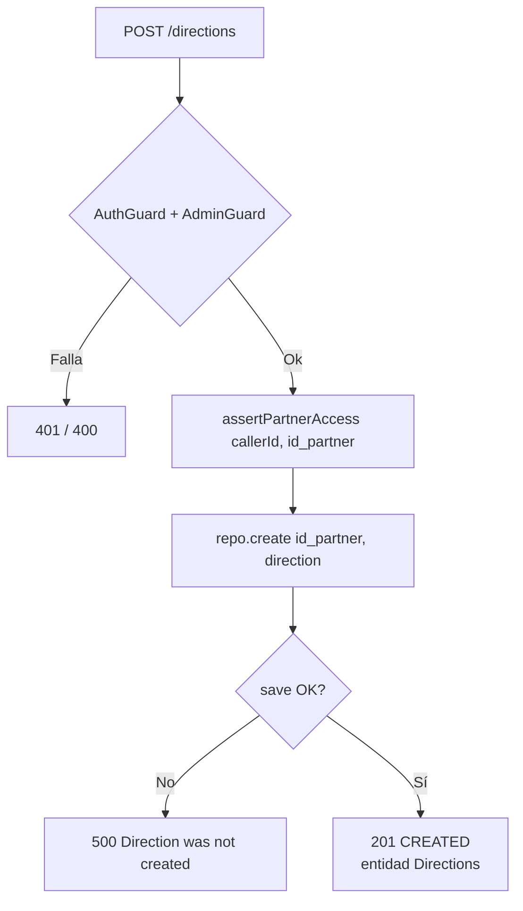
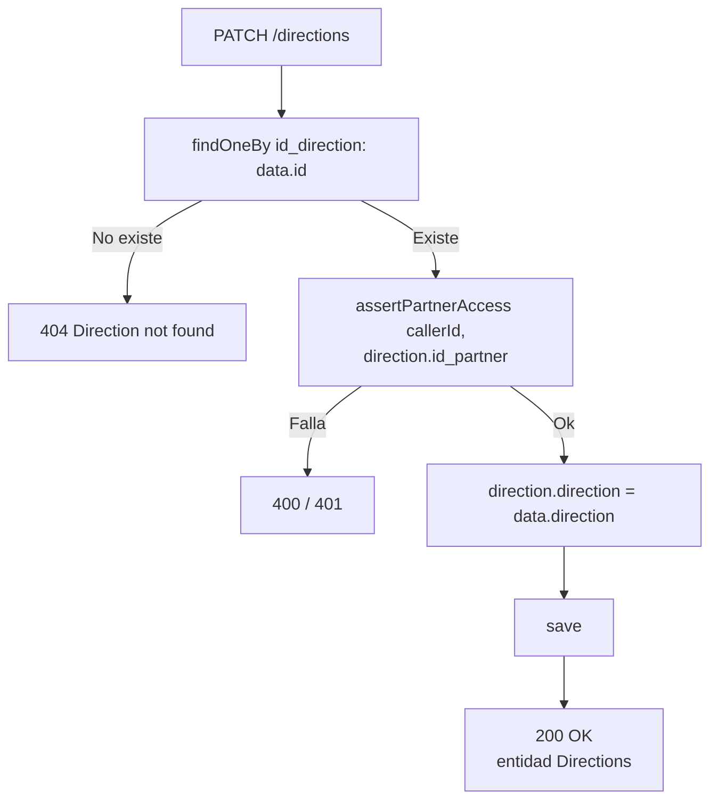
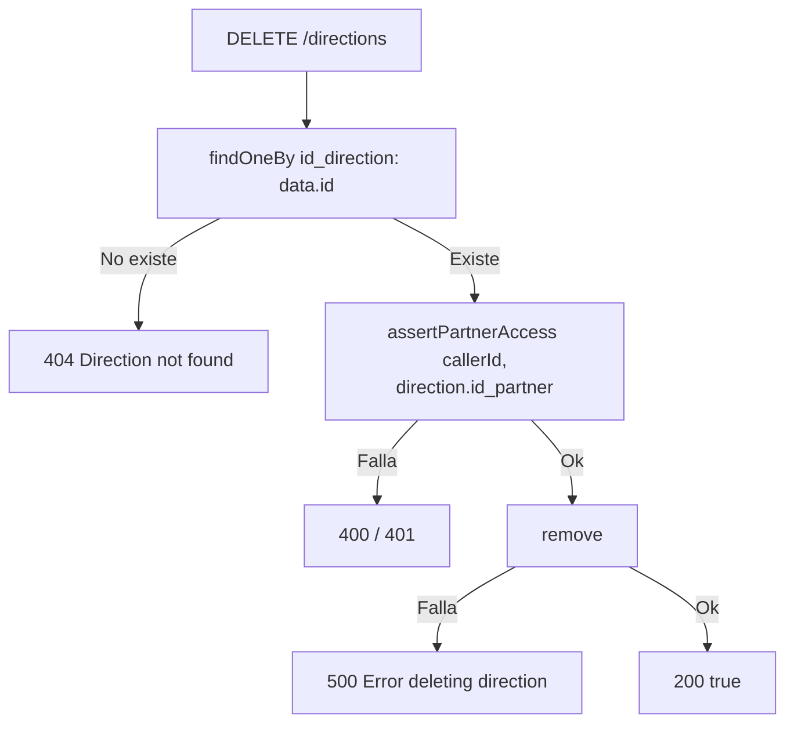

# Endpoints - Direcciones

En este archivo se detalla el funcionamiento interno de la entidad `Directions` y
sus endpoints. El módulo se creó en el rango documentado (commits `b1c0f71` y
`fb72ed1`).

Un partner pasó de tener **una** columna `direction` a tener **N** filas en
`Directions`. Esto affectó a:

- `PartnersEntity`: se eliminó la columna `direction` y se agregó la relación
  `OneToMany` a `Directions`.
- `PartnersDTO.direction: string` → `directions: string[]`.
- `PartnersService.create(dto)`: ya no guarda `direction`; ahora recibe un array
  `directions` y las inserta en bloque.
- `PdfService`: el PDF del voucher pasó de imprimir un `partner.direction` a
  imprimir todas las direcciones separadas por coma.
- `BenefitsReturn.direction: string` → `directions: string[]`.

---

## Autorización

`DirectionsService` tiene su propia copia de la verificación de acceso, idéntica
a la de `PartnersService`:

```typescript
private async assertPartnerAccess(callerId: string, id_partner: string) {
    if (!callerId)   throw new BadRequestException('Caller id is required');  // 400
    if (!id_partner) throw new BadRequestException('id is empty');            // 400

    const account = await this.accountsService.get_by_id(callerId);
    if (account.role === AccountRole.CECIT_ADMIN) return;   // bypass

    await this.partnersAdminsService.verify_admin(callerId, id_partner);  // 401
}
```

**Los tres endpoints están protegidos con `@UseGuards(AuthGuard('jwt'), AdminGuard)`**
y reciben el `callerId` desde `req.user?.user_id`.

> `createMany()` es la **única excepción**: no verifica acceso, porque es de uso
> interno del alta de partners.

---

## `POST /directions`

Crea una dirección para un partner.

### Parámetros de entrada

| Campo | Tipo | Validación | Descripción |
|-------|------|------------|-------------|
| `id_partner` | String | `@IsNotEmpty() @IsString()` | Negocio al que pertenece |
| `direction` | String | `@IsNotEmpty() @IsString()` | Texto de la dirección |

### Flujo del proceso



### Lógica de negocio

1. Se verifica el acceso del admin al partner.
2. Se crea y guarda la entidad con los datos del body.
3. Se responde la entidad completa.

> La dirección **no registra quién la creó**: el body solo trae `id_partner` y
> `direction`, y no hay columna de autor.

### Errores

| Código | Mensaje |
|--------|---------|
| `400` | `Caller id is required` / `id is empty` |
| `401` | `User is not admin` / `User is not admin of this partner` |
| `500` | `Direction was not created` |

### Respuesta

```json
{
  "id_direction": 7,
  "id_partner": "P001",
  "direction": "Av. Mitre 1450, Córdoba"
}
```

---

## `PATCH /directions`

Actualiza el texto de una dirección.

### Parámetros de entrada

| Campo | Tipo | Validación | Descripción |
|-------|------|------------|-------------|
| `id` | Number | `@IsNotEmpty()` | **`id_direction`** de la fila a actualizar |
| `direction` | String | `@IsNotEmpty() @IsString()` | Nuevo texto |

> El campo se llama `id` en el DTO pero corresponde a `Directions.id_direction`.

### Flujo del proceso



### Lógica de negocio

La fila se carga **primero** y la autorización se hace contra el
`id_partner` **de esa misma fila**, no contra un campo del body. Así un admin no
puede mover una dirección de un negocio a otro.

### Errores

| Código | Mensaje |
|--------|---------|
| `400` | `Caller id is required` / `id is empty` |
| `401` | Del `verify_admin` |
| `404` | `Direction not found` |

### Respuesta

```json
{ "id_direction": 7, "id_partner": "P001", "direction": "Av. Mitre 1455, Córdoba" }
```

---

## `DELETE /directions`

Elimina una dirección.

### Parámetros de entrada

| Campo | Tipo | Origen | Validación |
|-------|------|--------|------------|
| `id` | Number | **Body** | `@IsNotEmpty()` |

> El id va en el **body de un DELETE**, no en params.

### Flujo del proceso



### Errores

| Código | Mensaje |
|--------|---------|
| `400` | `Caller id is required` / `id is empty` |
| `401` | Del `verify_admin` |
| `404` | `Direction not found` |
| `500` | `Error deleting direction` |

### Respuesta

```json
true
```

> ⚠️ `DirectionsDeleteDTO` usa solo `@IsNotEmpty()`, sin `@IsInt()` ni
> `@Type(() => Number)`. Un `id` no numérico pasa la validación y TypeORM hace
> el match de forma laxa.

---

## Servicio `DirectionsService`

| Método | Descripción |
|--------|-------------|
| `create(data, callerId)` | Verifica acceso y crea. `500 Direction was not created`. |
| `createMany(id_partner, directions[])` | Inserción en bloque. **Sin verificación de acceso** (uso interno de `PartnersService.create`). Devuelve `[]` si el array está vacío. |
| `findByPartner(id_partner)` | `400 id is empty`; devuelve `Directions[]`. La usa `GET /partners/locations`. |
| `update(data, callerId)` | Carga por `id_direction`, verifica acceso contra el `id_partner` de la fila, actualiza. `404 Direction not found`. |
| `remove(data, callerId)` | Igual, pero borra. `404` / `500 Error deleting direction`. |

### Dependencias

`Directions` repository, `forwardRef(AccountsService)`,
`forwardRef(PartnersAdminsService)`.

---

## Entidad `Directions`

`@Entity('Directions')`

| Campo | Columna | Tipo | Null | Notas |
|-------|---------|------|------|-------|
| `id_direction` | `id_direction` | `int` | no | `@PrimaryGeneratedColumn` — **AUTO_INCREMENT** |
| `id_partner` | `id_partner` | `varchar(4)` | no | FK al partner |
| `direction` | `direction` | `varchar(150)` | no | |

### Relaciones

| Propiedad | Tipo | Destino | Join |
|-----------|------|---------|------|
| `partner` | `@ManyToOne` | `PartnersEntity` | `@JoinColumn({ name: 'id_partner', referencedColumnName: 'id_partner' })`, `nullable: false` |

El lado inverso es `PartnersEntity.directions` (`@OneToMany`).

Sin lifecycle hooks.

### Evolución de la PK

La tabla se creó con `id_partner` como PK (lo que solo permitía **una** dirección
por partner). La migración `1788211952494-directions-id.ts` la cambió a un
`id` AUTO_INCREMENT para permitir varias. Dos migraciones posteriores
(`1788216129258` y `1788216335821`) hacen más churn de PK y convergen en
`id_direction`.

> Las migraciones `1788216335821-all-db.ts` contienen **dos columnas
> AUTO_INCREMENT** y sentencias duplicadas; esa migración parece medio generada.
> Ver [`future.md`](./future.md).

### Desalineación entidad ↔ base

Las migraciones crean un índice llamado `id_partner` sobre `Directions` que la
entidad **no declara**.

---

## Módulo `DirectionsModule`

```typescript
@Module({
    imports: [
        TypeOrmModule.forFeature([Directions]),
        forwardRef(() => PartnersAdminsModule),
        AccountsModule,
    ],
    controllers: [DirectionsController],
    providers: [DirectionsService, AdminGuard],
    exports: [DirectionsService],
})
```

- `AdminGuard` se registra como provider local para evitar dependencia circular.
- Lo importa `PartnersModule`, **no** `AppModule` directamente.
- Exporta `DirectionsService`, que consume `PartnersService`.

---

## Tabla en DB

- `Directions` (`id_direction`, `id_partner`, `direction`)

## Endpoints de conveniencia

Los mismos datos están expuestos, mapeados, desde `PartnersController`:

| Endpoint | Descripción |
|----------|-------------|
| `GET /partners/locations?id_partner=` | Lista las direcciones con `id_location` en lugar de `id_direction` |
| `POST /partners/locations` | Agrega una dirección, devuelve `true` |

Ver [`partners.md`](./partners.md).
