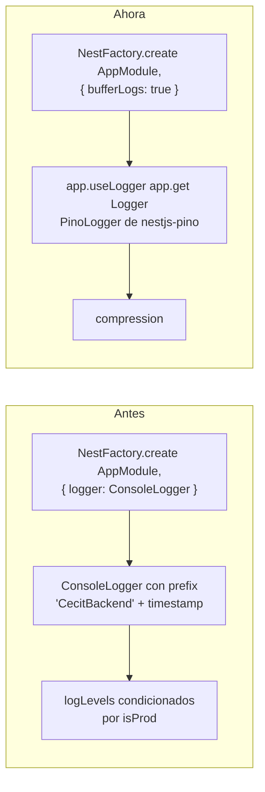
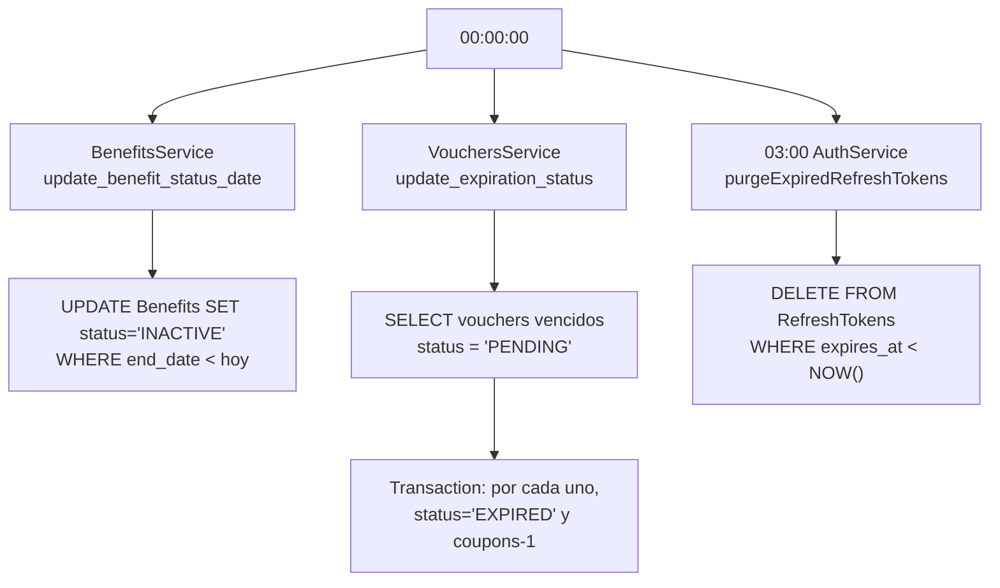

# Infraestructura

En este archivo se detalla la configuración transversal de la aplicación: el
bootstrap, el logging, las tareas programadas, el pool de base de datos, el
túnel SSH y las migraciones.

---

## Bootstrap — `src/main.ts`

| Aspecto | Valor |
|---------|-------|
| Prefijo global de rutas | **Ninguno** — no hay `setGlobalPrefix` |
| Versionado | Ninguno |
| Pipes | `new ValidationPipe({ transform: true })` |
| Guards globales | Ninguno en `main.ts`; `ThrottlerGuard` se registra vía `APP_GUARD` en `app.module.ts` |
| Interceptores | Ninguno en `main.ts`; `NoTransformInterceptor` vía `APP_INTERCEPTOR` |
| Filtros de excepción | **Ninguno** — no hay `APP_FILTER` ni `ExceptionFilter` |
| CORS | `origin: process.env.FRONT_URL`, `credentials: true`, métodos `GET,POST,PUT,PATCH,DELETE,OPTIONS`, headers `Content-Type,Authorization` |
| Cookies | `cookieParser(process.env.COOKIE_KEY)` |
| Compresión | `app.use(compression())` — **nuevo** |
| Puerto | `process.env.PORT ?? 3000` |

### Cambios en este rango



1. **Logging estructurado** (commit `1bd9519`): el `ConsoleLogger` del framework
   fue reemplazado por `nestjs-pino`. Se usa `bufferLogs: true` para no perder
   los logs del arranque, y después `app.useLogger(app.get(Logger))`.
2. **Compresión gzip** (commit `e84ffd0`).
3. `isProd` quedó **sin uso**: se declaraba para condicionar los `logLevels` del
   `ConsoleLogger`, que ya no existe. Es código muerto a borrar.

### Ausencia de prefijo

Todas las rutas son absolutas. `GET /benefits/all`, no
`GET /api/benefits/all`. Todos los documentos de `docs/` usan paths absolutos.

### `NoTransformInterceptor`

`src/common/no-transform.interceptor.ts` setea el header
`Cache-Control: no-transform` en todas las respuestas vía `tap()`. Previene que
proxies intermedios transformen los cuerpos (en particular el PDF en base64).

---

## Logging — `src/logger/` (nuevo)

Dos archivos nuevos en el commit `1bd9519`: `logger.config.ts` y
`logger.module.ts`.

### `LoggerModule`

```typescript
@Global()
@Module({
    imports: [PinoLoggerModule.forRoot(createLoggerConfig())],
    exports: [PinoLoggerModule],
})
export class LoggerModule {}
```

Es `@Global()`, así que `PinoLogger` se puede inyectar en cualquier servicio
sin re-importar el módulo.

### `createLoggerConfig()`

| Opción | Valor | Propósito |
|--------|-------|-----------|
| `level` | `process.env.LOG_LEVEL ?? 'debug'` | **Única** variable de entorno del logger |
| `genReqId` | `req.headers['x-request-id']?.toString() ?? randomUUID()` | ID de correlación; respeta un `x-request-id` entrante |
| `quietReqLogger` | `true` | Suprime las líneas automáticas de request recibido |
| `quietResLogger` | `true` | Suprime las líneas automáticas de respuesta |
| `customAttributeKeys` | `reqId → request_id`, `responseTime → response_time` | Renombra campos de pino |
| `customSuccessMessage` | `` `${req.method} ${req.url}` `` | |
| `customErrorMessage` | `` `${req.method} ${req.url} ${error.message}` `` | |
| `redact.paths` | `req.headers.authorization`, `req.headers.cookie`, `req.body.password`, `req.body.refreshToken`, `req.body.accessToken`, `password`, `refreshToken`, `accessToken` | Censura a `[REDACTED]` |
| `transport.target` | `pino-pretty` | Pretty printer |
| `transport.options` | `colorize: true`, `singleLine: true`, `translateTime: 'yyyy-mm-dd HH:MM:ss.l'`, `messageFormat: '[ {context} ] {msg} request_id={request_id} response_time={response_time}'`, `ignore: 'pid,hostname,res,request_id,response_time'` | Una línea, coloreada, con el contexto de Nest |

### Lo que el logger **no** hace

1. **No hay rama de producción.** La config es idéntica en dev y prod:
   - `pino-pretty` está **siempre** activo. No hay modo JSON a stdout para
     producción.
   - El level es `debug` en ambos casos salvo que se fije `LOG_LEVEL`.
2. **Sin transporte a archivo ni rotación.** Todo va a stdout; la agregación
   queda en el runtime.
3. **`pino-pretty` es una `devDependency`** (`^13.1.3`) pero se usa en el camino
   de producción. Si se despliega con `--omit=dev`, el arranque falla.

### Consumo

`PinoLogger` se inyecta en:

| Servicio | Uso |
|----------|-----|
| `auth.service.ts` | Log del email validado en cada login (nivel `debug`) |
| `benefits.service.ts` | Un solo `logger.debug(q)` en `search()`. No loguea errores del alta |
| `vouchers.service.ts` | `logger.info('Creating voucher for benefit X')` |
| `pdf.service.ts` | `logger.warn('PDF warmup failed: ...')`, `logger.debug('Could not load image ...')` |
| `ssh-tunnel.service.ts` | `setContext(SshTunnelService.name)`, y usa `logger.info` / `logger.debug` |

> El log de `auth.service.ts` emite el email del usuario en cada login. Con
> `LOG_LEVEL` sin fijar (default `debug`), eso va a stdout en producción. Conviene
> subir el level o anonimizar.

### Formato de salida

```
[ VouchersService ] Creating voucher for benefit B001 request_id=3f2a... response_time=12
```

---

## Tareas programadas — `@nestjs/schedule` (nuevo)

`ScheduleModule.forRoot()` se agregó a `app.module.ts` (commit `73d829e`).

| Ubicación | Cron | Acción |
|-----------|------|--------|
| `auth.service.ts` | `CronExpression.EVERY_DAY_AT_3AM` | `DELETE FROM RefreshTokens WHERE expires_at < NOW()` |
| `benefits.service.ts` | `'0 0 * * *'` | `UPDATE Benefits SET status = 'INACTIVE' WHERE end_date < CURDATE()` |
| `vouchers.service.ts` | `'0 0 * * *'` | Transacción: marca `EXPIRED` los vouchers vencidos y devuelve el cupón al beneficio |

### Diagrama de la medianoche



### Problemas

1. **Los dos jobs de medianoche chocan exactamente** en `00:00:00.000`. No hay
   jitter ni `CronExpression` que los separe. Convendría escalonar (`'5 0 * * *'`
   y `'10 0 * * *'`).
2. **No existe el job inverso** que reactive beneficios cuya `start_date` ya
   llegó. Combinado con la regla de alta (`start_date > hoy → INACTIVE`), esos
   beneficios quedan invisibles e incanjables hasta que alguien llame
   manualmente a `PATCH /benefits/activate`.
3. El job de vouchers filtra por `status = PENDING` y lee los candidatos con
   `vouchersRepository` fuera de la transacción, mientras que los `UPDATE` usan
   `manager`: un canje concurrente no queda protegido. Ver
   [`vouchers.md`](./vouchers.md).
4. `purgeExpiredRefreshTokens` corre a las 3 AM, pero `logout` y `refresh`
   invalidan tokens por su cuenta. El job es solo limpieza de huérfanos.

---

## Pool de base de datos

`TypeOrmModule.forRootAsync()` en `app.module.ts` (commits `5fc925e`, `1bd9519`).

```typescript
useFactory: async (ssh: SshTunnelService) => {
    await ssh.createTunnel();   // abre el túnel salvo DB_MODE=local

    return {
        type: 'mariadb',
        host: process.env.DB_HOST,
        port: Number(process.env.DB_PORT) || 3307,
        username: process.env.DB_USER,
        password: process.env.DB_PASSWORD,
        database: process.env.DB_NAME,
        autoLoadEntities: true,
        synchronize: false,                                  // solo migraciones
        poolSize: Number(process.env.DB_POOL_SIZE) || 10,     // nuevo
        connectTimeout: 10000,                               // nuevo
        extra: {
            waitForConnections: true,
            queueLimit: 0,                                    // cola ilimitada
            connectTimeout: 10000,
            enableKeepAlive: true,                            // nuevo
            keepAliveInitialDelay: 10000,                     // nuevo
        },
    };
}
```

### Motivación

Los comentarios del código explican el sentido: *"Pool persistente: reutiliza
conexiones y evita el costo de handshake (peor a través del túnel SSH)"* y
*"TCP keepalive: evita que NAT/firewalls o el propio túnel cierren conexiones
idle del pool"*.

| Opción | Efecto |
|--------|--------|
| `poolSize` | 10 conexiones por defecto, configurable con `DB_POOL_SIZE`. Antes era el default del driver. |
| `queueLimit: 0` | Cola de espera **ilimitada**: si se agotan las 10 conexiones, las requests esperan en vez de fallar. |
| `enableKeepAlive` + `keepAliveInitialDelay` | Los NAT y firewalls de los intermediarios (y el propio túnel SSH) no cierran conexiones ociosas. |
| `connectTimeout: 10000` | Falla rápido en vez de colgar. |
| `synchronize: false` | El esquema lo gobiernan las migraciones, nunca las entidades. |

---

## Túnel SSH — `src/ssh/ssh-tunnel.service.ts`

El servicio reenvía un puerto TCP local al MariaDB remoto. En producción la base
no está expuesta: el backend abre el túnel.

### Bypass para base local

```typescript
if (process.env.DB_MODE === 'local') {
    this.logger.info('DB_HOST is localhost, skipping SSH tunnel (local database)');
    this.ready = true;
    return;
}
```

Con `DB_MODE=local` (el valor que hay que fijar en `.env.development` para
desarrollar contra el compose, ya que el archivo trae `server`) se conecta
directo al `mariadb` del compose, sin tocar SSH.

### Keepalive y manejo de errores

| Cambio | Detalle |
|--------|---------|
| Keepalive por socket | `socket.setKeepAlive(true, 60000)` en el callback de `net.createServer` — *"las conexiones idle del pool no mueren por timeouts intermedios"* |
| Handler de error del socket | `socket.on('error', ...)` → `logger.debug` + `socket.destroy()`. Antes el error no se manejaba y podía tumbar el proceso. |
| Handler de error del stream | `stream.on('error', ...)` → `logger.debug` + `socket.destroy()` |
| Keepalive a nivel SSH | `keepaliveInterval: 10000`, `keepaliveCountMax: 3`, `readyTimeout: 20000` — *"mantiene viva la conexión de control frente a NAT/firewalls con timeouts agresivos"* |
| Logging | `new Logger(...)` → `PinoLogger` inyectado con `setContext()`. `logger.log()` → `logger.info()` |

### Sin cambios

`ready` / `connection` / `server`, `port: 22` hardcodeado, host/username/password
del env, `listen(Number(process.env.DB_PORT), '127.0.0.1', ...)`, y
`scheduleReconnect()` con reintento cada 5 s.

### `DB_PORT` con doble uso

`DB_PORT` se usa **tanto** para el puerto remoto del MariaDB como para el puerto
local donde escucha el reenvío. Es un valor compartido entre
`ssh-tunnel.service.ts:61` y `app.module.ts:43`.

> Con `DB_MODE=local` el túnel se saltea, pero `app.module.ts` sigue usando
> `DB_PORT` para conectar. Funciona, pero el nombre del variable no refleja que
> cumple dos papeles distintos.

---

## Generación de IDs — `src/common/utils/id-generator.ts` (nuevo)

### Lo que se eliminó

El commit `08b7b86` borró `src/common/database/db.service.ts` y `db.module.ts`
(el directorio completo). `DbService` delegaba la generación de IDs a
**procedimientos almacenados de MariaDB**:

```typescript
// DbService.getNewId() - eliminado
const queryRunner = this.dataSource.createQueryRunner();
await queryRunner.connect();
await queryRunner.query('CALL get_new_id(?, ?, @new_id)', [table, col]);
const [row] = await queryRunner.query('SELECT @new_id AS id');
await queryRunner.release();
```

Es decir, un `QueryRunner` dedicado, un round-trip al servidor y una variable de
sesión MySQL por cada ID generado. Además, esos procedimientos
(`get_new_id`, `get_new_token`) vivían **fuera** de cualquier migración: eran
objetos de base de datos sin control de versiones.

### Lo que lo reemplaza

Dos funciones puras, sin Nest, sin DI, sin `DataSource`:

```typescript
function generateHex(length: number): string {
    return randomBytes(Math.ceil(length / 2)).toString('hex')
        .slice(0, length).toUpperCase();
}

export async function generateUniqueId<T>(repo: Repository<T>, columnName: string): Promise<string> {
    // genera 4 hex mayúsculas; SELECT COUNT mientras exista colisión
}

export async function generateUniqueToken<T>(repo: Repository<T>, columnName: string): Promise<string> {
    // idéntico, pero 6 hex mayúsculas
}
```

| Función | Longitud | Destino |
|---------|----------|---------|
| `generateUniqueId` | 4 chars hex mayúsculas | PKs `varchar(4)` |
| `generateUniqueToken` | 6 chars hex mayúsculas | `Vouchers.token varchar(6)` |

### Call sites

| Archivo | Repo | Columna |
|---------|------|---------|
| `benefits.service.ts` | `benefitsRepository` | `id_benefit` |
| `partners.service.ts` | `partnersRepo` | `id_partner` |
| `partnersadmins.service.ts` | `adminsRepo` | `id_account` |
| `users.service.ts` | `userRepository` | `id_user` |
| `vouchers.service.ts` | `vouchersRepository` | `token` |

### Trade-off

Se eliminó el round-trip al procedimiento almacenado, pero se introdujo un
`SELECT COUNT` por cada ID generado. El balance es favorable (una query local
contra dos round-trips remotos), pero hay dos puntos a tener en cuenta:

1. **No es seguro ante concurrencia.** No hay captura de violación de índice único
   ni retry: dos requests concurrentes pueden generar el mismo candidato y ambos
   pasar el `COUNT`. La PK unique lo haría fallar en el `INSERT`, sin reintento.
2. Con 4 caracteres hex hay solo 65.536 combinaciones. El bucle de reintento
   hace la probabilidad de colisión despreciable en volumen bajo, pero se
   degrada si el espacio de IDs se llena.

---

## Migraciones — `src/migration/`

Seis migraciones, todas MariaDB/InnoDB, registradas vía `data-source.ts` con
`migrations: [__dirname + "/src/migration/*{.ts,.js}"]` y `synchronize: false`.

| Archivo | Qué hace |
|---------|----------|
| `1782477643088-change-accounts-system.ts` | Esquema original completo. 12 tablas. Sin cambios en este rango (solo reindentado). |
| `1788211952493-all-db.ts` | Regeneración amplia. Crea `Users` directamente con `lastname` (el `last_name` → `lastname` queda en `1788216129258`); `Accounts.password` a `varchar(255)`; `Accounts.role` de `enum('0','1','2')` a `enum('USER','CECIT_ADMIN','PARTNER_ADMIN')`; `RefreshTokens` gana `email`; `Partners` gana `id_owner` y se crea **sin** `direction`, que vuelve a agregar mediante un `ALTER TABLE` dentro del mismo `up()`; `Benefits` gana `max_per_user`; `Vouchers` gana `limit_date` y el estado `REJECTED`; `Directions` **nueva** (con `id_partner` como PK). |
| `1788211952494-directions-id.ts` | Cambia la PK de `Directions` de `id_partner` a `id` AUTO_INCREMENT, para permitir varias direcciones por partner. |
| `1788216129258-all-db.ts` | Migración incremental grande: alinea columnas, índices, FKs y tipos con las entidades. |
| `1788216335821-all-db.ts` | **Casi duplicada de la anterior** (~95 % idéntica), con el churn de PK de `Directions` repetido y algunas sentencias aplicadas dos veces en el mismo `up()`. **Parece medio generada.** |
| `1788300000000-benefits-datetime.ts` | `Benefits.start_date` y `end_date`: `date` → `datetime`. Permite definir la hora del día de la vigencia. |

### Orden de ejecución

Las tres migraciones `all-db` coexisten y se aplican en orden. La segunda
(`1788216129258`) renombra `Partners_Admins.id_account` a `id_user`, en dirección
contraria a lo que espera la entidad. Sobre `Partners.direction` en cambio no hay
reversión: `1788211952493` la crea y la vuelve a agregar en su propio `up()`,
y ninguna migración posterior la elimina. El esquema resultante depende de la
secuencia exacta.

### Desalineación entidad ↔ base

Con `synchronize: false`, nada auto-corrige las diferencias. Estas son las que
existen hoy:

| Cambio en la entidad | Migración |
|----------------------|-----------|
| `Accounts.id_user` → **`id_account`** | ❌ Ninguna. Las migraciones hacen lo contrario en `Partners_Admins` |
| `Accounts.last_activity` eliminada | ❌ Ninguna. La columna sigue en la base |
| `Vouchers.id_user` → **`id_account`** | ❌ Ninguna |
| `Partners.direction` eliminada | ❌ Ninguna. La columna sigue, y `1788211952493` la vuelve a agregar |
| `Partners.logo` 255 → 2048 | ❌ Ninguna |
| `Benefits.image` 500 → 2048 | ❌ Ninguna |
| `Benefits.refund_limit` agregada | ❌ Ninguna |
| Tabla `Employees` (ManyToMany de empleados) | ❌ Ninguna. No existe |
| `Users.dni` 8 → 11 | ❌ Ninguna |
| `RefreshTokens` → PK `binary(32)`, sin `id_token` | ❌ Ninguna |
| `Directions.id_direction` | ⚠️ Parcial, con churn entre las 3 migraciones |

**Impacto:** una base creada únicamente con `npm run migration:run` no coincide
con el esquema que espera el código.

---

## Variables de entorno

Archivo único: `.env.development` (los demás están gitignored; **no hay
`.env.example` ni `.env` versionado**).

| Variable | Dónde | Propósito | Default |
|----------|-------|-----------|---------|
| `PORT` | `main.ts:24` | Puerto HTTP | `3000` |
| `FRONT_URL` | `main.ts:18` | Origin de CORS, y base de las imágenes del PDF | — |
| `COOKIE_KEY` | `main.ts:23` | Secreto de `cookieParser` | — |
| `NODE_ENV` | `main.ts:8` | Se lee a `isProd` | **sin uso** |
| `LOG_LEVEL` | `logger.config.ts:7` | Nivel de pino | `debug` |
| `DB_MODE` | `ssh-tunnel.service.ts:18` | `local` saltea el túnel SSH | `server` |
| `DB_HOST` | `app.module.ts:42` | Host de MariaDB | — |
| `DB_PORT` | `app.module.ts:43`, `ssh-tunnel.service.ts:61` | **Doble uso**: puerto remoto y puerto local del reenvío | `3307` |
| `DB_USER` | `app.module.ts:44` | Usuario de MariaDB | — |
| `DB_PASSWORD` | `app.module.ts:45` | Contraseña de MariaDB | — |
| `DB_NAME` | `app.module.ts:46` | Nombre del schema | — |
| `DB_POOL_SIZE` | `app.module.ts:51` | **Nuevo.** Tamaño del pool | `10` |
| `SSH_HOST` | `ssh-tunnel.service.ts:78` | Host del jump | — |
| `SSH_USER` | `ssh-tunnel.service.ts:80` | Usuario SSH | — |
| `SSH_PASS` | `ssh-tunnel.service.ts:81` | Contraseña SSH (texto plano, sin soporte de claves) | — |
| `REFRESH_TOKEN_EXPIRES` | `auth.service.ts:42`, `refresh-token.entity.ts:39` | Vigencia del refresh token, **en días** | `7` |
| `JWT_SECRET` | `auth.module.ts:25`, `jwt.strategy.ts:13` | Secreto de firma | **`'secret'`** ⚠️ |
| `JWT_ACCESS_EXPIRATION` | `auth.module.ts:27` | TTL del access token | `'15m'` |

> `SSH_PORT` está en `.env.development` con valor `443` pero **el código nunca lo
> lee**: `ssh-tunnel.service.ts` tiene `port: 22` hardcodeado.

> `JWT_SECRET` cae a `'secret'` si no está definida. Es un default inseguro que
> nunca debería activarse en producción: cualquiera puede firmar tokens.

---

## Dependencias agregadas

### `dependencies`

| Paquete | Versión | Por qué |
|---------|---------|---------|
| `@nestjs/schedule` | `^12.0.1` | `ScheduleModule.forRoot()` + los 3 `@Cron` |
| `compression` | `^1.8.1` | Compresión gzip de las respuestas |
| `nestjs-pino` | `^5.2.1` | Logger de Pino integrado a Nest |
| `pino` | `^10.3.1` | Logger base |
| `pino-http` | `^11.0.0` | Logging de request/response |

### `devDependencies`

| Paquete | Versión | Por qué |
|---------|---------|---------|
| `@types/compression` | `^1.8.1` | Tipos |
| `pino-pretty` | `^13.1.3` | `transport.target` de `logger.config.ts` |

> ⚠️ `pino-pretty` es `devDependency` pero se usa incondicionalmente en el
> arranque. Un deploy con `--omit=dev` rompe.

**Los scripts de `package.json` no cambiaron.** No se agregaron scripts para
migraciones, seed ni compose.

---

## Base de datos local — `compose.yaml` (nuevo)

```yaml
services:
  mariadb:
    image: mariadb:latest
    container_name: localdb
    restart: unless-stopped
    environment:
      MARIADB_ROOT_PASSWORD: root
      MARIADB_DATABASE: mi_base
      MARIADB_USER: imdf
      MARIADB_PASSWORD: 1234
    ports:
      - "3306:3306"
    volumes:
      - mariadb-data:/var/lib/mysql
volumes:
  mariadb-data:
```

Un solo servicio, pensado para combinar con `DB_MODE=local` y saltear el túnel SSH.

| Observación | Detalle |
|-------------|---------|
| `image` sin fijar versión | `mariadb:latest` puede cambiar de comportamiento entre despliegues |
| Credenciales en el repo | `root` / `1234`. Valores de desarrollo, no secretos, pero conviene que lo sean explícitamente |
| Conflicto de DB name | El compose crea `mi_base`; `.env.development` apunta a `DB_NAME=cecit` y `DB_USER=cecit_user` |
| Sin healthcheck | La app puede intentar conectar antes de que MariaDB esté listo |

---

## Datos de prueba — `seed/` (nuevo)

13 CSV + `load_data.sql` + `load.sh`. Cargan datos demo en la base del compose.

### `load.sh`

```bash
DB_HOST=${DB_HOST:-localhost}  DB_PORT=${DB_PORT:-3306}
DB_NAME=${DB_NAME:-mi_base}   DB_USER=${DB_USER:-imdf}   DB_PASS=${DB_PASS:-1234}

cd "$(dirname "$0")/.."
MYSQL_PWD="$DB_PASS" mariadb --local-infile=1 -h "$DB_HOST" -P "$DB_PORT" \
    -u "$DB_USER" "$DB_NAME" < seed/load_data.sql
```

### `load_data.sql`

110 líneas. Envuelve todo en `SET FOREIGN_KEY_CHECKS = 0` … `= 1` y ejecuta 12
`LOAD DATA LOCAL INFILE` con:

```sql
FIELDS TERMINATED BY ',' OPTIONALLY ENCLOSED BY '"'
LINES TERMINATED BY '\n'
IGNORE 1 LINES
```

Los booleanos se cargan a una variable y se convierten con
`SET active = IF(@active = '1', TRUE, FALSE)`. `Vouchers.delivery_date` usa
`SET delivery_date = NULLIF(@delivery_date, '')`. Termina con un `SELECT`
de confirmación.

| Paso | CSV | Tabla | Columnas |
|------|-----|-------|----------|
| 1 | `01_users.csv` | `Users` | `id_user, name, last_name, dni` |
| 2 | `02_accounts.csv` | `Accounts` | `id_user, email, password, role, active` |
| 3 | `03_benefit_types.csv` | `BenefitTypes` | `id_type, name, active` |
| 4 | `04_categories.csv` | `Categories` | `id_category, name, icon_url, active` |
| 5 | `05_payment_methods.csv` | `PaymentMethods` | `id_payment_method, name, active` |
| 6 | `06_partners.csv` | `Partners` | `id_partner, name, logo, id_owner, active` |
| 7 | `07_directions.csv` | `Directions` | `id_partner, direction` (sin `id_direction`: es AI) |
| 8 | `08_benefits.csv` | `Benefits` | 14 columnas |
| 9 | `09_vouchers.csv` | `Vouchers` | `token, id_user, id_benefit, application_date, delivery_date, limit_date, status` |
| 10 | `11_payment_methods_benefits.csv` | `PaymentMethods_Benefits` | `id_payment_method, id_benefit` |
| 11 | `12_partners_admins.csv` | `Partners_Admins` | `id_account, id_partner` |
| 12 | `13_partners_categories.csv` | `Partners_Categories` | `id_partner, id_category` |

### Contenido

- **10 usuarios** `U001`–`U010`.
- **10 cuentas** con un **único hash argon2 compartido** (una misma password
  demo para todos). Roles: `U005` = `CECIT_ADMIN`; `U006`, `U007` =
  `PARTNER_ADMIN`; el resto `USER`.
- **5 partners** `P001`–`P005`; 4 tipos; 5 categorías; 5 métodos de pago.
- **5 direcciones** — una por partner. **No ejercita el 1:N**: ningún partner
  tiene más de una.
- **15 beneficios** `B001`–`B015`, con `B004`, `B008` y `B013` en `PENDING`.
- **10 vouchers** cubriendo los cuatro estados: 4 `DELIVERED`, 4 `PENDING`,
  1 `EXPIRED`, 1 `REJECTED`.
- **7 relaciones** partner-admin (dos partners con dos admins) y
  7 partner-categoría.

### Problemas del seed

1. **`02_accounts.csv` se carga corrupto.** Cada fila tiene **7 campos**, no 5:
   el hash argon2 (`$argon2id$v=19$m=65536,t=3,p=4$…`) contiene comas sin
   escapar. Como `load_data.sql` declara una lista explícita de 5 columnas, la
   carga desalinea todo: `role` recibe `t=3` y `active` recibe `p=4$...`.
   **Ninguna cuenta del seed queda con un rol válido**, lo que deja inútil el
   seed para probar guards y roles. Habría que envolver el hash entre comillas
   dobles (el `OPTIONALLY ENCLOSED BY '"'` ya está en la cláusula) o cambiar el
   separador.
2. **Las rutas de los CSV son absolutas y específicas de la máquina:**
   `/home/fede/work/cecit/cecit-backend/seed/01_users.csv`. El seed no es
   portable.
3. **`FOREIGN_KEY_CHECKS=0` deja referencias colgantes.** `08_benefits.csv`
   referencia partners `P006`–`P015`, que **no existen** en `06_partners.csv`
   (que solo tiene `P001`–`P005`). Esos 10 beneficios quedan apuntando a
   partners inexistentes.
4. **Los nombres de columna están desalineados con las entidades:**
   - `Users.last_name` vs `lastname` en la entidad.
   - `Accounts.id_user` vs `id_account`.
   - `Vouchers.id_user` vs `id_account`.
   - `12_partners_admins.csv` declara el header `id_user,id_partner` mientras
     `load_data.sql` pide `id_account, id_partner`.
5. **`10_refresh_tokens.csv` nunca se carga** — no hay paso en
   `load_data.sql` que lo referencie. Además su forma (`id_token`, `token_hash`
   hex) corresponde al esquema anterior al cambio a `binary(32)`.
6. **La tabla `Employees` no tiene seed**, así que la relación de empleados
   queda vacía.
7. **El nombre de la base no coincide:** `load.sh` apunta a `mi_base`/`imdf` y
   `.env.development` a `cecit`/`cecit_user`.
8. **`07_directions.csv` no ejercita el 1:N**: una sola dirección por partner,
   que es exactamente lo que la entidad nueva vino a reemplazar.

---

## Módulos registrados en `app.module.ts`

```typescript
@Global()                            // el módulo raíz también es global
@Module({
    imports: [
        ConfigModule.forRoot({ isGlobal: true, envFilePath: '.env.development' }),
        CacheModule.register({ isGlobal: true, ttl: 60000 }),
        ScheduleModule.forRoot(),              // nuevo
        SshTunnelModule,                       // debe preceder a TypeORM
        TypeOrmModule.forRootAsync(/* ... */),
        ThrottlerModule.forRoot({ throttlers: [{ ttl: 60000, limit: 20 }] }),
        CategoriesModule, UsersModule, BenefitsModule, BenefitTypeModule,
        VouchersModule, PartnersAdminsModule, PartnersCategoriesModule,
        PaymentMethodsModule, PaymentBenefitModule, AuthModule,
        PartnersModule, AccountsModule,
        LoggerModule,                          // nuevo
    ],
    controllers: [AppController],
    providers: [
        AppService,
        { provide: APP_GUARD, useClass: ThrottlerGuard },
        { provide: APP_INTERCEPTOR, useClass: NoTransformInterceptor },
    ],
})
```

- `AppModule` es `@Global()` y expone `GET /` a través de `AppController` /
  `AppService.getHello()`.
- `DirectionsModule` no está en la lista: lo importa `PartnersModule`.

> `envFilePath` está hardcodeado a `.env.development`. En producción el archivo
> tiene que existir con ese nombre, o el deploy falla.

### Rutas expuestas

`auth`, `benefits`, `categories`, `directions`, `partners`,
`partners-categories`, `partners-admins`, `payment-methods`, `payment-benefit`
(sin handlers), `users`, `vouchers`, `accounts`, `benefit-types`, y `GET /`.

---

## Rate limiting

```typescript
ThrottlerModule.forRoot({ throttlers: [{ ttl: 60000, limit: 20 }] })
// ThrottlerGuard registrado como APP_GUARD
```

**20 requests/minuto** para todo, incluidos los endpoints públicos de lectura.
`POST /auth/login` lo baja a 3/minuto con
`@Throttle({ default: { limit: 3, ttl: 60000 } })`.

> El límite global de 20/min es agresivo para un frontend que carga la home con
> varios listados en paralelo. Si aparecen `429` en desarrollo normal, es este
> número.

---

## Cache

```typescript
CacheModule.register({ isGlobal: true, ttl: 60000 })
```

Cache en memoria del proceso, TTL global de 60 s. Usada por:

| Consumer | Clave | Contenido |
|----------|-------|-----------|
| `PartnersAdminsService.verify_admin` | `admin-partner:<id>_<id_partner>` | `true` (solo positivos) |
| `CategoriesService.findAll` | `categories:all` | `CategoriesDTO[]` |
| `CategoriesService.findActives` | `categories:actives` (lee) / `categories:active` (escribe) | `CategoriesDTO[]` — **nunca acierta** |
| `CategoriesService.toggleActive` | borra las tres claves anteriores | |
| `BenefitTypeService.get_all` | `benefit-types:all` | `BenefitTypeDTO[]` (cacheado sin TTL explícito) |
| `PaymentMethodsService.getMethods` | `payment-methods:active` | `string[]` — **sin invalidación posible** |

Al ser in-memory, **no se comparte entre réplicas**: con más de una instancia,
cada una tiene su propia cache y su propio estado de la verificación de admin.

---

Ver también: [`future.md`](./future.md) — el listado consolidado de problemas.
