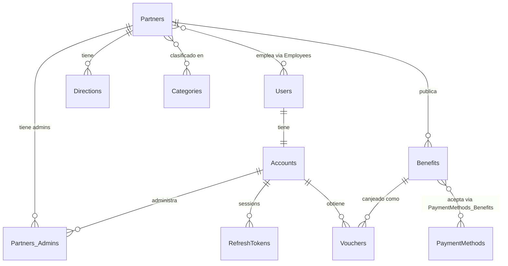
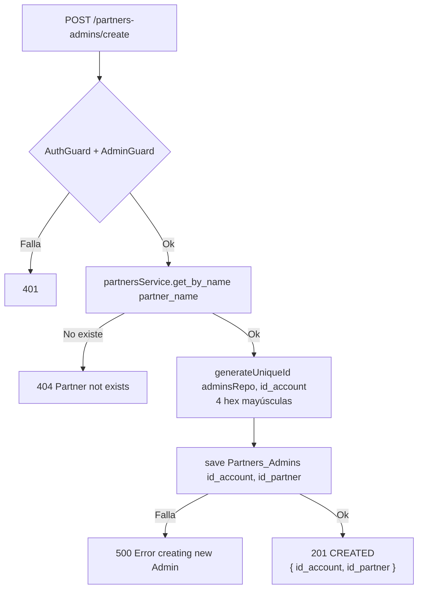
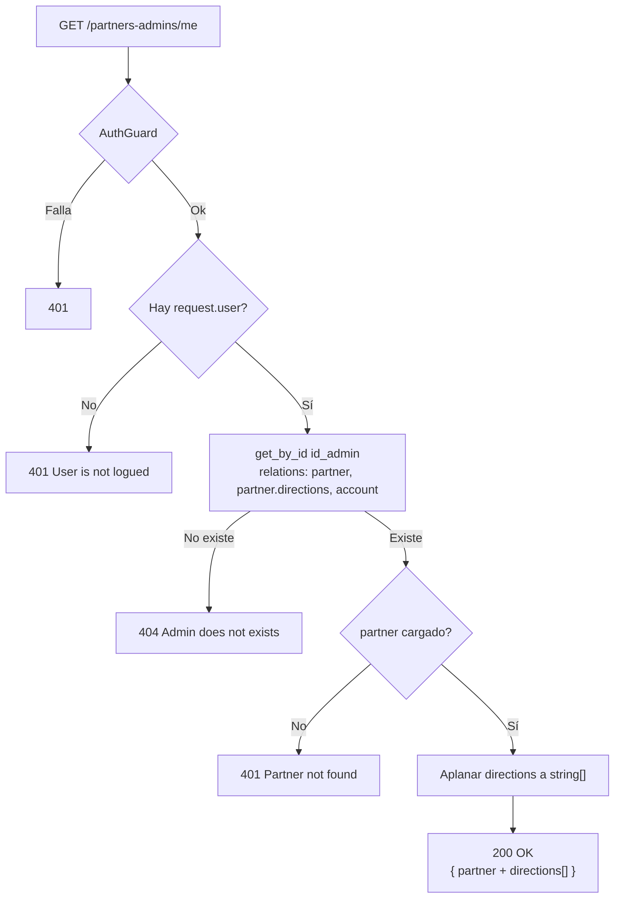
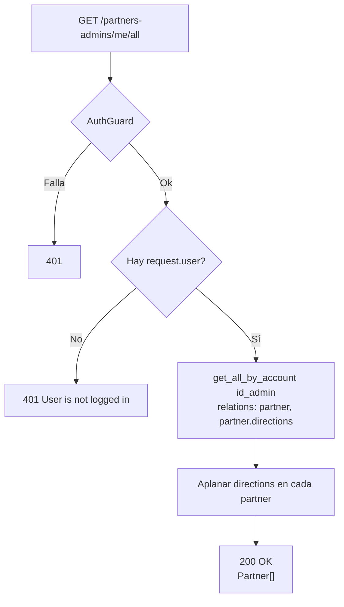
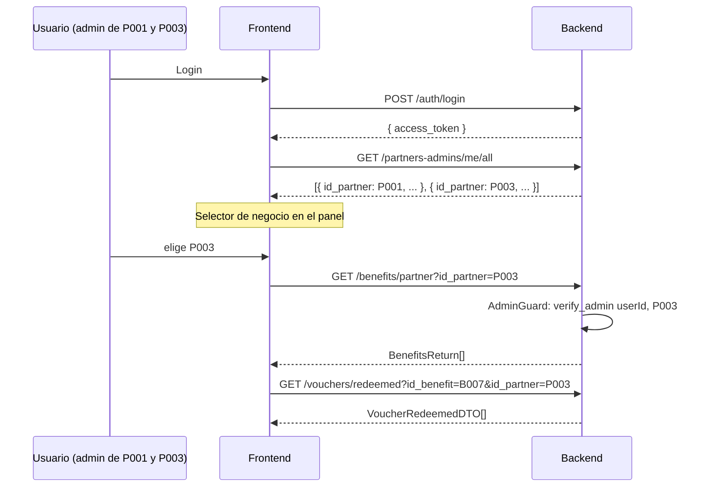
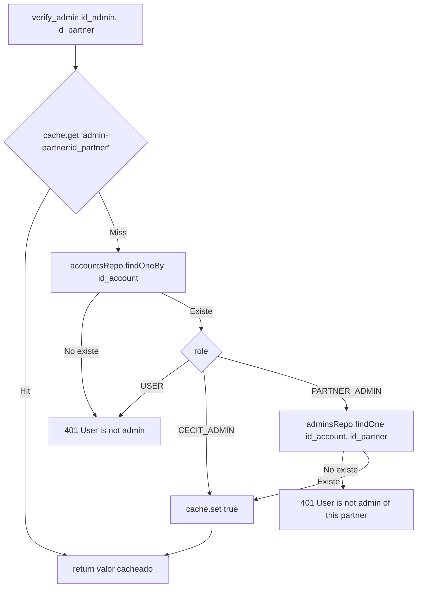

# Endpoints - Administradores de Partners

En este archivo se detalla el funcionamiento interno de cada endpoint relacionado a los administradores de partners de la plataforma.

---

## Modelo de datos

La relación **administradores ↔ partners** **no** es un `@ManyToMany`. Es una
entidad de primera clase sobre la tabla `Partners_Admins`, porque cada fila se
consulta de forma independiente para resolver `/me` y `/me/all`.

El único `ManyToMany` real entre partners y socios es
`Partners.employees ↔ Users.partners` sobre la tabla `Employees`, que
representa la pertenencia laboral, no la administración.



---

## `POST /partners-admins/create`

Protegido con `@UseGuards(AuthGuard('jwt'), AdminGuard)`. Crea la relación
administrador ↔ partner.

### Parámetros de entrada

| Campo | Tipo | Validación | Descripción |
|-------|------|------------|-------------|
| `partner_name` | String | `@IsNotEmpty()` | Nombre del partner (se busca en `Partners`) |
| `email` | String | `@IsNotEmpty() @IsEmail()` | **Ignorado por el servicio** |
| `password` | String | `@IsNotEmpty() @IsString()` | **Ignorado por el servicio** |

### Flujo del proceso



### Lógica de negocio

1. Se busca el partner por nombre (los nombres se guardan en minúsculas).
2. `id_account = await generateUniqueId(adminsRepository, 'id_account')`.
3. Se guarda la fila `{ id_account, id_partner }`. Si falla, `500 Error creating new Admin`.
4. Se devuelve la entidad cruda.

### Problemas

- ⚠️ El `id_account` generado es **aleatorio y no corresponde a ninguna cuenta
  real** de `Accounts`. Este endpoint no crea la cuenta, solo la fila de
  relación. Un admin creado por acá no puede autenticarse.
- ⚠️ `email` y `password` se reciben y se descartan: el servicio no los usa.
- El flujo correcto para dar de alta un administrador es que el socio se registre
  vía `POST /auth/register`; si es dueño de un partner (`Partners.id_owner`),
  la relación se crea automáticamente.

### Errores

| Código | Mensaje |
|--------|---------|
| `401` | Del `AdminGuard` |
| `404` | `Partner not exists` |
| `500` | `Error creating new Admin` |

### Respuesta

```json
{ "id_account": "F3A9", "id_partner": "P002" }
```

> El campo se llama `id_account`. Antes era `id_user`. El mapper
> `PartnersAdminsMapper.toDTO()` lo expone como `id_admin`.

---

## `GET /partners-admins/me`

Protegido con `@UseGuards(AuthGuard('jwt'))`. Devuelve el **primer** negocio que
administra el usuario autenticado.

### Parámetros de entrada

Ninguno. El id del admin sale de `request.user.user_id`.

### Flujo del proceso



### Lógica de negocio

1. Sin `request.user` → `401 User is not logued`.
2. `get_by_id(req.user.user_id)` con `relations: ['partner', 'partner.directions', 'account']`. Si no hay fila → `404 Admin does not exists`.
3. Si la relación existe pero el partner no se pudo cargar → `401 Partner not found`.
4. Se aplana `partner.directions` a `string[]` y se responde.

> `categories` y `employees` **no** se cargan. `findOne` sin `order` devuelve la
> primera fila, así que con varios negocios el resultado es **no determinista**.

### Respuesta

```json
{
  "id_partner": "P001",
  "name": "restaurante el buen sabor",
  "logo": "https://placehold.co/200x200?text=...",
  "id_owner": "U006",
  "active": true,
  "directions": ["Av. Mitre 1450, Córdoba"]
}
```

---

## `GET /partners-admins/me/all`

Protegido con `@UseGuards(AuthGuard('jwt'))`. Devuelve **todos** los negocios que
administra el usuario. Es lo que habilita el **panel multi-negocio** (commit
`575fccc`).

### Parámetros de entrada

Ninguno. El id del admin sale de `request.user.user_id`.

### Flujo del proceso



### Lógica de negocio

1. Sin `request.user` → `401 User is not logged in`.
2. `get_all_by_account(req.user.user_id)` con `['partner', 'partner.directions']`.
3. Cada partner se devuelve con `directions` aplanada a `string[]`.

### Flujo del panel multi-negocio



El `id_partner` elegido viaja en cada request, y `AdminGuard` verifica la
propiedad en cada una.

### Errores

| Código | Mensaje |
|--------|---------|
| `401` | `User is not logged in` |

> El mensaje difiere del de `/me` (`User is not logued`, sin la `g` final) por
> una inconsistencia de tipeo.

### Respuesta

```json
[
  {
    "id_partner": "P001",
    "name": "restaurante el buen sabor",
    "logo": "https://placehold.co/200x200?text=...",
    "id_owner": "U006",
    "active": true,
    "directions": ["Av. Mitre 1450, Córdoba"]
  },
  {
    "id_partner": "P003",
    "name": "moda urbana",
    "logo": "https://placehold.co/200x200?text=...",
    "id_owner": "U006",
    "active": true,
    "directions": ["Bv. San Juan 200"]
  }
]
```

Si el usuario no administra ningún negocio, devuelve `[]` con `200`.

---

## `verify_admin` — verificación de autorización con cache

No es un endpoint, pero es el componente central de este módulo: lo usan
`AdminGuard` (vía la copia sin cache de `AccountsService`) y todos los servicios
que aplican `assertPartnerAccess`.

Introducida en `62e241f`, con cache en `c5fc5ba` y soporte de `CECIT_ADMIN` en
`f1c73a2`.

```typescript
async verify_admin(id_admin: string, id_partner: string): Promise<boolean> {
    const cacheKey = `admin-partner:${id_admin}_${id_partner}`;
    const cached = await this.cache.get<boolean>(cacheKey);
    if (cached !== undefined && cached !== null) return cached;

    const account = await this.accountsRepo.findOneBy({ id_account: id_admin });
    if (!account) throw new UnauthorizedException('User is not admin');              // 401
    if (account.role === AccountRole.USER) throw new UnauthorizedException('User is not admin');  // 401

    if (account.role === AccountRole.CECIT_ADMIN) {
        await this.cache.set(cacheKey, true);
        return true;                                                                  // bypass
    }

    const relation = await this.adminsRepo.findOne({ id_account: id_admin, id_partner });
    if (!relation) throw new UnauthorizedException('User is not admin of this partner');  // 401

    await this.cache.set(cacheKey, true);
    return true;
}
```

### Diagrama



### Características de la cache

| Aspecto | Comportamiento |
|---------|----------------|
| Clave | `admin-partner:<id_admin>_<id_partner>` |
| TTL | Heredado del `CacheModule.register({ isGlobal: true, ttl: 60000 })` — 60 s |
| Qué se cachea | **Solo resultados `true`**. Los `401` no se cachean. |
| Invalidación | **Ninguna.** No hay forma de expulsar la entrada. |

> ⚠️ Como solo se cachean los positivos, **quitar** a un admin de un negocio
> tarda hasta 60 s en surtir efecto. Concedido el bajo costo de un falso positivo
> frente a una consulta, es un trade-off razonable, pero conviene documentarlo
> como comportamiento observable.

### Copia sin cache

`AccountsService.verify_admin()` implementa exactamente la misma lógica sin
`CACHE_MANAGER`. Existe para que `AdminGuard` no dependa de
`PartnersAdminsService` y se genere una dependencia circular
(`AuthModule → AccountsModule → PartnersAdminsModule → PartnersModule → ...`).

Ver [`accounts.md`](./accounts.md#verify_admin-copia-sin-cache).

---

## Servicio `PartnersAdminsService`

| Método | Descripción |
|--------|-------------|
| `create(dto)` | Resuelve el partner por nombre y genera un `id_account` nuevo. `500 Error creating new Admin`. |
| `createByOwner(id_account, id_partner)` | Crea la relación dueño ↔ negocio. `400 id_account and id_partner are required`. **Idempotente** desde `82670a9`: si la fila ya existe, la devuelve sin error. `500 Error creating admin by owner`. |
| `get_by_id(id_admin)` | `400 id admin is required`; carga `['partner', 'partner.directions', 'account']`. `404 Admin does not exists`. |
| `get_all_by_account(id_account)` | `400 id_account is required`; carga `['partner', 'partner.directions']`. Todas las relaciones del usuario. |
| `verify_admin(id_admin, id_partner)` | Verificación con cache. Ver arriba. |

### Dependencias

`PartnersAdminsEntity` repository, **`AccountsEntity`** repository (nuevo),
`forwardRef(PartnersService)`, **`CACHE_MANAGER`** (nuevo).

> `DbModule` fue eliminado: los IDs salen de
> `src/common/utils/id-generator.ts`.

### Dónde NO están `changeRole` ni `addEmployee`

Estos cambios de rol y de empleados se repartieron entre otros servicios:

| Operación | Ubicación |
|-----------|-----------|
| `changeRole` | `AccountsService` — `PATCH /accounts/role` |
| `addEmployee` / `removeEmployee` | `PartnersService` — `POST`/`DELETE /partners/employees` |
| `verify_admin` (con cache) | `PartnersAdminsService` |
| `verify_admin` (sin cache) | `AccountsService` |

---

## Entidad `Partners_Admins`

`@Entity('Partners_Admins')`

| Campo | Columna | Tipo | Notas |
|-------|---------|------|-------|
| `id_account` | `id_account` | `varchar(4)` | **`@PrimaryColumn`** (era `id_user`) |
| `id_partner` | `id_partner` | `varchar(4)` | `@PrimaryColumn` |

PK compuesta.

### Relaciones

| Propiedad | Tipo | Destino | Join |
|-----------|------|---------|------|
| `partner` | `@ManyToOne` | `PartnersEntity` | `@JoinColumn({ name: 'id_partner', referencedColumnName: 'id_partner' })`, `nullable: false` |
| `account` | `@ManyToOne` | `AccountsEntity` | `@JoinColumn({ name: 'id_account', referencedColumnName: 'id_account' })`, `nullable: false` |

> Antes apuntaba a `Users.id_user`. Ahora apunta a `Accounts.id_account` (commit
> `5d881c8`).

### Desalineación con las migraciones

⚠️ Las migraciones `1788216129258` y `1788216335821` **renombran
`Partners_Admins.id_account` a `id_user`**, es decir, en dirección contraria a la
entidad. No existe migración que aplique el renombre a `id_account`. Con
`synchronize: false`, la columna real sigue siendo `id_user` mientras la entidad
espera `id_account`. Ver [`future.md`](./future.md).

---

## DTOs

| DTO | Tipo | Notas |
|-----|------|-------|
| `PartnersAdminsDTO` | `interface` | `{ id_admin, id_partner }` |
| `PartnersAdminsCreateDTO` | `class` | Validado. `email`/`password` ignorados |
| `BenefitTypeDeleteDTO` — n/a | — | — |
| `PartnersAdminsMapper.toDTO(admin)` | — | Devuelve `{ id_admin: admin.id_account, id_partner: admin.id_partner }`. El nombre de la columna cambió de `id_user` a `id_account` |

---

## Módulo `PartnersAdminsModule`

```typescript
@Module({
    imports: [
        TypeOrmModule.forFeature([PartnersAdminsEntity, AccountsEntity]),  // Accounts nuevo
        forwardRef(() => PartnersModule),
        AccountsModule,
    ],
    controllers: [PartnersAdminsController],
    providers: [PartnersAdminsService, AdminGuard],  // AdminGuard nuevo
    exports: [PartnersAdminsService],
})
```

## Tabla en DB

- `Partners_Admins` (`id_account`, `id_partner`, PK compuesta)
- `Accounts` (lectura, para resolver el rol)
- `Partners` (lectura)

---

Ver también:
- [`accounts.md`](./accounts.md) — `PATCH /accounts/role` y `changeRole`.
- [`partners.md`](./partners.md) — gestión de empleados.
- [`auth.md`](./auth.md) — `AdminGuard` y `CecitAdminGuard`.
