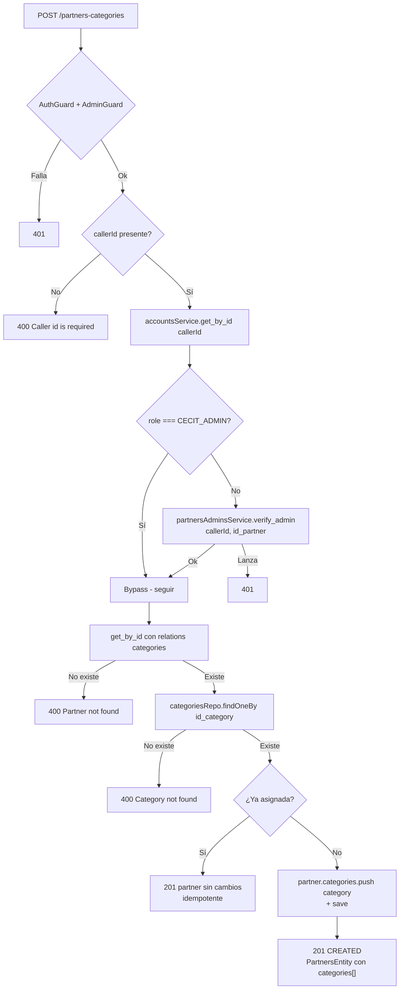
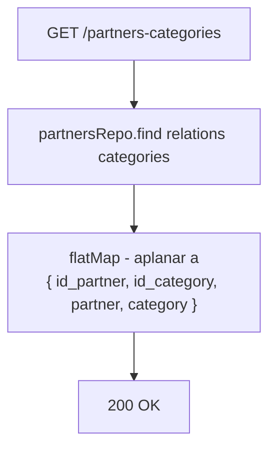

# Endpoints - Categorías de Partners

En este archivo se detalla el funcionamiento interno de cada endpoint relacionado a la asignación de categorías a partners.

---

## Cambio de modelo

En el commit `5d881c8` se eliminó la entidad `PartnersCategoriesEntity` (el
archivo `partners_categories.entity.ts` fue borrado). La relación pasó a
expresarse como un `@ManyToMany` de TypeORM:

| Lado | Propiedad | Decorador |
|------|-----------|-----------|
| Propietario | `PartnersEntity.categories` | `@ManyToMany(...)` + `@JoinTable({ name: 'Partners_Categories' })` |
| Inverso | `CategoriesEntity.partners` | `@ManyToMany(() => PartnersEntity, p => p.categories)` |

La **tabla física `Partners_Categories` no cambió**: sigue con PK compuesta
(`id_partner` varchar(4), `id_category` int). Lo que cambió es quién la posee:
antes una entidad con sus propias relaciones `ManyToOne`; ahora un `@JoinTable`
declarado en `PartnersEntity`.

Consecuencia práctica: las categorías de un partner ahora llegan **planas** en
`partner.categories`, sin el nivel extra `partner.categories[].category`. Por eso
`BenefitsService` cambió de
`partner.categories[].category.name` a `partner.categories.map(c => c.name)`.

El módulo `partners_categories` sigue existiendo (controller, service, dto,
module) pero ahora opera sobre el repositorio de `PartnersEntity` y su relación
`categories`.

---

## `POST /partners-categories`

Protegido con `@UseGuards(AuthGuard('jwt'), AdminGuard)`. Asigna una categoría a
un partner.

### Cambio de guard

| Antes | Ahora |
|-------|-------|
| `AuthGuard('jwt')` + `CecitAdminGuard` | `AuthGuard('jwt')` + `AdminGuard` |

Con el guard anterior, un `PARTNER_ADMIN` no podía asignar categorías a su
propio negocio. Ahora `AdminGuard` resuelve el `id_partner` del body, verifica
la relación y `CECIT_ADMIN` sigue entrando por el camino rápido.

### Parámetros de entrada

> `PartnersCategoriesDto` es una `class` sin decoradores de validación: el
> `ValidationPipe` la acepta sin comprobar nada.

| Campo | Tipo | Origen | Descripción |
|-------|------|--------|-------------|
| `id_partner` | String | Body | ID del partner |
| `id_category` | Number | Body | ID de la categoría a asignar |

El `callerId` sale de `req.user?.user_id`.

### Flujo del proceso



### Lógica de negocio

1. Sin `callerId` → `400 Caller id is required`.
2. Se busca la cuenta del admin. Si es `CECIT_ADMIN`, se saltea la verificación; si no, se llama a `partnersAdminsService.verify_admin(callerId, data.id_partner)`.
3. Se carga el partner con `relations: ['categories']`. Si no existe, `400 Partner not found`.
4. Se busca la categoría. Si no existe, `400 Category not found`.
5. **Si la categoría ya está asignada, se devuelve el partner sin cambios** — la operación es idempotente, no hay error.
6. Si no, se hace `partner.categories.push(category)` y `partnersRepo.save(partner)`.

> La verificación de acceso está **duplicada**: el `AdminGuard` del controlador
> ya la hizo (con la copia sin cache de `AccountsService`), y el servicio la
> repite (con la versión cacheada de `PartnersAdminsService`). Es una segunda
> consulta evitable en la mayoría de los casos; con la cache, en general sale de
> memoria.

### Errores

| Código | Mensaje |
|--------|---------|
| `400` | `Caller id is required` |
| `400` | `Partner not found` |
| `400` | `Category not found` |
| `401` | `User is not admin` / `User is not admin of this partner` |

### Respuesta

`201` con la **entidad `PartnersEntity` completa**, con el array `categories`
ya poblado:

```json
{
  "id_partner": "P001",
  "name": "restaurante el buen sabor",
  "logo": "https://example.com/logo.png",
  "id_owner": "U006",
  "active": true,
  "categories": [
    { "id_category": 1, "name": "Gastronomía", "icon_url": "https://...", "active": true }
  ]
}
```

Si la categoría ya estaba asignada, se devuelve el partner con el estado
anterior (idempotencia).

---

## `GET /partners-categories`

Obtiene todas las relaciones partner-categoría.

### Parámetros de entrada

Ninguno. **Sin guard.**

### Flujo del proceso



### Lógica de negocio

1. `partnersRepo.find({ relations: ['categories'] })` — se cargan los partners
   con sus categorías.
2. Se hace `flatMap` sobre `partner.categories` para producir **un objeto por
   relación**, con las formas legadas:
   ```typescript
   [{ id_partner, id_category, partner: <entidad partner completa>, category: <entidad category completa> }]
   ```
3. Se devuelve el arreglo.

> El comentario en el código dice *"Return flattened for backward compat"*: se
> mantiene la forma plana aunque ahora la relación se pueda leer anidada desde
> `partner.categories`, para no romper consumidores.

**No hay verificación de acceso** a nivel de servicio.

### Respuesta

```json
[
  {
    "id_partner": "P001",
    "id_category": 1,
    "partner": {
      "id_partner": "P001",
      "name": "restaurante el buen sabor",
      "logo": "https://example.com/logo.png",
      "id_owner": "U006",
      "active": true
    },
    "category": {
      "id_category": 1,
      "name": "Gastronomía",
      "icon_url": "https://example.com/icons/gastronomia.png",
      "active": true
    }
  },
  {
    "id_partner": "P001",
    "id_category": 3,
    "partner": { "...": "..." },
    "category": { "...": "..." }
  }
]
```

> A diferencia de `POST`, el partner aquí **no** trae el array `categories`
> anidado: viene la entidad partner con sus campos, y la categoría aparte.

---

## No existe endpoint de desasignación

No hay forma de **quitar** una categoría de un partner por la API. El servicio
tiene `findByPartner()` pero no un `remove()`.

Las dos vías indirectas que existen:

1. **Desactivar la categoría** — `PATCH /categories/:id_category` con
   `{ active: false }`. La fila de `Partners_Categories` sigue existiendo, pero
   `BenefitsService.findActives()` filtra por `categories.active = true`, así que
   los beneficios de ese partner **desaparecen de todos los listados públicos**.
2. **Modificar la base directamente.**

Ver [`categories.md`](./categories.md).

---

## Servicio `PartnersCategoriesService`

| Método | Descripción |
|--------|-------------|
| `create(data, callerId)` | Firma **cambiada** en el commit `5d881c8`: antes `create(data)`. Ahora verifica acceso. Idempotente. Devuelve la entidad `PartnersEntity`. |
| `findAll()` | Sin verificación de acceso. Aplana a la forma legada. |
| `findByPartner(id_partner)` | Sin verificación de acceso. Solo de servicio, **no expuesto** por el controlador. `[]` si el partner no existe. |

> `PartnersCategoriesService` ya no tiene `remove()` ni `findAll()` con filtros.
> Su única escritura es el alta de relación.

---

## DTOs

| DTO | Tipo | Notas |
|-----|------|-------|
| `PartnersCategoriesDto` | `class` | Sin decoradores de validación. |
| `PartnersCategoriesReturn` | `interface` | `{ id_partner, partner, id_categories: string[], categories: string[] }` |

`PartnersCategoriesReturn` **sí se usa**: la construye
`BenefitsService.get_categories(id_partner)` a partir de
`PartnersService.get_by_id_with_categories()`, sumando nombres de categoría y
`id_category.toString()`. Devuelve `null` si el partner no tiene categorías.

Pero `BenefitsService.get_categories()` **no está expuesto por ningún
controlador**: es código muerto.

---

## Módulo `PartnersCategoriesModule`

```typescript
@Module({
    imports: [
        TypeOrmModule.forFeature([PartnersEntity, CategoriesEntity]),  // reemplaza a la entidad eliminada
        AccountsModule,
        forwardRef(() => PartnersAdminsModule),   // nuevo
    ],
    controllers: [PartnersCategoriesController],
    providers: [PartnersCategoriesService, AdminGuard],   // AdminGuard nuevo
    exports: [PartnersCategoriesService],
})
```

---

## Tabla en DB

### `Partners_Categories`

| Columna | Tipo | Notas |
|---------|------|-------|
| `id_partner` | `varchar(4)` | PK, FK → `Partners.id_partner` |
| `id_category` | `int` | PK, FK → `Categories.id_category` |

PK compuesta. Ahora propiedad de `PartnersEntity` vía `@JoinTable`.

---

Ver también:
- [`categories.md`](./categories.md) — activación y desactivación de categorías.
- [`partners.md`](./partners.md) — entidad `Partners` y sus relaciones.
