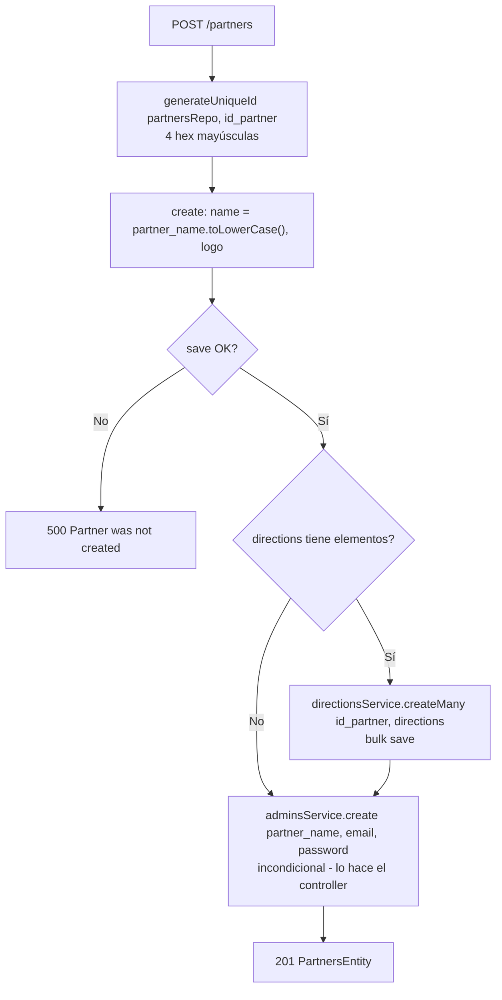
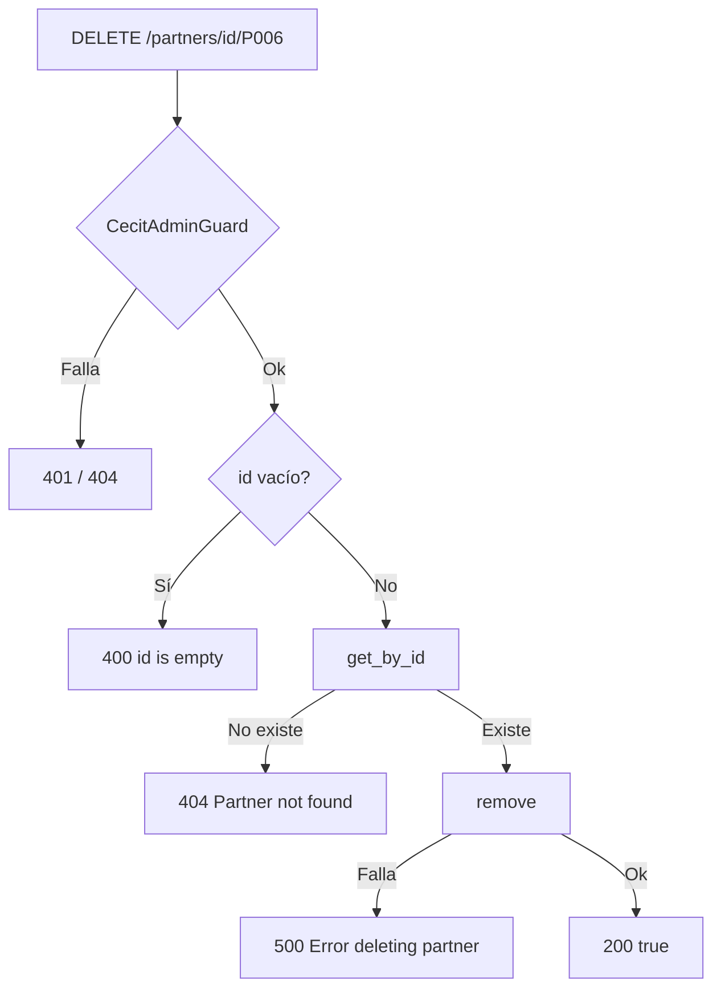
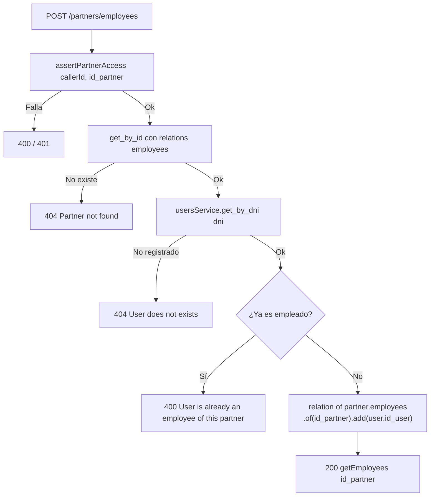
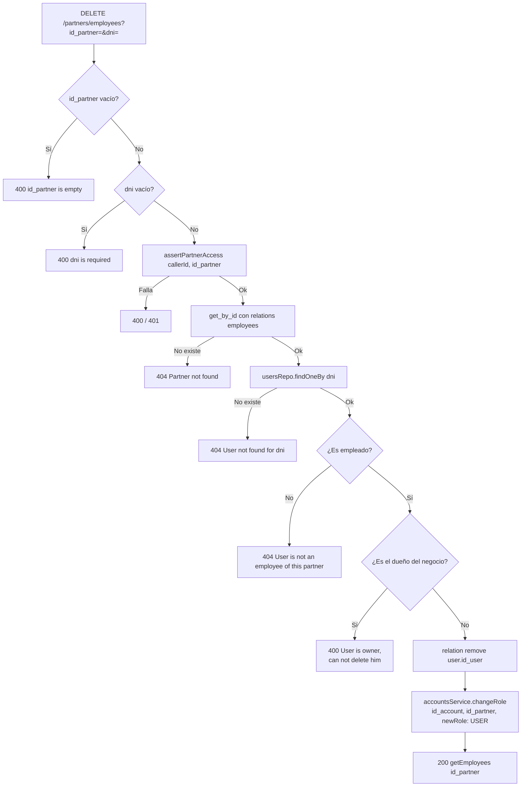

# Endpoints - Partners (Comercios)

En este archivo se detalla el funcionamiento interno de cada endpoint relacionado a los partners (comercios afiliados) de la plataforma.

---

## Autorización de modificaciones

Todos los endpoints de escritura y los de datos sensibles pasan por
`PartnersService.assertPartnerAccess()`:

```typescript
private async assertPartnerAccess(callerId: string, id_partner: string) {
    if (!callerId)  throw new BadRequestException('Caller id is required');   // 400
    if (!id_partner) throw new BadRequestException('id is empty');             // 400

    const account = await this.accountsService.get_by_id(callerId);
    if (account.role === AccountRole.CECIT_ADMIN) return;   // bypass

    await this.partnersAdminsService.verify_admin(callerId, id_partner);  // 401
}
```

El `callerId` sale **siempre** de `req.user?.user_id` (es decir, del JWT), nunca
del body. Esto se agregó en el commit `62e241f` para evitar que un admin de un
negocio modificara el de otro.

`verify_admin` cachea los resultados positivos durante 60 s.

> `DirectionsService` tiene una **copia idéntica** de este método privado, usada
> por su propio CRUD.

Se invoca en: `updateLogo`, `updateName`, `addLocation`, `addEmployee`,
`removeEmployee`.

---

## `GET /partners/all`

Obtiene todos los partners registrados.

### Parámetros de entrada

Ninguno.

### Lógica de negocio

1. `find({ relations: { directions: true }, order: { name: 'ASC' } })`.
2. Se mapea cada partner con `PartnersMapper.entityToDto()`.

### Respuesta

```json
[
  {
    "id_partner": "P001",
    "name": "restaurante el buen sabor",
    "logo": "https://placehold.co/200x200?text=...",
    "directions": ["Av. Mitre 1450, Córdoba", "Bv. San Juan 200"],
    "active": true
  }
]
```

### Errores

| Código | Mensaje |
|--------|---------|
| `404` | `Partners are empty` |

### Cambio

| Antes | Ahora |
|-------|-------|
| `select { name, logo }` | Entidad completa + `directions` |
| `[{ name, logo }]` | `PartnersDTO[]` con `id_partner`, `name`, `logo`, `directions[]`, `active` |
| Sin orden | `order: { name: 'ASC' }` |

---

## `POST /partners`

Crea un nuevo partner, sus direcciones iniciales y el registro de su
administrador.

### Parámetros de entrada

| Campo | Tipo | Validación | Descripción |
|-------|------|------------|-------------|
| `partner_name` | String | `@IsNotEmpty()` | Nombre del negocio (se guarda en minúsculas) |
| `email` | String | `@IsNotEmpty() @IsEmail()` | Email del admin |
| `password` | String | `@IsNotEmpty() @IsString()` | Contraseña del admin |
| `logo` | String | `@IsNotEmpty() @IsUrl()` | URL del logo |
| `directions` | String[] | `@IsString({ each: true })` | Direcciones iniciales. **Reemplaza a `direction: string`** |

> `directions` no tiene `@IsNotEmpty()`, así que es efectivamente opcional: el
> servicio solo las crea si `?.length` es truthy.

### Flujo del proceso



### Lógica de negocio

1. **Partner:** `id_partner = await generateUniqueId(partnersRepo, 'id_partner')`. Se crea con `name` en minúsculas y `logo`. Ya **no** guarda `direction`. Si el save falla, `500 Partner was not created`.
2. **Direcciones:** si `directions` viene con elementos, `directionsService.createMany(id_partner, directions)` las inserta en bloque. `createMany` no hace verificación de acceso (es uso interno del alta).
3. **Administrador:** lo hace el **controlador**, no el servicio, y es **incondicional** (no depende de que haya direcciones): `adminsService.create({ partner_name, email, password })` busca el partner por nombre, genera un `id_account` nuevo y escribe la fila en `Partners_Admins`.

### Respuesta

`201` con la **entidad cruda**, no mapeada:

```json
{
  "id_partner": "P006",
  "name": "nuevo comercio",
  "logo": "https://example.com/logo.png",
  "id_owner": null,
  "active": true
}
```

### Problemas

- ⚠️ El partner se crea **sin `id_owner`**, así que la fila de `Partners_Admins`
  que genera este endpoint apunta a un `id_account` que **no existe** en
  `Accounts`. El admin resultante no puede autenticarse. El flujo real de alta
  de un comercio debería pasar por `POST /auth/register` de un socio que ya
  figure como `id_owner`.
- El endpoint **no tiene guard**: cualquiera puede crear partners.
- `email` y `password` se pasan a `adminsService.create()`, que los descarta.

---

## `DELETE /partners/id/:id`

Elimina un partner por su ID.

### Parámetros de entrada

| Campo | Tipo | Origen | Descripción |
|-------|------|--------|-------------|
| `id` | String | URL param | ID del partner a eliminar. |

### Flujo del proceso



### Errores

| Código | Mensaje |
|--------|---------|
| `400` | `id is empty` |
| `401` | `Admin access required` |
| `404` | `Partner not found` |
| `500` | `Error deleting partner` |

### Respuesta

```json
true
```

### Cambio de ruta

| Antes | Ahora |
|-------|-------|
| `DELETE /partners/:id` | `DELETE /partners/id/:id` |
| **Sin guard** | JWT + `CecitAdminGuard` |

El prefijo `id/` evita que `:id` capture subrutas como `employees` o
`locations`, y el guard evita que cualquiera borre negocios.

---

## `PATCH /partners/logo`

Protegido con `@UseGuards(AuthGuard('jwt'), AdminGuard)`. Actualiza el logo.

### Parámetros de entrada

| Campo | Tipo | Validación |
|-------|------|------------|
| `id_partner` | String | `@IsNotEmpty()` |
| `new_logo` | String | `@IsNotEmpty() @IsUrl()` |

### Lógica de negocio

1. `assertPartnerAccess(req.user?.user_id, data.id_partner)`.
2. Se busca el partner. Si no existe, `400 Partner not exists`.
3. `partner.logo = data.new_logo`; se guarda.
4. Se responde el `PartnersDTO` resultante.

> El mensaje `Partner not exists` (con `exists`) es distinto del
> `Partner not found` que usa `get_by_id()`. Conviene unificarlo.

### Respuesta

```json
{
  "id_partner": "P001",
  "name": "restaurante el buen sabor",
  "logo": "https://example.com/nuevo-logo.png",
  "directions": ["Av. Mitre 1450, Córdoba"],
  "active": true
}
```

---

## `PATCH /partners/name`

Protegido con `@UseGuards(AuthGuard('jwt'), AdminGuard)`. Actualiza el nombre.

### Parámetros de entrada

| Campo | Tipo | Validación |
|-------|------|------------|
| `id_partner` | String | `@IsNotEmpty()` |
| `new_name` | String | `@IsNotEmpty() @IsString()` |

### Lógica de negocio

Idéntica a `PATCH /partners/logo`, salvo que asigna
`partner.name = data.new_name.toLowerCase()`.

### Respuesta

```json
{
  "id_partner": "P001",
  "name": "nuevo nombre",
  "logo": "https://example.com/logo.png",
  "directions": ["Av. Mitre 1450, Córdoba"],
  "active": true
}
```

---

## Ubicaciones

Endpoints de conveniencia sobre `DirectionsService`. El CRUD completo está en
[`directions.md`](./directions.md).

### `GET /partners/locations`

Protegido con `@UseGuards(AuthGuard('jwt'), AdminGuard)`.

| Campo | Tipo | Origen | Descripción |
|-------|------|--------|-------------|
| `id_partner` | String | Query | ID del negocio |

El `AdminGuard` lee el mismo `id_partner` de la query, así que la verificación
de propiedad es automática.

**Lógica:** `directionsService.findByPartner(id_partner)` y se re-mapea el
`id_direction` a `id_location`:

```json
[
  {
    "id_partner": "P001",
    "id_location": 1,
    "direction": "Av. Mitre 1450, Córdoba"
  }
]
```

**Errores:** `400 id is empty` (del servicio de direcciones), `401` del guard.

### `POST /partners/locations`

Protegido con `@UseGuards(AuthGuard('jwt'), AdminGuard)`.

**Body** — `AddLocationDTO`:

| Campo | Tipo | Validación |
|-------|------|------------|
| `id_partner` | String | `@IsNotEmpty()` |
| `direction` | String | `@IsNotEmpty() @IsString()` |

**Lógica:**
1. `assertPartnerAccess(callerId, id_partner)`.
2. Se busca el partner. Si no existe, `404 Partner not found`.
3. `directionsService.create({ id_partner, direction }, callerId)` — que **vuelve
   a verificar el acceso** internamente.
4. Se responde `200 true`.

**Respuesta:** `true`

---

## Empleados

Los empleados son socios de CeCIT (`Users`) vinculados al negocio mediante la
tabla `Employees`. **No son un rol**: su cuenta permanece en `USER` hasta que un
administrador los promueva con `PATCH /accounts/role`.

### `GET /partners/employees`

Protegido con `@UseGuards(AuthGuard('jwt'), AdminGuard)`.

| Campo | Tipo | Origen |
|-------|------|--------|
| `id_partner` | String | Query |

**Lógica:**
1. `findOne({ where: { id_partner }, relations: ['employees'] })`. Si no existe, `404 Partner not found`.
2. Si no hay empleados, devuelve `[]`.
3. **Una sola consulta batch** resuelve las cuentas: `accountsRepo.find({ where: { id_account: In(employeeIds) } })`, y se le pegan `email` y `role` (`?? null`).

Esto evita el N+1 de consultar `Accounts` una vez por empleado.

**Respuesta:**

```json
[
  {
    "id_user": "U008",
    "name": "Ana",
    "lastname": "Gómez",
    "dni": "33445566",
    "email": "ana@example.com",
    "role": "USER"
  }
]
```

### `POST /partners/employees`

Protegido con `@UseGuards(AuthGuard('jwt'), AdminGuard)`.

**Body** — `AddEmployeeDTO`:

| Campo | Tipo | Validación | Descripción |
|-------|------|------------|-------------|
| `id_partner` | String | `@IsNotEmpty() @IsString()` | Negocio. **En el body**, no en query. |
| `dni` | String | `@IsNotEmpty() @IsString()` | DNI del socio a vincular |

**Flujo del proceso:**



**Cambio de comportamiento (dos commits):**

| Commit | Comportamiento |
|--------|----------------|
| `6e978e5` | `addEmployee` llamaba `usersService.create()`, **creando** un `Users` si el DNI no existía. `id_partner` venía por query string. |
| `94d5539` | **Ya no crea usuarios.** Usa `usersService.get_by_dni(dni)`. `id_partner` pasó al body. `getEmployees` se mejoró con el join batch a `Accounts` para traer `email` y `role`. |

**Errores:** `400 User is already an employee of this partner`, `401`, `404 Partner not found`, `404 User does not exists`.

**Respuesta:** el mismo array enriquecido de `GET /partners/employees`.

### `DELETE /partners/employees`

Protegido con `@UseGuards(AuthGuard('jwt'), AdminGuard)`.

| Campo | Tipo | Origen | Validación |
|-------|------|--------|------------|
| `id_partner` | String | Query | **Ninguna** |
| `dni` | String | Query | **Ninguna** |

**Flujo del proceso:**



**Protección del dueño** (commit `e16e18e`): si
`partner.id_owner === user.id_user`, se responde `400 User is owner, can not
delete him`.

**Degradación de rol** (commit `94d5539`): tras desvincular, llama a
`accountsService.changeRole({ id_partner, id_account: user.id_user, newRole:
AccountRole.USER })`.

> `changeRole` solo degrada el rol si la cuenta administra **a lo sumo un**
> negocio. Si el empleado era admin de varios, conserva `PARTNER_ADMIN` en los
> que le quedan.

**Respuesta:** el mismo array enriquecido de `GET /partners/employees`.

---

## `PartnersService`

| Método | Descripción |
|--------|-------------|
| `get_all()` | Todos con `directions`, ordenados por nombre. `404 Partners are empty` si no hay ninguno. |
| `create(dto)` | Crea el partner (minúsculas) y sus direcciones iniciales. |
| `remove(id)` | Borrado duro. `400`/`404`/`500`. |
| `get_by_id(id_partner)` | `404 Partner not found`. |
| `get_by_id_with_categories(id_partner)` | **Nuevo.** Con `relations: ['categories']`. La usa `BenefitsService.get_categories()`. |
| `get_by_name(name)` | Con `directions`, mapeado a `PartnersDTO`. `400 partner name is empty` / `404 Partner not exists`. |
| `updateLogo(dto, callerId)` | Actualiza el logo. |
| `updateName(dto, callerId)` | Actualiza el nombre (minúsculas). |
| `getByOwnerId(id_owner)` | `findOne({ where: { id_owner } })`. Devuelve la entidad o `null`. La usa `AuthService.register()`. |
| `getLocations(id_partner)` | **Nuevo.** Direcciones mapeadas a `{ id_partner, id_location, direction }`. |
| `addLocation(dto, callerId)` | **Nuevo.** Devuelve `true`. |
| `getEmployees(id_partner)` | **Nuevo.** Empleados con `email` y `role`. |
| `addEmployee(callerId, dto)` | **Nuevo.** Vincula por DNI. Devuelve el array de empleados. |
| `removeEmployee(id_partner, callerId, dni)` | **Nuevo.** Desvincula y degrada. Devuelve el array de empleados. |

### Dependencias

`PartnersEntity`, `UsersEntity` y `AccountsEntity` repositories;
`DirectionsService`, `AccountsService`, `UsersService`,
`forwardRef(PartnersAdminsService)`.

---

## `PartnersMapper`

Capa de traducción entidad ↔ DTO, para que la capa HTTP nunca exponga campos
sensibles como `id_owner`.

| Método | Entrada | Salida | Nota |
|--------|---------|--------|------|
| `dtoToEntity(dto)` | `PartnersDTO` | entidad | Normaliza `name.toLowerCase()`. **La asignación de `direction` se eliminó** (la columna ya no existe). Hoy no lo usa ningún servicio. |
| `entityToDto(entity)` | entidad | `PartnersDTO` | **Aplana** `directions` a `string[]` con `?? []`. |

Usado por: `get_all()`, `get_by_name()`, `updateLogo()`, `updateName()`.

---

## `PartnersEntity`

`@Entity('Partners')`

| Campo | Columna | Tipo | Null | Default | Notas |
|-------|---------|------|------|---------|-------|
| `id_partner` | `id_partner` | `varchar(4)` | no | — | `@PrimaryColumn` |
| `name` | `name` | `varchar(50)` | no | — | `name!` (asignación definite) |
| `logo` | `logo` | **`varchar(2048)`** | no | — | Era 255 |
| `id_owner` | `id_owner` | `varchar(4)` | no | — | Dueño del negocio |
| `active` | `active` | `boolean` | no | `true` | |

### Relaciones

| Propiedad | Tipo | Destino | Tabla / Join |
|-----------|------|---------|--------------|
| `owner` | `@OneToOne` | `UsersEntity` | `@JoinColumn({ name: 'id_owner', referencedColumnName: 'id_user' })` |
| `categories` | `@ManyToMany` | `CategoriesEntity` | **`@JoinTable('Partners_Categories')`** — lado propietario. Era `OneToMany` a `PartnersCategoriesEntity` |
| `directions` | `@OneToMany` | `Directions` | FK `Directions.id_partner` — **nuevo** |
| `employees` | `@ManyToMany` | `UsersEntity` | **`@JoinTable('Employees')`** — lado propietario. **Nuevo** |

### Cambios de esquema

| Cambio | Migración |
|--------|-----------|
| Se elimina la columna `direction` de la entidad | ❌ **sin migración**; la columna sigue en la base |
| `logo` 255 → 2048 | ❌ **sin migración** |
| `id_owner` con índice único | `1788211952493` ✅ (parcial; ver [`future.md`](./future.md)) |
| Tabla `Employees` | ❌ **sin migración ni seed** |

---

## DTOs

| DTO | Tipo | Notas |
|-----|------|-------|
| `PartnersDTO` | `interface` | `id_partner`, `name`, `logo`, `directions[]`, `active`. **`direction: string` → `directions: string[]`** |
| `PartnersCreateDTO` | `class` | `directions[]` reemplaza a `direction` |
| `PartnersUpdateLogoDTO` | `class` | Validado |
| `PartnersUpdateNameDTO` | `class` | Validado |
| `AddLocationDTO` | `class` | Nuevo. Validado |
| `AddEmployeeDTO` | `class` | Nuevo. Validado |
| `GetLocationsReturn` | `interface` | Nuevo. `{ id_partner, id_location, direction }` |
| `Employee` | `interface` | Nuevo. `{ id_user, email, name, lastname, dni, role }`. **Sin uso por los controladores** |
| `PartnerLogo` | `interface` | `{ name, logo }`. **Obsoleto**: `get_all()` ya devuelve `PartnersDTO` |

---

## Tablas en DB

- `Partners`
- `Directions`
- `Employees` — **sin migración**
- `Partners_Admins`
- `Partners_Categories`

## Dependencias
- `DirectionsService` — alta masiva al crear el partner
- `UsersService` — búsqueda de socios por DNI
- `AccountsService` — resolución de rol en `assertPartnerAccess`
- `PartnersAdminsService` — verificación de acceso (con cache)
- `src/common/utils/id-generator.ts` — generación de IDs
- `AdminGuard` — provider local del módulo

---

Ver también:
- [`directions.md`](./directions.md) — CRUD de direcciones.
- [`partners-admins.md`](./partners-admins.md) — relación admin ↔ partner.
- [`partners-categories.md`](./partners-categories.md) — relación partner ↔ categoría.
- [`accounts.md`](./accounts.md) — `changeRole` para promover empleados.
