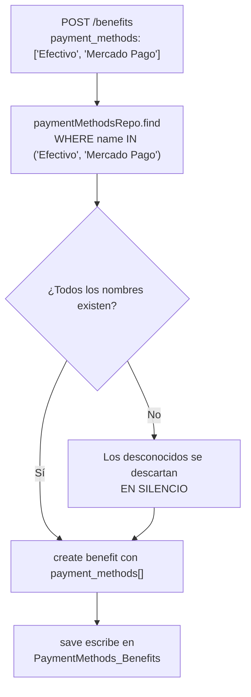

# Endpoints - Métodos de Pago por Beneficio

En este archivo se detalla la relación entre métodos de pago y beneficios.

---

## La entidad fue eliminada

En el commit `5d881c8` ("replace middle tables with ManyToMany Typeorm
relations") se borró el archivo `payment_benefit.entity.ts`.

Lo que declaraba:

```typescript
@Entity('PaymentMethods_Benefits')
class PaymentBenefitEntity {
    @PrimaryColumn() id_payment_method: number;
    @PrimaryColumn() id_benefit: string;
    @ManyToOne(PaymentMethodsEntity) payment_method: PaymentMethodsEntity;
    @ManyToOne(BenefitsEntity) benefit: BenefitsEntity;
}
```

**La tabla física no cambió.** Sigue siendo `PaymentMethods_Benefits`, con PK
compuesta. Lo que cambió es la propiedad: ahora es el `@JoinTable` de
`BenefitsEntity.payment_methods`.

| | Antes | Ahora |
|---|-------|-------|
| Tabla | `PaymentMethods_Benefits` | `PaymentMethods_Benefits` (igual) |
| Propietaria | `PaymentBenefitEntity` (con `ManyToOne` a ambos lados) | `BenefitsEntity` (`@ManyToMany` + `@JoinTable`) |
| Accesarla | `PaymentBenefitService.findByBenefit(id)` — 1 query por beneficio | `relations: ['payment_methods']` — incluida en la query principal |

> Los nombres de las FK cambiaron en las migraciones
> `1788216129258` / `1788216335821`:
> `FK_1020856c55a0eabf5757f6f60b0` y `FK_fde159496e03a8c7dc3501b22f3` →
> `FK_7c725b86f1f2cb0256ce1d3f36e` y `FK_c4525e24654be41a18f16cee9d9`.

---

## Cómo se usa ahora

### En la escritura — `BenefitsService.create()`

Commit `28fd21d`. El array `payment_methods` viene en el body como
**array de nombres** y se resuelve en **una sola consulta**:

```typescript
const paymentMethods = await this.paymentMethodsRepo.find({
    where: dto.payment_methods.map(name => ({ name })),
});

const benefit = this.benefitsRepository.create({
    ...dto,
    id_benefit,
    admin, partner, type, status,
    payment_methods: paymentMethods,   // TypeORM escribe el @JoinTable
});
await this.benefitsRepository.save(benefit);
```



Implicaciones:

- Un beneficio **sin** métodos de pago es válido: array vacío o ausente → `[]`.
- Los nombres inexistentes se descartan **sin error ni warning**: un typo en el
  nombre pasa desapercibido.
- Se hace match por `name`, no por `id_payment_method`.
- Por eso `BenefitsModule` importa
  `TypeOrmModule.forFeature([BenefitsEntity, PaymentMethodsEntity])` e inyecta
  `Repository<PaymentMethodsEntity>`.

### En la lectura

`defaultRelations` de `BenefitsService`:

```typescript
['partner', 'partner.directions', 'partner.categories', 'type', 'payment_methods']
```

Los nombres salen de la relación eager, sin round-trip extra:

```typescript
payment_methods: (benefit.payment_methods ?? []).map(p => p.name)
```

Esto eliminó la consulta adicional a `PaymentBenefitEntity` que se hacía por
cada beneficio en `GET /benefits/all`, `GET /benefits/popular` y
`GET /benefits/news` — un N+1 considerable.

### En los vouchers

`BenefitsService.getPaymentMethodNames(id_benefit)` carga solo
`relations: ['payment_methods']` — **sin** filtro de `active` — y la usa
`VouchersService.get_by_token()` para mostrarle al comercio qué métodos acepta el
beneficio.

---

## Lo que quedó del módulo

`PaymentBenefitModule` sigue registrado en `app.module.ts`, pero **ningún otro
módulo lo importa**. Es código muerto que queda pendiente de borrar.

### `PaymentBenefitService`

| Método | Comportamiento actual | ¿Usado? |
|--------|----------------------|---------|
| `findByBenefit(id_benefit)` | Carga el beneficio con `relations: ['payment_methods']`. Si no existe, `[]`. Si existe, mapea cada método a la **forma legada**: `{ id_benefit, id_payment_method, payment_method, benefit }` (`any[]`) | No |
| `findByBenefits(ids_benefits[])` | Igual, con `In(ids_benefits)`. `[]` para `null`/vacío. `flatMap` del resultado | No |
| `make_relation(id_benefit, payment_method_name)` | `findOneBy({ name })` → `false` si no existe. Carga el beneficio. Si ya está relacionado, `true` inmediato. Si no, `benefit.payment_methods.push(method)` + `save(benefit)` | No |

`make_relation()` es la única forma de **agregar** un método de pago a un
beneficio existente — y no está expuesto por ningún endpoint. `BenefitsService`
solo asocia métodos en el alta; no hay un `PATCH` para cambiar los métodos de un
beneficio ya creado.

### `PaymentBenefitController`

`@Controller('payment-benefit')` con **cero route handlers**. No expone ningún
endpoint.

### `PaymentBenefitDTO`

```typescript
export interface PaymentBenefitDTO {
    id_payment_method: number;
    id_benefit: string;
}
```

Sin uso.

### `PaymentBenefitModule`

```typescript
@Module({
    imports: [TypeOrmModule.forFeature([BenefitsEntity, PaymentMethodsEntity])],
    providers: [PaymentBenefitService],
    exports: [PaymentBenefitService],
})
```

Registra las dos entidades en lugar de la propia.

---

## Estructura de la tabla

### `PaymentMethods_Benefits`

| Columna | Tipo | Notas |
|---------|------|-------|
| `id_benefit` | `varchar(4)` | PK, FK → `Benefits.id_benefit`. Declarada como `joinColumn` en el `@JoinTable` |
| `id_payment_method` | `int` | PK, FK → `PaymentMethods.id_payment_method`. `inverseJoinColumn` |

PK compuesta. Históricamente las migraciones la tenían en el orden inverso
(`id_payment_method` primero), lo que es irrelevante para una PK compuesta pero
sí para los scripts que lean por posición.

---

Ver también:
- [`payment-methods.md`](./payment-methods.md) — entidad y endpoint de lectura.
- [`benefits.md`](./benefits.md) — alta de beneficios con métodos de pago.
