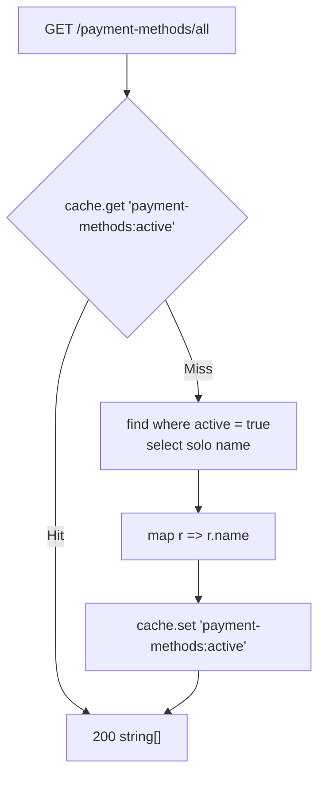
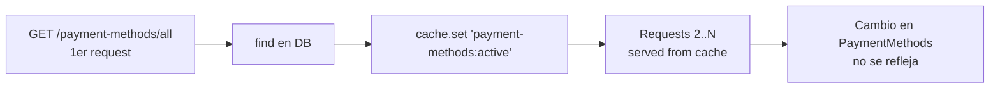

# Endpoints - Métodos de Pago

En este archivo se detalla el funcionamiento interno de cada endpoint relacionado a los métodos de pago de la plataforma.

---

## `GET /payment-methods/all`

Obtiene los nombres de los métodos de pago activos.

### Parámetros de entrada

Ninguno. **Sin guard.**

### Flujo del proceso



### Lógica de negocio

1. Se busca la clave `payment-methods:active` en el cache.
2. Si hay hit, se devuelve.
3. Si hay miss, se ejecuta:
   ```typescript
   this.repo.find({
       select: { id_payment_method: false, name: true, active: false },
       where: { active: true },
   })
   ```
   Proyectando **solo** `name` y filtrando por `active: true`.
4. Se mapea a `string[]` y se cachea.

### Respuesta

```json
["Mercado Pago", "Efectivo", "Tarjeta de Débito", "Tarjeta de Crédito", "Transferencia Bancaria"]
```

> Se devuelven **nombres**, no objetos. El frontend los usa para poblar el
> selector del formulario de alta de beneficio, y luego los manda como array de
> strings en `BenefitsCreateDTO.payment_methods`.

---

## Defecto: cache sin invalidación

El resultado se cachea y **no existe ninguna ruta que lo invalide**: no hay
endpoints para crear, editar ni eliminar métodos de pago, y el servicio no está
exportado a ningún otro módulo.



Consecuencia: si un administrador agrega, renombra o desactiva un método de pago
directamente en la base, **el endpoint sigue devolviendo el valor viejo** hasta
que pasen los 60 s del TTL global.

Un método simple (un `@Cron` diario con `cache.del()`, o un evento de dominio
que se dispare en las escrituras) resolvería esto. Como no hay escrituras por
API, la alternativa es directamente **no cachear** este endpoint: el costo es
una consulta `SELECT name FROM PaymentMethods WHERE active = 1` por request, que
es trivial.

Además, el servicio **no se exporta** desde `PaymentMethodsModule` y no lo
consume ningún otro módulo, así que la cache solo existe para este endpoint.

---

## Entidad `PaymentMethodsEntity`

`@Entity('PaymentMethods')`

| Campo | Columna | Tipo | Default | Notas |
|-------|---------|------|---------|-------|
| `id_payment_method` | `id_payment_method` | `int` | AI | `@PrimaryGeneratedColumn` |
| `name` | `name` | `varchar(50)` | — | **Clave de negocio**: es lo que el cliente manda en `BenefitsCreateDTO.payment_methods` |
| `active` | `active` | `boolean` | `true` | |
| `benefits` | — | `@ManyToMany(() => BenefitsEntity, b => b.payment_methods)` | — | **Nuevo.** Lado **inverso**, sin `@JoinTable` |

### Relación con beneficios

`BenefitsEntity` es el lado propietario:

```typescript
@ManyToMany(() => PaymentMethodsEntity, pm => pm.benefits)
@JoinTable({
    name: 'PaymentMethods_Benefits',
    joinColumn: { name: 'id_benefit' },
    inverseJoinColumn: { name: 'id_payment_method' },
})
payment_methods: PaymentMethodsEntity[];
```

Ver [`payment-benefit.md`](./payment-benefit.md).

> La resolución se hace **por nombre**, no por id. Agregar un método de pago con
> un nombre duplicado haría la relación ambigua.

---

## Servicio `PaymentMethodsService`

| Método | Descripción |
|--------|-------------|
| `getMethods()` | Nombres de los métodos activos, cacheados. |

**No se exporta** desde el módulo y no lo usa ningún otro servicio: el
`BenefitsService` accede directo al repositorio de `PaymentMethodsEntity`.

## Módulo `PaymentMethodsModule`

```typescript
@Module({
    imports: [TypeOrmModule.forFeature([PaymentMethodsEntity])],
    controllers: [PaymentMethodsController],
    providers: [PaymentMethodsService],
})
```

Sin `exports` — el servicio es privado del módulo.

## Tabla en DB

- `PaymentMethods`
- `PaymentMethods_Benefits` (tabla intermedia, propiedad de `BenefitsEntity`)

---

Ver también:
- [`payment-benefit.md`](./payment-benefit.md) — relación con beneficios.
- [`benefits.md`](./benefits.md) — `POST /benefits` y `payment_methods`.
