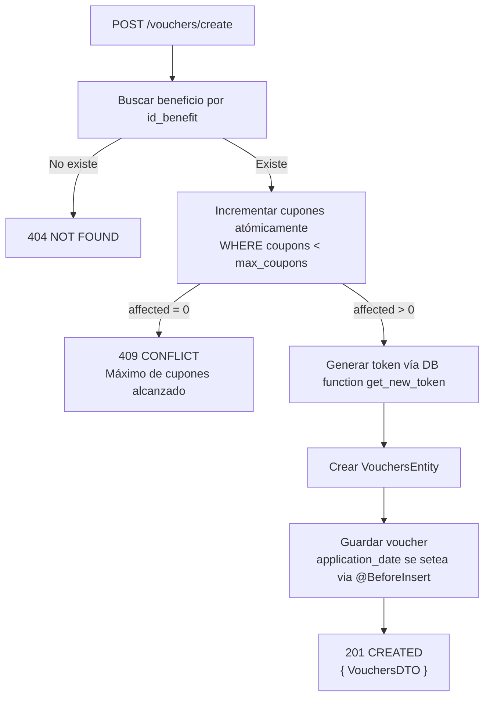

# Endpoints - Vouchers (Cupones)

En este archivo se detalla el funcionamiento interno de cada endpoint relacionado a los vouchers (cupones canjeados) de la plataforma.

---

## `GET /vouchers/all`

Obtiene todos los vouchers registrados.

### Parámetros de entrada

Ninguno.

### Lógica de negocio

1. Se obtienen todas las entidades `VouchersEntity`.
2. Se mapea cada una mediante `VouchersMapper.toDTO()` que retorna `{ token, id_user, id_benefit, application_date, delivery_date, status }`.
3. Se retorna un arreglo de `VouchersDTO`.

### Respuesta

```json
[
  {
    "token": "abc123def456",
    "id_user": "0001",
    "id_benefit": "0002",
    "application_date": "2024-06-15T10:30:00.000Z",
    "delivery_date": null,
    "status": "PENDING"
  }
]
```

---

## `GET /vouchers/byuser`

Obtiene los vouchers de un usuario específico.

### Parámetros de entrada

| Campo | Tipo | Origen | Descripción |
|-------|------|--------|-------------|
| `id_user` | String | Query param | ID del usuario. |

### Lógica de negocio

1. Se buscan vouchers donde `id_user` coincida.
2. Si no se encuentran, se lanza `NotFoundException`.
3. Se mapean a `VouchersDTO` y se retornan.

### Respuesta

```json
[
  {
    "token": "abc123",
    "id_user": "0001",
    "id_benefit": "0002",
    "application_date": "2024-06-15T10:30:00.000Z",
    "delivery_date": null,
    "status": "PENDING"
  }
]
```

---

## `GET /vouchers/bybenefit`

Obtiene los vouchers de un beneficio específico.

### Parámetros de entrada

| Campo | Tipo | Origen | Descripción |
|-------|------|--------|-------------|
| `id_benefit` | String | Query param | ID del beneficio. |

### Lógica de negocio

1. Se buscan vouchers donde `id_benefit` coincida.
2. Si no se encuentran, se lanza `NotFoundException`.
3. Se mapean a `VouchersDTO` y se retornan.

### Respuesta

```json
[
  {
    "token": "abc123",
    "id_user": "0001",
    "id_benefit": "0002",
    "application_date": "2024-06-15T10:30:00.000Z",
    "delivery_date": null,
    "status": "PENDING"
  }
]
```

---

## `GET /vouchers/bytoken`

Obtiene un voucher específico por su token.

### Parámetros de entrada

| Campo | Tipo | Origen | Descripción |
|-------|------|--------|-------------|
| `token` | String | Query param | Token del voucher. |

### Lógica de negocio

1. Se busca un voucher por `token`.
2. Si no existe, se lanza `NotFoundException`.
3. Se mapea a `VouchersDTO` y se retorna.

### Respuesta

```json
{
  "token": "abc123",
  "id_user": "0001",
  "id_benefit": "0002",
  "application_date": "2024-06-15T10:30:00.000Z",
  "delivery_date": null,
  "status": "PENDING"
}
```

---

## `GET /vouchers/bystatus`

Obtiene los vouchers filtrados por estado.

### Parámetros de entrada

| Campo | Tipo | Origen | Descripción |
|-------|------|--------|-------------|
| `status` | Enum | Query param | Estado del voucher: `PENDING`, `DELIVERED` o `EXPIRED`. |

### Lógica de negocio

1. Se buscan vouchers donde `status` coincida.
2. Si no se encuentran, se lanza `NotFoundException`.
3. Se mapean a `VouchersDTO` y se retornan.

### Respuesta

```json
[
  {
    "token": "abc123",
    "id_user": "0001",
    "id_benefit": "0002",
    "application_date": "2024-06-15T10:30:00.000Z",
    "delivery_date": null,
    "status": "PENDING"
  }
]
```

---

## `POST /vouchers/create`

Protegido con `@UseGuards(AuthGuard('jwt'))`. Crea un nuevo voucher (canjea un cupón de un beneficio).

### Parámetros de entrada

| Campo | Tipo | Descripción |
|-------|------|-------------|
| `id_user` | String | ID del usuario que canjea. |
| `id_benefit` | String | ID del beneficio a canjear. |

### Flujo del proceso



### Lógica de negocio

1. Se busca el beneficio por `id_benefit`. Si no existe, `NotFoundException`.
2. Se realiza un incremento atómico del campo `coupons` en el beneficio usando TypeORM `increment()` con condición `coupons < LessThan(max_coupons)`.
3. Si `result.affected === 0`, significa que se alcanzó el máximo de cupones y se lanza `ConflictException('Max coupons reached')`.
4. Se genera un token único mediante la función de MySQL `get_new_token()` vía `dbService.getNewToken()`.
5. Se crea la entidad `VouchersEntity` con `id_benefit`, `id_user` y `token`.
6. Se guarda el voucher. La fecha `application_date` se asigna automáticamente mediante el decorador `@BeforeInsert`.
7. Se retorna la entidad mapeada a `VouchersDTO`.

### Respuesta

```json
{
  "token": "nuevo-token-generado",
  "id_user": "0001",
  "id_benefit": "0002",
  "application_date": "2024-06-15T10:30:00.000Z",
  "delivery_date": null,
  "status": "PENDING"
}
```

---

## `DELETE /vouchers`

Elimina un voucher por su token.

### Parámetros de entrada

| Campo | Tipo | Descripción |
|-------|------|-------------|
| `token` | String | Token del voucher a eliminar. |

### Lógica de negocio

1. Se ejecuta `vouchersRepository.delete({ token })`.
2. Si falla, se lanza `NotFoundException`.
3. Se retorna `{ result: 'ok' }`.

### Respuesta

```json
{
  "result": "ok"
}
```

---

## `GET /vouchers/file`

Protegido con `@UseGuards(AuthGuard('jwt'))`. Genera un archivo PDF del voucher.

### Parámetros de entrada

| Campo | Tipo | Origen | Descripción |
|-------|------|--------|-------------|
| `token` | String | Query param | Token del voucher. |

### Lógica de negocio

1. Se valida que el token no esté vacío. Si lo está, `BadRequestException`.
2. Se verifica que el voucher exista. Si no, `BadRequestException`.
3. Se construye HTML con el token del voucher.
4. Se llama a `pdfService.generatePDF(html)` que:
   - Lanza Puppeteer en modo headless.
   - Establece el contenido HTML.
   - Obtiene 3 imágenes remotas (logo, assets de footer) y las convierte a base64 data URIs.
   - Genera un PDF tamaño A6 con plantillas de header y footer.
   - Retorna un buffer del PDF.
5. Se retorna el PDF como descarga.

### Respuesta

Archivo PDF con headers:
```
Content-Type: application/pdf
Content-Disposition: attachment; filename=cecit_voucher_<token>.pdf
```

## Futuras features
- Agregar un EVENT que actualice el status de los vouchers según si está expirado o no en la fecha actual:
```sql
    UPDATE Vouchers SET status = 'EXPIRED' WHERE CURRENT_DATE > limit_date;
```
