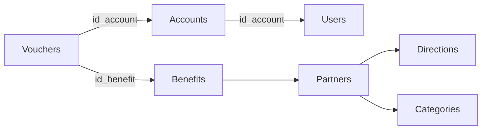
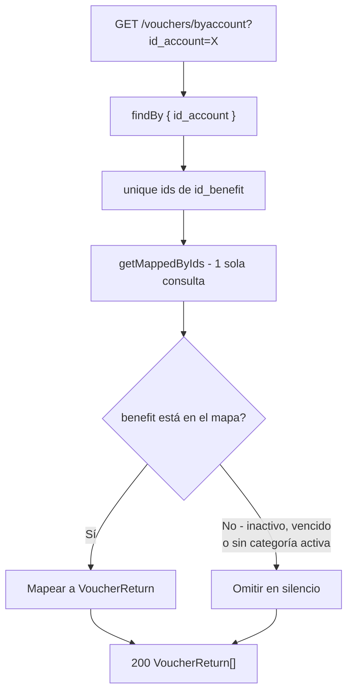
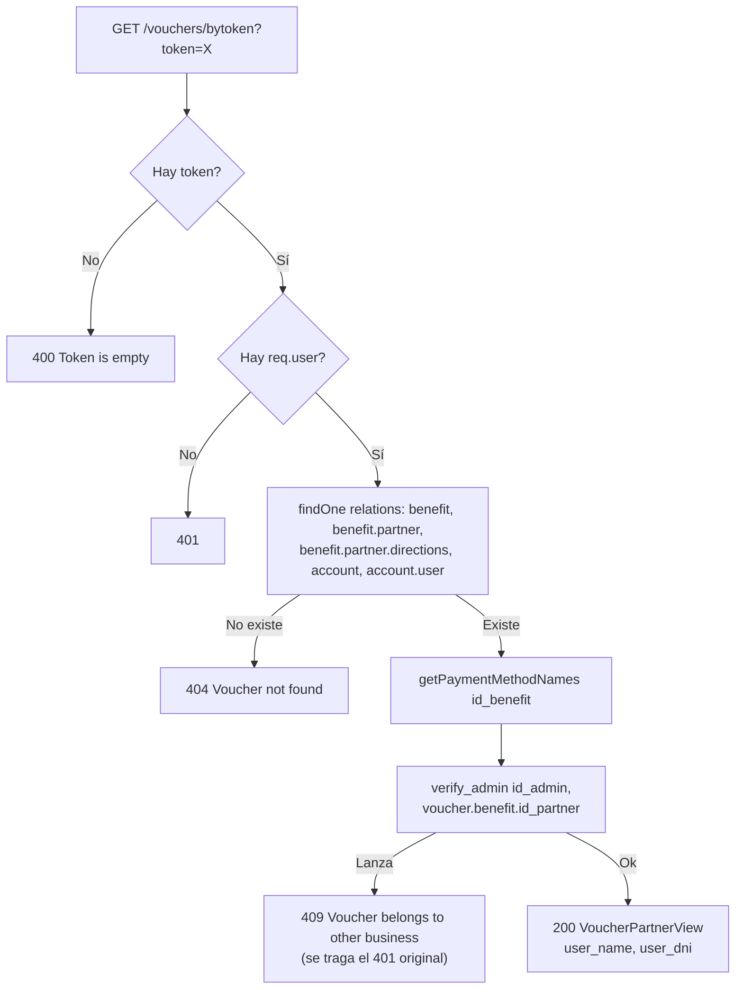
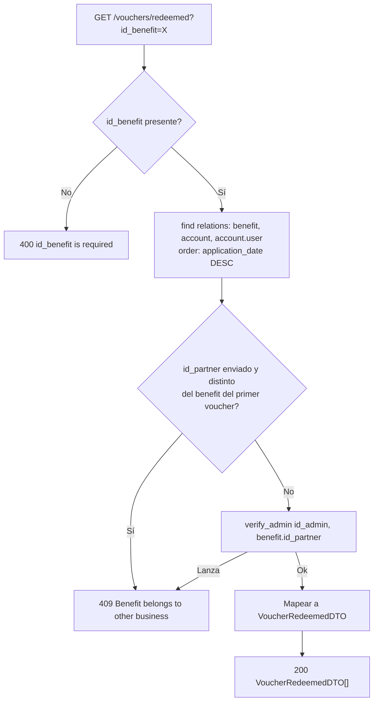
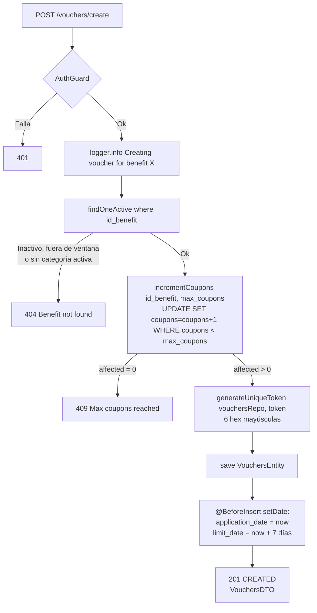
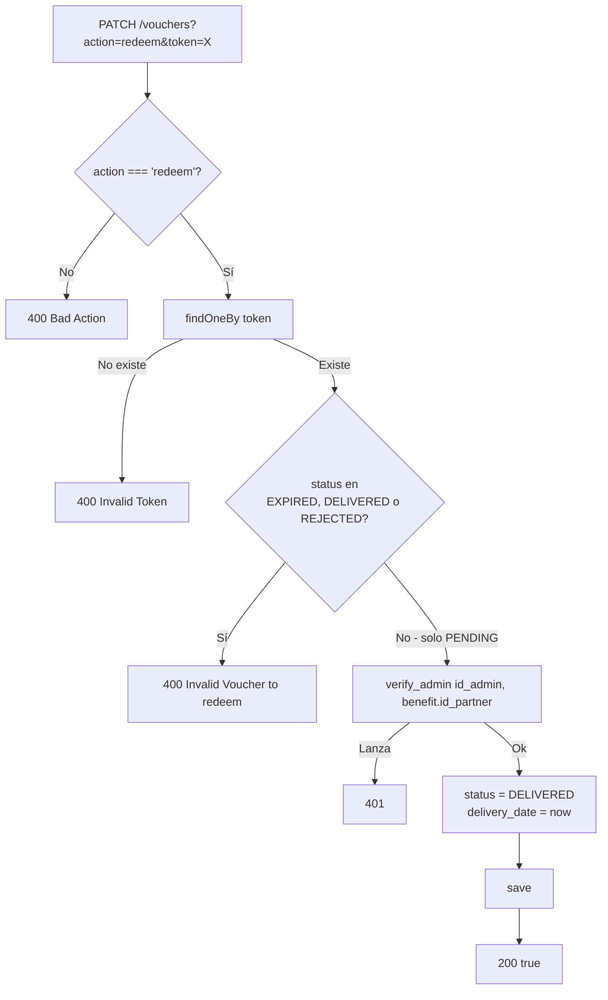
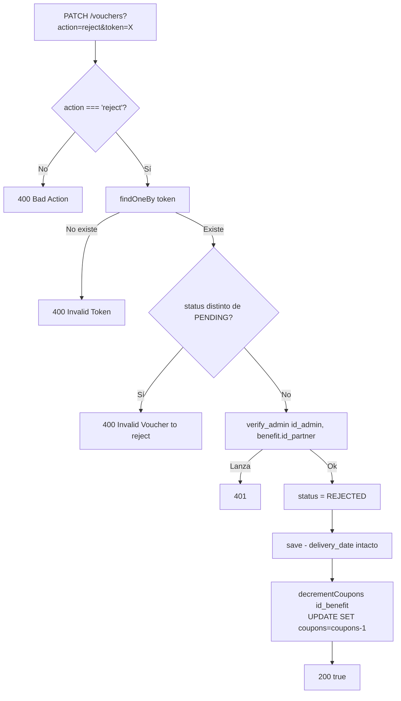
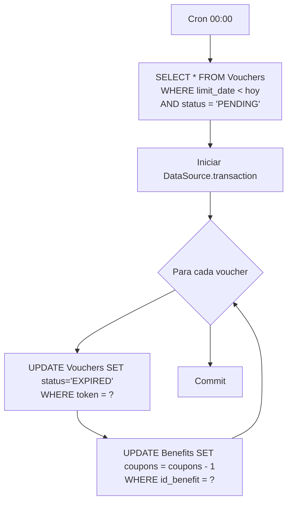
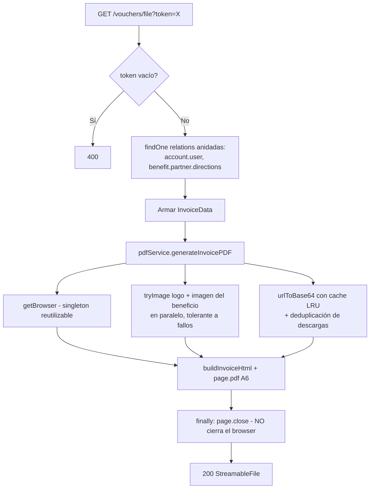

# Endpoints - Vouchers (Cupones)

En este archivo se detalla el funcionamiento interno de cada endpoint relacionado a los vouchers (cupones canjeados) de la plataforma.

---

## Entidad `VouchersEntity`

`@Entity('Vouchers')`

| Campo | Columna | Tipo | Null | Default | Notas |
|-------|---------|------|------|---------|-------|
| `token` | `token` | `varchar(6)` | no | — | `@PrimaryColumn`. 6 hex mayúsculas generadas en la app |
| `id_account` | `id_account` | `varchar(4)` | no | — | `@Index()`. **Era `id_user` → `Users`** |
| `id_benefit` | `id_benefit` | `varchar(4)` | no | — | `@Index()`. Existe desde el esquema original |
| `application_date` | `application_date` | `date` | no | — | La pone `@BeforeInsert setDate()` |
| `delivery_date` | `delivery_date` | `date` | **sí** | `null` | Se setea al canjear |
| `limit_date` | `limit_date` | `date` | no | `'2026-05-11'` | **Nuevo.** La pone `@BeforeInsert` a +7 días |
| `status` | `status` | `enum(VoucherStatus)` | no | `PENDING` | `@Index()`. **Nuevo `REJECTED`** |

### Relaciones

| Propiedad | Tipo | Destino | Join |
|-----------|------|---------|------|
| `account` | `@ManyToOne` | `AccountsEntity` | `id_account` → `Accounts.id_account` |
| `benefit` | `@ManyToOne` | `BenefitsEntity` | `id_benefit` |

### Cambio de modelo: de `Users` a `Accounts`

Antes el voucher referenciaba `Users.id_user`. Ahora referencia
`Accounts.id_account`, que es la entidad de la que cuelgan `role` y `email`. Los
datos personales se alcanzan por la cadena `voucher.account.user`:


```mermaid
flowchart LR
    V[Vouchers] -->|id_account| A[Accounts]
    A -->|id_account| U[Users]
    V -->|id_benefit| B[Benefits]
    B --> P[Partners]
    P --> D[Directions]
    P --> C[Categories]
```

No hay relación directa con `Partners` ni con `Partners_Categories`: los datos
del negocio se alcanzan por `voucher.benefit.partner`.

### Lifecycle hook

```typescript
@BeforeInsert()
setDate() {
    this.application_date = new Date();
    this.limit_date = new Date();
    this.limit_date.setDate(this.application_date.getDate() + 7);
}
```

> `VouchersEntity` **no tiene** ningún otro método: solo `setDate()`. El
> `change_token()` que re-hashea y renueva la expiración está en
> `RefreshTokenEntity` (`src/entities/refresh-token.entity.ts`) y está sin uso
> desde que la rotación se hace vía `AuthService`. Ver
> [`auth.md`](./auth.md).

---

## `GET /vouchers/all`

Obtiene todos los vouchers registrados.

### Parámetros de entrada

Ninguno.

### Lógica de negocio

1. `find()` de todas las entidades, ordenadas por `application_date: 'DESC'`.
2. Se mapea cada una con `VouchersMapper.toDTO()`.
3. Se retorna un arreglo de `VouchersDTO`.

**Cambio:** el orden pasó de `ASC` a `DESC` en el commit `351d535`, para mostrar
los más recientes primero.

### Respuesta

```json
[
  {
    "token": "ABC123",
    "id_account": "U001",
    "id_benefit": "B001",
    "application_date": "2024-06-15T00:00:00.000Z",
    "delivery_date": null,
    "limit_date": "2024-06-22T00:00:00.000Z",
    "status": "PENDING"
  }
]
```

---

## `GET /vouchers/byaccount`

Vouchers de una cuenta, resueltos para el usuario.

### Parámetros de entrada

| Campo | Tipo | Origen | Descripción |
|-------|------|--------|-------------|
| `id_account` | String | Query | ID de la cuenta. |

### Flujo del proceso


```mermaid
flowchart TD
    A["GET /vouchers/byaccount?id_account=X"] --> B["findBy { id_account }"]
    B --> C["unique ids de id_benefit"]
    C --> D["getMappedByIds - 1 sola consulta"]
    D --> E{"benefit está en el mapa?"}
    E -->|No - inactivo, vencido<br/>o sin categoría activa| F[Omitir en silencio]
    E -->|Sí| G[Mapear a VoucherReturn]
    G --> H["200 VoucherReturn[]"]
    F --> H
```

### Lógica de negocio

1. `findBy({ id_account })`.
2. Se extraen los `id_benefit` **únicos** y se llama a
   `BenefitsService.getMappedByIds()`, que resuelve **todos** los beneficios en
   **una** consulta. Esto eliminó el N+1 que tenía antes (un `get_benefit()` por
   voucher).
3. Por cada voucher se arma el `VoucherReturn` con los datos del beneficio.

**Si no hay vouchers, devuelve `[]` con `200`** (no `404`).

> ⚠️ Los vouchers cuyo beneficio no aparece en el mapa **se pierden en
> silencio**. Como `getMappedByIds` filtra por `status = ACTIVE` y categoría
> activa, un voucher emitido sobre un beneficio que después se desactivó
> desaparece de la lista del usuario.
>
> `getMappedByIds` **no** filtra por la ventana de fechas, así que un beneficio
> vencido pero aún `ACTIVE` sí aparece.

### Respuesta

```json
[
  {
    "title": "Descuento 20%",
    "image": "https://placehold.co/600x400?text=...",
    "partner": "Restaurante El Buen Sabor",
    "endDate": "2024-12-31T00:00:00.000Z",
    "methods": ["Efectivo", "Mercado Pago"],
    "directions": ["Av. Mitre 1450, Córdoba"],
    "logo": "https://placehold.co/200x200?text=...",
    "token": "ABC123",
    "status": "PENDING"
  }
]
```

> Aquí `endDate` es el **`end_date` del beneficio**. En `/bytoken` el mismo
> campo vale por el `limit_date` del voucher. La inconsistencia viene del
> código; conviene unificarlo.

---

## `GET /vouchers/byuser`

Alias deprecado de `/byaccount`. Acepta `id_account` y, por compatibilidad,
`id_user`.

### Lógica de negocio

Resuelve `id_account ?? id_user` y delega en `get_by_account()`.

---

## `GET /vouchers/bybenefit`

Obtiene los vouchers de un beneficio específico.

### Parámetros de entrada

| Campo | Tipo | Origen | Descripción |
|-------|------|--------|-------------|
| `id_benefit` | String | Query | ID del beneficio. |

### Lógica de negocio

`findBy({ id_benefit })` + `VouchersMapper.toDTO()`. **Sin orden.**

### Errores

| Código | Mensaje | Nota |
|--------|---------|------|
| `404` | `Vouchers not found` | **Inalcanzable**: el `if (!vouchers)` guarda contra `findBy()`, que devuelve `[]` — siempre truthy. Para detectarlo hay que mirar `.length` |

---

## `GET /vouchers/bytoken`

Protegido con `@UseGuards(AuthGuard('jwt'), AdminGuard)`. El comercio busca un
voucher por su token para validarlo.

> El guard se agregó en el commit `55ddfbb`. Antes el endpoint era público y
> cualquiera con un token podía ver los datos personales del socio.

### Parámetros de entrada

| Campo | Tipo | Origen | Descripción |
|-------|------|--------|-------------|
| `token` | String | Query | Token del voucher. |

El id del admin sale de `req.user.user_id`.

### Flujo del proceso


```mermaid
flowchart TD
    A["GET /vouchers/bytoken?token=X"] --> B{Hay token?}
    B -->|No| C[400 Token is empty]
    B -->|Sí| D{Hay req.user?}
    D -->|No| E[401]
    D -->|Sí| F["findOne relations: benefit, benefit.partner,<br/>benefit.partner.directions, account, account.user"]
    F -->|No existe| G[404 Voucher not found]
    F -->|Existe| H["getPaymentMethodNames id_benefit"]
    H --> I["verify_admin id_admin,<br/>voucher.benefit.id_partner"]
    I -->|Lanza| J["409 Voucher belongs to other business<br/>(se traga el 401 original)"]
    I -->|Ok| K["200 VoucherPartnerView<br/>user_name, user_dni"]
```

### Lógica de negocio

1. Si no hay `token` → `400 Token is empty`. Si no hay `req.user` → `401`.
2. Se carga el voucher con `['benefit', 'benefit.partner', 'benefit.partner.directions', 'account', 'account.user']`.
3. Se obtienen los métodos de pago vía `BenefitsService.getPaymentMethodNames(voucher.id_benefit)`.
4. Se verifica con `PartnersAdminsService.verify_admin(id_admin, voucher.benefit.id_partner)`.
   **Cualquier excepción se captura y se re-lanza como `409 Voucher belongs to
   other business`**, ocultando el `401` original.
5. Se responde `VoucherPartnerView`.

### Respuesta

```json
{
  "title": "Descuento 20%",
  "image": "https://placehold.co/600x400?text=...",
  "partner": "Restaurante El Buen Sabor",
  "endDate": "2024-06-22T00:00:00.000Z",
  "methods": ["Efectivo"],
  "directions": ["Av. Mitre 1450, Córdoba"],
  "logo": "https://placehold.co/200x200?text=...",
  "token": "ABC123",
  "status": "PENDING",
  "user_name": "Juan Pérez",
  "user_dni": "30111222"
}
```

- `user_name` es un **único string** `"nombre apellido"`, a diferencia de
  `/redeemed` que separa `user_name` y `user_lastname`.
- `endDate` aquí es el **`limit_date` del voucher**.

### Errores

| Código | Mensaje |
|--------|---------|
| `400` | `Token is empty` |
| `401` | Del `AdminGuard` |
| `401` | `User is not logged` — si el `id_admin` no llega resuelto |
| `404` | `Voucher not found` |
| `409` | `Voucher belongs to other business` |

---

## `GET /vouchers/redeemed`

Protegido con `@UseGuards(AuthGuard('jwt'), AdminGuard)`. Lista los vouchers de
un beneficio con los datos del usuario, para el panel del comercio. Agregado en
el commit `a457710`.

### Parámetros de entrada

| Campo | Tipo | Origen | Descripción |
|-------|------|--------|-------------|
| `id_benefit` | String | Query | **Obligatorio.** Beneficio a consultar. |
| `id_partner` | String | Query | Opcional. Si viene, debe coincidir con el del primer voucher. |

El id del admin sale de `req.user.user_id`.

### Flujo del proceso


```mermaid
flowchart TD
    A["GET /vouchers/redeemed?id_benefit=X"] --> B{id_benefit presente?}
    B -->|No| C[400 id_benefit is required]
    B -->|Sí| D["find relations: benefit, account, account.user<br/>order: application_date DESC"]
    D --> E{id_partner enviado y distinto<br/>del benefit del primer voucher?}
    E -->|Sí| F[409 Benefit belongs to other business]
    E -->|No| G["verify_admin id_admin, benefit.id_partner"]
    G -->|Lanza| F
    G -->|Ok| H[Mapear a VoucherRedeemedDTO]
    H --> I["200 VoucherRedeemedDTO[]"]
```

### Lógica de negocio

1. Si falta `id_benefit` → `400 id_benefit is required`.
2. Se cargan los vouchers con `['benefit', 'account', 'account.user']`, ordenados por `application_date DESC`.
3. Si se envió `id_partner` y no coincide con `vouchers[0].benefit.id_partner` → `409 Benefit belongs to other business`.
4. `verify_admin(id_admin, benefitPartner)`. Cualquier excepción se convierte en `409`.
5. Se mapea a `VoucherRedeemedDTO`.

### Respuesta

```json
[
  {
    "token": "ABC123",
    "id_account": "U001",
    "id_user": "U001",
    "user_name": "Juan",
    "user_lastname": "Pérez",
    "user_dni": "30111222",
    "user_email": "juan@example.com",
    "application_date": "2024-06-15T10:30:00.000Z",
    "delivery_date": null,
    "limit_date": "2024-06-22T00:00:00.000Z",
    "status": "PENDING"
  }
]
```

Fallbacks del mapper: `id_user = account.user.id_user ?? id_account`, los
datos personales y `delivery_date` van a `''`/`null` si faltan.

### Errores

| Código | Mensaje |
|--------|---------|
| `400` | `id_benefit is required` |
| `400` | `Benefit id is empty` |
| `401` | Del `AdminGuard` |
| `401` | `User is not logged` — si el `id_admin` no llega resuelto |
| `409` | `Benefit belongs to other business` |
| `404` | Si el beneficio de la FK no existe |

---

## `GET /vouchers/bystatus`

Obtiene los vouchers filtrados por estado.

### Parámetros de entrada

| Campo | Tipo | Origen | Descripción |
|-------|------|--------|-------------|
| `status` | `VoucherStatus` | Query | `PENDING`, `DELIVERED`, `EXPIRED` o `REJECTED`. |

> ⚠️ `status` **no se valida** contra el enum. Un string arbitrario llega a la
> columna `enum` y produce un error de base de datos, no un `400` limpio.

### Lógica de negocio

`findBy({ status })` + `VouchersMapper.toDTO()`. **Sin orden.**

### Errores

| Código | Mensaje | Nota |
|--------|---------|------|
| `404` | `Vouchers not found` | **Inalcanzable**: el `if (!vouchers)` guarda contra `findBy()`, que devuelve `[]` — siempre truthy |

---

## `GET /vouchers/userbenefit`

Cuenta los vouchers de un par usuario-beneficio. Sirve para que el frontend
aplique `max_per_user`.

### Parámetros de entrada

| Campo | Tipo | Origen |
|-------|------|--------|
| `id_account` | String | Query |
| `id_benefit` | String | Query |

### Lógica de negocio

```sql
SELECT COUNT(*) FROM Vouchers WHERE id_benefit = ? AND id_account = ?;
```

> Arreglado en el rango documentado: la versión anterior contaba
> `id_user: vouchers.id_account`, que ya no corresponde a ninguna columna.

### Respuesta

```json
{ "id_account": "U001", "coupons": 2 }
```

---

## `POST /vouchers/create`

Protegido con `@UseGuards(AuthGuard('jwt'))`. Crea un voucher (canjea un cupón).

### Parámetros de entrada

> `VouchersCreateDTO` es una `interface`: **sin validación**.

| Campo | Tipo | Descripción |
|-------|------|-------------|
| `id_account` | String | ID de la cuenta que canjea. |
| `id_benefit` | String | ID del beneficio a canjear. |

### Flujo del proceso


```mermaid
flowchart TD
    A[POST /vouchers/create] --> B{AuthGuard}
    B -->|Falla| C[401]
    B -->|Ok| D["logger.info Creating voucher for benefit X"]
    D --> E["findOneActive where id_benefit"]
    E -->|Inactivo, fuera de ventana<br/>o sin categoría activa| F[404 Benefit not found]
    E -->|Ok| G["incrementCoupons id_benefit, max_coupons<br/>UPDATE SET coupons=coupons+1 WHERE coupons &lt; max_coupons"]
    G -->|affected = 0| H["409 Max coupons reached"]
    G -->|affected &gt; 0| I["generateUniqueToken vouchersRepo, token<br/>6 hex mayúsculas"]
    I --> J["save VouchersEntity"]
    J --> K["@BeforeInsert setDate:<br/>application_date = now<br/>limit_date = now + 7 días"]
    K --> L["201 CREATED<br/>VouchersDTO"]
```

### Lógica de negocio

1. Se registra el intento en el log.
2. Se busca el beneficio con **`findOneActive()`** (no `findOneBy`). Debe estar `ACTIVE`, dentro de la ventana de fechas y su partner debe tener categoría activa. Si no, `404 Benefit not found`.
3. Se descuenta un cupón de forma **atómica**:
   ```sql
   UPDATE Benefits SET coupons = coupons + 1
   WHERE id_benefit = ? AND coupons < max_coupons;
   ```
   Si `affected === 0` → `409 Max coupons reached`.
4. `token = await generateUniqueToken(vouchersRepository, 'token')` — 6 hex mayúsculas con verificación de colisión.
5. Se guarda. `@BeforeInsert` pone `application_date = now` y `limit_date = now + 7 días`.
6. Se responde `VouchersDTO`.

### Consideraciones

- ⚠️ **`max_per_user` no se valida en el servidor.** El contador se expone vía
  `GET /vouchers/userbenefit` y la aplicación del límite queda en el frontend.
  Un cliente que llame directo al endpoint puede superarlo.
- ⚠️ No se verifica que `id_account` exista: se confía en la FK.

### Errores

| Código | Mensaje |
|--------|---------|
| `401` | Del `AuthGuard` |
| `404` | `Benefit not found` |
| `409` | `Max coupons reached` |

### Respuesta

```json
{
  "token": "A1B2C3",
  "id_account": "U001",
  "id_benefit": "B001",
  "application_date": "2024-06-15T10:30:00.000Z",
  "delivery_date": null,
  "limit_date": "2024-06-22T00:00:00.000Z",
  "status": "PENDING"
}
```

---

## `PATCH /vouchers`

Canje o rechazo de un voucher. **Un único endpoint** con dispatch por query param
(commits `2c2bd19` y `d926a5d` fusionando los dos endpoints anteriores).

Protegido con `@UseGuards(AuthGuard('jwt'), AdminGuard)`.

### Parámetros de entrada

| Campo | Tipo | Origen | Descripción |
|-------|------|--------|-------------|
| `action` | String | Query | `redeem` o `reject`. Cualquier otro valor → `400 Bad Action`. |
| `token` | String | Query | Token del voucher. |

El id del admin sale de `req.user.user_id`.

### `action=redeem`


```mermaid
flowchart TD
    A["PATCH /vouchers?action=redeem&token=X"] --> B{action === 'redeem'?}
    B -->|No| Z[400 Bad Action]
    B -->|Sí| C[findOneBy token]
    C -->|No existe| D[400 Invalid Token]
    C -->|Existe| E{"status en<br/>EXPIRED, DELIVERED o REJECTED?"}
    E -->|Sí| F[400 Invalid Voucher to redeem]
    E -->|No - solo PENDING| G["verify_admin id_admin, benefit.id_partner"]
    G -->|Lanza| H[401]
    G -->|Ok| I["status = DELIVERED<br/>delivery_date = now"]
    I --> J[save]
    J --> K[200 true]
```

**No toca los cupones**: el cupón queda consumido.

### `action=reject`

Agregado en el commit `70d6976`.


```mermaid
flowchart TD
    A["PATCH /vouchers?action=reject&token=X"] --> B{action === 'reject'?}
    B -->|No| Z[400 Bad Action]
    B -->|Sí| C[findOneBy token]
    C -->|No existe| D[400 Invalid Token]
    C -->|Existe| E{"status distinto de PENDING?"}
    E -->|Sí| F[400 Invalid Voucher to reject]
    E -->|No| G["verify_admin id_admin, benefit.id_partner"]
    G -->|Lanza| H[401]
    G -->|Ok| I[status = REJECTED]
    I --> J[save - delivery_date intacto]
    J --> K["decrementCoupons id_benefit<br/>UPDATE SET coupons=coupons-1"]
    K --> L[200 true]
```

**Devuelve el cupón al pool del beneficio.** La guarda previa garantiza que el
voucher estaba en `PENDING`, así que el cupón estaba reservado y no consumido, y
que no se devuelve dos veces.

### Errores

| Código | Mensaje |
|--------|---------|
| `400` | `Bad Action` |
| `400` | `Invalid Token` |
| `400` | `Invalid Voucher to redeem` |
| `400` | `Invalid Voucher to reject` |
| `401` | Del `AdminGuard` o de `verify_admin` |

### Respuesta

```json
true
```

### Guards de estado

`redeem` y `reject` son **simétricos**: ambos aceptan únicamente vouchers
`PENDING` y rechazan cualquier otro estado.

| Estado actual | `action=redeem` | `action=reject` |
|---------------|-----------------|-----------------|
| `PENDING` | ✅ → `DELIVERED` | ✅ → `REJECTED` |
| `DELIVERED` | `400 Invalid Voucher to redeem` | `400 Invalid Voucher to reject` |
| `REJECTED` | `400 Invalid Voucher to redeem` | `400 Invalid Voucher to reject` |
| `EXPIRED` | `400 Invalid Voucher to redeem` | `400 Invalid Voucher to reject` |

La simetría importa por el efecto sobre los cupones: como `reject` **devuelve**
un cupón al beneficio, permitir el reintento sobre un voucher ya `REJECTED`
haría que una segunda llamada descontara otro cupón. Con la guarda actual, cada
voucher cambia de estado —y devuelve su cupón— a lo sumo una vez.

No hay forma de revertir un voucher a `PENDING`: un rechazo es terminal desde el
punto de vista del ciclo de vida.

---

## Cron de expiración — `@Cron('0 0 * * *')`

`VouchersService.update_expiration_status()`, a medianoche.


```mermaid
flowchart TD
    A["Cron 00:00"] --> B["SELECT * FROM Vouchers<br/>WHERE limit_date &lt; hoy<br/>AND status = 'PENDING'"]
    B --> C[Iniciar DataSource.transaction]
    C --> D{Para cada voucher}
    D --> E["UPDATE Vouchers SET status='EXPIRED'<br/>WHERE token = ?"]
    E --> F["UPDATE Benefits SET coupons = coupons - 1<br/>WHERE id_benefit = ?"]
    F --> D
    D --> G[Commit]
```

### Lógica de negocio

1. Se buscan los vouchers con `limit_date < hoy` y **`status = PENDING`**.
2. Dentro de una transacción, por cada uno: se marca `EXPIRED` y se devuelve un
   cupón al beneficio.

### Por qué el filtro es `= PENDING` y no `!= EXPIRED`

El cron solo debe devolver el cupón de los vouchers que **lo tenían reservado y
nunca se usaron**: los que seguem en `PENDING`. Filtrar por el estado exacto en
lugar de por "cualquier cosa salvo `EXPIRED`" es lo que mantiene la contabilidad
de `Benefits.coupons` consistente, porque cada transición de estado se hace
cargo de su propio cupón exactamente una vez:

| Estado al llegar el `limit_date` | Cupón | Quién lo devolvió | ¿Lo vuelve a devolver el cron? |
|----------------------------------|-------|-------------------|-------------------------------|
| `PENDING` | Reservado, sin usar | — | **Sí.** Correcto. |
| `REJECTED` | Ya devuelto en `reject_voucher` | El endpoint de rechazo | **No.** Evita el doble descuento. |
| `DELIVERED` | Consumido en el canje | Nadie: se gastó realmente | **No.** El beneficio ya no debe ese cupón. |

Con un filtro `!= EXPIRED` los tres casos entraban al cron y los cupones de los
dos últimos se devolvían una segunda vez, con lo que `coupons` quedaba
subestimado de forma acumulativa y sin autocorrección.

### Estado final de los vouchers vencidos

Solo los `PENDING` vencidos pasan a `EXPIRED`. Un voucher `REJECTED` o
`DELIVERED` que supere su `limit_date` **conserva su estado**: el registro ya
refleja cómo terminó su ciclo de vida y no hay razón para sobrescribirlo.

### Nota sobre la transacción

El `SELECT` usa `vouchersRepository` (fuera de la transacción) mientras que los
`UPDATE` usan `manager`. Un cambio de estado concurrente entre la lectura y la
escritura no está protegido: en el peor caso el cron marcaría `EXPIRED` y
devolvería el cupón de un voucher que un comercio estaba canjeando en ese
momento. Con el filtro `= PENDING` la ventana es muy chica, pero la lectura podría
moverse dentro de la transacción para cerrarla.

---

## `DELETE /vouchers`

Borra un voucher por su token.

> ⚠️ **No requiere autenticación.** Cualquiera con el token puede borrarlo.

### Parámetros de entrada

> `VouchersDeleteDTO` es una `interface`: sin validación.

| Campo | Tipo | Descripción |
|-------|------|-------------|
| `token` | String | Token del voucher. |
| `id_account` | String | No se usa para el delete. |

### Lógica de negocio

1. `vouchersService.delete()` ejecuta `vouchersRepository.delete({ token })` — **borrado duro**.
2. El servicio devuelve `true` incondicionalmente.
3. El controlador compara contra `false`:

```typescript
// vouchers.controller.ts
const voucherDeleted = await this.vouchersService.delete(dto);
if (!voucherDeleted) {
    throw new NotFoundException('Voucher does not exists');
}
return { result: 'ok' };
```

> No devuelve el cupón al beneficio.

### Comportamiento a corregir

- El mensaje real que se lanza está en el **servicio**:
  `El voucher que se quiere eliminar no fue encontrado`
  (`vouchers.service.ts`), no en el controlador.
- Y ambos están **inalcanzables**: `delete()` devuelve `true` siempre, así que
  el `if (!voucherDeleted)` nunca se cumple. `Repository.delete()` de TypeORM
  devuelve un objeto `DeleteResult` (`{ raw, affected }`), que siempre es
  truthy. Para detectar que no había fila hay que mirar `affected`.
- Borrar un voucher no devuelve el cupón al beneficio.

### Errores

| Código | Mensaje | Nota |
|--------|---------|------|
| `404` | `Voucher does not exists` | En el controlador, **inalcanzable** |
| `404` | `El voucher que se quiere eliminar no fue encontrado` | En el servicio, **inalcanzable** |

### Respuesta

```json
{ "result": "ok" }
```

---

## `GET /vouchers/file`

Protegido con `@UseGuards(AuthGuard('jwt'))`. Genera y descarga el PDF del
voucher.

### Parámetros de entrada

| Campo | Tipo | Origen | Descripción |
|-------|------|--------|-------------|
| `token` | String | Query | Token del voucher. |

### Flujo del proceso


```mermaid
flowchart TD
    A["GET /vouchers/file?token=X"] --> B{token vacío?}
    B -->|Sí| C[400]
    B -->|No| D["findOne relations anidadas:<br/>account.user, benefit.partner.directions"]
    D --> E[Armar InvoiceData]
    E --> F["pdfService.generateInvoicePDF"]
    F --> G["getBrowser - singleton reutilizable"]
    F --> H["tryImage logo + imagen del beneficio<br/>en paralelo, tolerante a fallos"]
    F --> I["urlToBase64 con cache LRU<br/>+ deduplicación de descargas"]
    G --> J["buildInvoiceHtml + page.pdf A6"]
    H --> J
    I --> J
    J --> K[finally: page.close - NO cierra el browser]
    K --> L["200 StreamableFile"]
```

### Lógica de negocio

1. Se valida el token. Si está vacío → `400`.
2. Se carga el voucher con `relations: { account: { user: true }, benefit: { partner: { directions: true } } }`. (El cast `as any` es necesario por la sintaxis anidada de TypeORM 0.3.)
3. Se arma el `InvoiceData`:
   - `customer.id = voucher.account.id_account` — **antes era `user.id_user`**, por eso el PDF muestra el `id_account` como "Legajo".
   - `provider.address = directions.map(d => d.direction).join(', ')` — **antes** el `partner.direction` singular.
4. `pdfService.generateInvoicePDF(invoice)` resuelve el logo y la imagen del
   beneficio en paralelo y genera el PDF.
5. Se devuelve un `StreamableFile`.

### Respuesta

```
Content-Type: application/pdf
Content-Disposition: attachment; filename=cecit_voucher_<token>.pdf
Content-Length: <bytes>
```

---

## `PdfService`

### Navegador singleton

```typescript
private browser: Browser | null = null;
private browserLaunching: Promise<Browser> | null = null;
```

Commit `851fb29`. Antes **cada** PDF lanzaba y cerraba un Chromium completo
(0,5–2 s y 100–200 MB por voucher).

| Aspecto | Comportamiento |
|---------|----------------|
| `getBrowser()` | Reutiliza el browser si `browser?.connected`; descarta referencias muertas |
| Concurrencia | Reutiliza la promesa `browserLaunching` en vuelo, así N requests simultáneos lanzan **un** browser |
| Autorreparación | `browser.on('disconnected')` anula la referencia para relanzar |
| `onModuleInit()` | `warmup()` en background: lanza el browser y precarga las imágenes estáticas. Los fallos solo hacen `logger.warn` |
| `onModuleDestroy()` | Vacía la cache de imágenes y cierra el browser en `try/catch/finally` |
| Por request | Solo se cierra la **página** (`finally { await page.close() }`), nunca el browser |

Flags de lanzamiento: `--no-sandbox`, `--disable-setuid-sandbox`,
`--disable-dev-shm-usage`, `--disable-gpu`, `--no-first-run`, `--no-zygote`.

### Cache de imágenes (LRU)

```typescript
FETCH_TIMEOUT_MS     = 5_000
STATIC_IMAGE_TTL_MS  = 24 * 60 * 60 * 1000   // 24 h
DYNAMIC_IMAGE_TTL_MS =  6 * 60 * 60 * 1000   // 6 h
MAX_CACHED_IMAGES    = 100
MAX_IMAGE_BYTES      = 2_500_000
```

| Método | Comportamiento |
|--------|----------------|
| `urlToBase64(url, ttlMs)` | Cache hit → devuelve. Si no, **reutiliza la promesa de `inflightFetches`** para deduplicar descargas concurrentes de la misma URL. Siempre limpia la entrada en `finally`. |
| `getFromCache` | Expira de forma perezosa (`expiresAt < Date.now()`) y refresca la recencia (delete + set). |
| `setCache` | Desaloja la entrada más antigua en bucle mientras `size >= MAX_CACHED_IMAGES`. |
| `fetchImageAsBase64` | `fetch` con `AbortSignal.timeout(5000)`. Lanza `HTTP <status> fetching <url>` si `!res.ok`. **Valida que el `content-type` empiece por `image/`** — antes se asumía `image/png` a ciegas. Rechaza tamaños declarados o reales `> 2.5 MB` y cuerpos de 0 bytes. |
| `tryImage` | Envuelve todo y devuelve `null` ante cualquier error, logueando `Could not load image <url>`. Se usa para el logo y la imagen del beneficio, de modo que una imagen rota no rompe el PDF. |

### Imágenes desde el frontend

Commit `de756d8`. Antes había tres URLs fijas de WordPress hardcodeadas contra
`centrodecomercioag.com.ar`. Ahora se arman con `FRONT_URL`:

```typescript
const STATIC_IMAGE_PATHS = {
    cecitLogo: '/logo_sin_texto.png',
    recurso6:  '/empresas.png',
    recurso8:  '/Paseos.png',
};
// → `${configService.get('FRONT_URL', 'https://centrodecomercioag.com.ar')}/logo_sin_texto.png`
```

Así funciona igual en desarrollo (`localhost:5173`) y en producción.
`cecitLogo` va inline en el body; `recurso6` y `recurso8` en el
`footerTemplate` de Puppeteer (52 px, `gap: 35px`).

### Formato de fechas

Commit `f184649`. `formatDate(date)`:

| Tipo de entrada | Tratamiento |
|-----------------|-------------|
| Falsy | `'—'` |
| **String** | Regex `^(\d{4})-(\d{2})-(\d{2})` → `DD/MM/YYYY`, **sin conversión de zona horaria** |
| `Date` | `getUTCDate()` / `getUTCMonth()+1` / `getUTCFullYear()` → `DD/MM/YYYY` |
| Inválida | `'—'` |

Las columnas `date` de MariaDB llegan como strings `'YYYY-MM-DD'`. La versión
anterior hacía `new Date()` + `getDate()`, que bajo UTC-3 corría todas las
fechas un día hacia atrás.

### Contenido del PDF

Formato **A6**, `printBackground: true`, `displayHeaderFooter: true`, márgenes
`{ top: '0px', bottom: '70px', left: '0px', right: '0px' }`. No hay
`headerTemplate`: el header de CeCIT es contenido del body, así que se imprime
una sola vez.

`page.setContent(html, { waitUntil: 'domcontentloaded' })`, y después
`page.evaluate` espera `document.fonts.ready` y la carga de todas las
`document.images` antes de llamar a `page.pdf()`.

| Bloque | Contenido |
|--------|-----------|
| `.inv-head` | `Comprobante` + `Canje de beneficio · CeCIT`, badge `Nº {number}` |
| `.grid` card Socio | `Nombre`, `DNI`, **`Legajo: {customer.id}`** (= `id_account`) |
| `.grid` card Comercio | Logo (max 70×26, se omite si es `null`), `Razón social`, `Dirección` |
| `table.detail` fila 1 | Miniatura 52×52 de la imagen del beneficio (con fallback: recuadro gris + inicial del título en mayúscula), título, descripción, `Vigencia: {start} al {end}` |
| `table.detail` fila 2 | `Cantidad: 1` (hardcodeado) |
| `.code` | `Código de validación` — 20 px Courier New, `letter-spacing: 6px`, borde punteado |
| `.meta` | `Emisión`, `Entrega`, `Estado` con badge de color |

Todos los valores pasan por `escapeHtml`; los vacíos se muestran como `—`.

### Badges de estado

```typescript
STATUS_LABELS = { PENDING: 'Pendiente', DELIVERED: 'Entregado', EXPIRED: 'Vencido' }
STATUS_STYLES = {
    PENDING:   '#b45309 / #fef3c7',
    DELIVERED: '#15803d / #dcfce7',
    EXPIRED:   '#b91c1c / #fee2e2',
}
```

> ⚠️ **`REJECTED` no está en ninguno de los dos mapas.** El PDF de un voucher
> rechazado muestra el texto crudo `REJECTED` sobre el badge gris de fallback
> (`color:#374151; background-color:#f3f4f6`).

### Métodos públicos

| Método | Descripción |
|--------|-------------|
| `generateInvoicePDF(invoice)` | Resuelve logo e imagen en paralelo vía `tryImage` y llama a `generatePDF(buildInvoiceHtml(invoice))`. Lo usa `VouchersService.gen_file`. |
| `generateVoucherPDF(token)` | Autocontenido: busca el voucher y arma el `InvoiceData`. **Sin uso** — `VouchersService` hace ese lookup. |
| `generatePDF(html)` | El renderizador. |

---

## Servicio `VouchersService`

| Método | Descripción |
|--------|-------------|
| `get_all()` | Todos, `application_date DESC`. |
| `get_by_account(id_account)` | Vouchers de la cuenta, resueltos en batch. |
| `get_by_user(id_account)` | **Deprecado**, delega a `get_by_account`. |
| `get_by_benefit(id_benefit)` | Vouchers de un beneficio. |
| `get_by_token(token, id_admin)` | Voucher con verificación de pertenencia al negocio. |
| `get_redeemed_by_benefit(id_benefit, id_admin, id_partner)` | Vouchers canjeados con datos del usuario. |
| `get_by_status(status)` | Vouchers por estado. |
| `get_by_user_benefit(dto)` | Conteo del par usuario-beneficio. |
| `create(dto)` | Emite un voucher. |
| `delete(dto)` | Borrado duro. |
| `redeem_voucher` / `reject_voucher` | Cambios de estado. |
| `gen_file(token)` | Genera el `StreamableFile` PDF. |
| `update_expiration_status()` | Cron de medianoche. |
| `mapVoucher(voucher)` | **Sin uso.** El N+1 que quedaba del viejo `get_by_user_benefit`. |

### Dependencias

`PinoLogger`, `Repository<VouchersEntity>`, `BenefitsService`, `PdfService`,
`PartnersAdminsService`, `DataSource` (para la transacción del cron).

## DTOs

Todos son `interface`: **ningún endpoint de este módulo valida su entrada**.

| DTO | Campos | Nota |
|-----|--------|------|
| `VouchersCreateDTO` | `id_account`, `id_benefit` | `id_user` → `id_account` |
| `VouchersDeleteDTO` | `token`, `id_account` | |
| `VoucherFileDTO` | `token` | |
| `VoucherBenefitUser` | `id_benefit`, `id_account` | |
| `ReturnCouponsUser` | `id_account`, `coupons` | |
| `VouchersDTO` | `token`, `id_account`, `id_benefit`, `application_date`, `delivery_date`, `limit_date`, `status` | `limit_date` nuevo |
| `VoucherReturn` | `title`, `image`, `partner`, `endDate`, `methods[]`, `directions[]`, `logo`, `token`, `status` | `direction`→`directions`; `voucherToken`→`token`; `status` nuevo |
| `VoucherPartnerView` | `VoucherReturn` + `user_name`, `user_dni` | Nuevo |
| `VoucherRedeemedDTO` | ver [arriba](#get-vouchersredeemed) | Nuevo |

---

Ver también:
- [`benefits.md`](./benefits.md) — emisión y control de cupones.
- [`partners-admins.md`](./partners-admins.md) — `verify_admin` usado por los endpoints de negocio.
